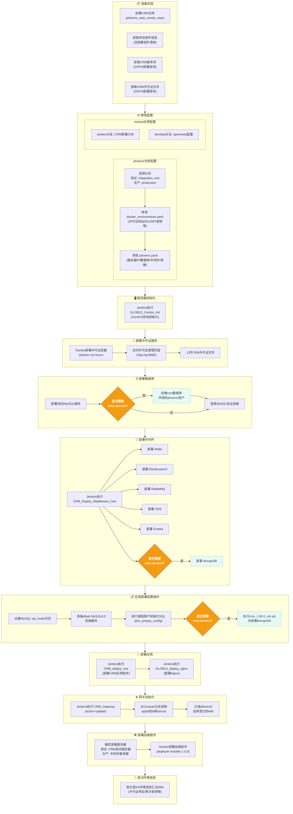
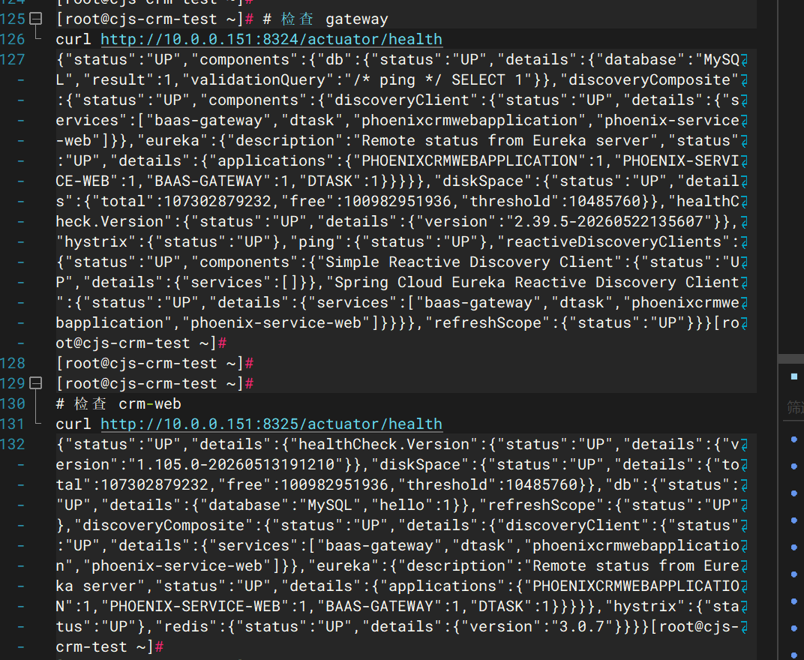
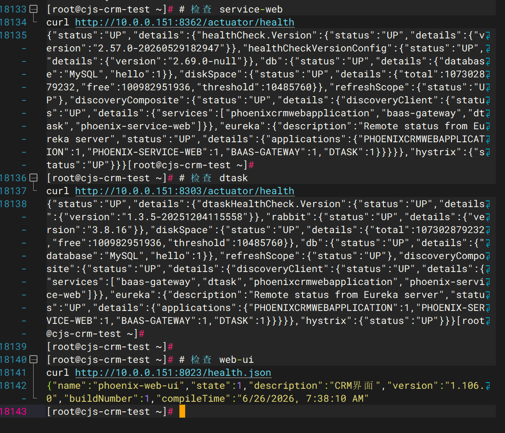
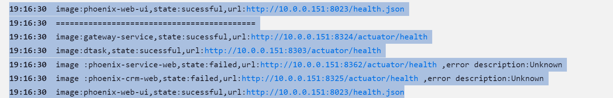
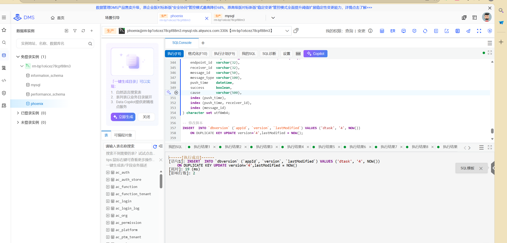
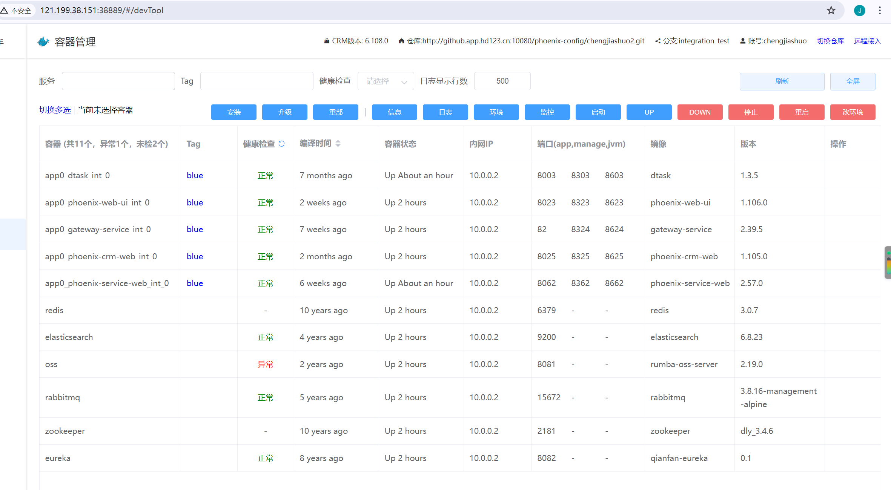

2## 部署过程总体预览




## 部署步骤

 
  
### 1.1 部署架构
`Git配置仓库 → Jenkins自动化流水线 → Harbor镜像仓库 → OpenResty反向代理网关 → 前端访问`
### 1.2 核心组件与角色映射
#### 1.2.1 Apollo (统一配置中心)：
在服务拉起前预先创建，为后续启动的各个微服务提供统一的动态配置(通过 apollo_token 鉴权)。
#### 1.2.2 Git (Toolset 仓库)：
 包含三个核心分支
- jenkins 分支：管理 Jenkins 本身的配置(JCasC)以及自动化 Job 的生成模板
- erp 分支：管理微服务的部署清单(erp.csv 记录版本、镜像、端口)和全局基础参数(all.yaml、app.yaml
- develop 分支：管理网关路由转发规则(OpenResty 的 hdpos.conf 和 upstream.conf)
#### 1.2.3 jenkins (执行引擎)： 部署在 OPS 宿主机上(Docker 容器化)，通过免密登录(SSH)控制目标应用服务器。它读取 Git 仓库中的“图纸”，自动生成 Job，并执行具体的拉取镜像、启动容器等动作
#### 1.2.4 Harbor (镜像仓库)： 存储所有中间件和业务微服务(如 hdpos4-dist, jposbo)的 Docker 镜像
#### 1.2.5目标服务器 (如 172.16.0.61)：承载 Oracle 数据库、中间件(Redis, OSS-MySQL, License-server)以及最终运行的业务容器
#### 1.2.6 OpenResty (流量网关)：作为反向代理，接收外部前端的 HTTP 请求，并根据配置路由到后端目标服务器上对应的微服务端口(如将流量打到 38180 端口的 hdpos4-dist)。

## 2. 前期资源筹备工作
 
提前需要知道的信息:
 apollo创建

- 客户编码(如:zjywvtvt)
- 客户代码(如: 8881)
- openapi_token (apollo token)
- 各个应用组件名称
- 授权用户信息即可

Toolset仓库申请

- 客户编码(如:zjywvtvt)
- GIT_NAME(如：浙江义乌VTVT)
- JIRA_ID (任务单号)
- PRODUCTS (需要部署的产品)
- PROFILES (需要部署的环境)
- JENKINS_PUB (Jenkins的公网地址)
- JENKINS_INTERNAL (Jenkins的内网地址)
- K8S_BRANCHES (toolset_x中需要增加的k8s分支)


### 2.1 apollo创建
 
| 参数名           | 说明                                                         | 当前值                                                                                                                                                                                                                                   |
| ---------------- | ------------------------------------------------------------ |---------------------------------------------------------------------------------------------------------------------------------------------------------------------------------------------------------------------------------------|
| apps             | 定义需要申请开通Apollo的应用组件列表，多值以英文逗号分隔，如：hdpos4-dist,jposbo | `hdpos4-dist、jposbo、pasoreport-web、sos-h6-transfer-service、spms-hdpos-web、h6-crm-service、panther-dts-server、panther-taskweb、up-connector-service、gem-service、init-tool、h6-openapi2-service、openapi-doc-service、hdpos6-notice-service` |
| alias            | 客户简称，比方nmgIkbl                                         | `zjywvtvt`                                                                                                                                                                                                                            |
| custom_code      | 客户编码，比方9999                                            | `8881`                                                                                                                                                                                                                                |
| jira_id          | Jira任务单ID，如：DOPS-75558                                  | `DOPS-85786`                                                                                                                                                                                                                          |
| openapi_token    | Apollo开放平台token                                          | 默认                                                                                                                                                                                                                                    |
| project_admins   | 项目管理员权限，多值以英文逗号分隔                            | shujun,yaobohai,zhaochenhao,chengjiashuo,提单人                                                                                                                                                                                          |
| namespace_admins | namespace可修改、发布权限，多值以英文逗号分隔                  | shujun,yaobohai,zhaochenhao,chengjiashuo,提单人(同上)                                                                                                                                                                                                                                  |

地址：
http://ci.hddomain.cn/job/create_ka_apollo_appid/


### 2.1 私有化Toolset仓库申请
申请专属私有化配置仓库：`http://github.app.hd123.cn/qianfanops/toolset_zjywvtvt `

申请地址：
http://ci.hddomain.cn/view/%E8%BF%90%E7%BB%B4/job/create_new_toolset/

| 参数名             | 说明                                       | 当前值                                |
| ------------------ | ------------------------------------------ |------------------------------------|
| `GIT_USERNAME`     | -                                          | `zjywvtvt`                         |
| `GIT_NAME`         | 例如：泡泡玛特                             | `浙江义乌VTVT`                         |
| `JIRA_ID`          | jira任务单id, DOPS-xxxxx                  | `DOPS-85696`                       |
| `PRODUCTS`         | 多值以英文逗号分隔, 例如 h6,crm            | `h6,crm`                           |
| `PROFILES`         | 多值以英文逗号分隔                         | `int,production`                   |
| `JENKINS_PUB`      | jenkins server 公网地址                    | `http://118.31.251.173:8888`(项目清单) |
| `JENKINS_INTERNAL` | jenkins server 内网地址                    | `http://10.6.1.19:8080`(项目清单)      |
| `K8S_BRANCHES`     | 多值以英文逗号分隔, 例如: k8s_mas,k8s_baas | `NA`                               |

jenkins server 公网地址 


 jenkins server 内网地址 





 

## 3. OPS宿主机环境初始化(用jenkins——global_centos_int这个job 不用docker run命令)
## http://172.17.11.182:8888/job/GLOBLE_Centos_Init/ 
  


 

### 3.1 部署Jenkins(在ops机器上手工执行命令 在dnet用户下面)
dnet用户下面
dnet用户下面


```shell
docker pull harbor.qianfan123.com/jenkins/jenkins-server:2.492.1-lts-hd
docker rm -f jenkins-server
docker run -d --restart always --security-opt seccomp=unconfined --name jenkins-server\
  -p 8080:8080 \
  -p 50000:50000 \
  -e JAVA_OPTS="-Xms256m -Xmx2048m -XshowSettings:vm -Dhudson.slaves.NodeProvisioner.initialDelay=0 -Dhudson.slaves.NodeProvisioner.MARGIN=50 -Dhudson.slaves.NodeProvisioner.MARGIN0=0.85 -Djenkins.install.runSetupWizard=false -Dorg.jenkinsci.plugins.gitclient.Git.timeOut=30 -Dorg.apache.commons.jelly.tags.fmt.timeZone=Asia/Shanghai" \
  -e JAVA_TOOL_OPTIONS="-Dfile.encoding=UTF-8 -Dsun.jnu.encoding=UTF-8" \
  -v /hdapp/jenkins/jenkins_home:/var/jenkins_home \
  -v ~:/root \
  -v ~:/home/dnet \
  -v $(which docker):/usr/bin/docker \
  -v /var/run/docker.sock:/var/run/docker.sock \
  harbor.qianfan123.com/jenkins/jenkins-server:2.492.1-lts-hd
docker exec jenkins-server sh /var/jenkins_home_tmp/setup.sh
sudo ln -s /hdapp/jenkins/jenkins_home /var/jenkins_home
docker restart jenkins-server
```


## 3.2 部署完成后发布公网
- 白名单添加公司固定通道ip：116.228.14.192/29,116.228.14.96/29,117.144.176.248/29,58.246.166.14,117.184.130.206**


## 3.2 部署完成后负载均衡发布公网
部署完jenkins之后应该通过负载均衡发布到公网，并且添加白名单，如果不做就需要使用windows服务器内网访问


## 3.3 配置凭证和git仓库地址
####   地址：http://1xxxx:8080/manage/credentials/
 
####  仓库密码：http://gitlab.app.hd123.cn/-/ide/project/qianfanops/toolset_zjywvtvt/tree/jenkins/-/config/jenkins.yaml/

####  仓库地址：http://11xxxx:8080/job/GLOBLE_update_jenkins_config/configure

####  仓库地址 http://1xxxx:8080/job/GLOBLE-update-jenkins-jobs/configure

64解码 https://base64.us/

### 3.4 配置免密登录(ERP 应用均使用普通用户 dnet 执行部署升级)

#### 3.4.1ops服务器执行

## 已更新优化,不需要分发密钥，但仍然需要手动执行下vim /home/dnet/.ssh/config
```commandline
    docker exec -it jenkins-server ssh-keygen

    docker exec -it jenkins-server ssh-copy-id dnet@172.16.0.61(应用服务器1)

    docker exec -it jenkins-server ssh-copy-id dnet@应用服务器2
```

## centos_init 这个 Ansible 任务需要复制 SSH 公钥到目标机器在 Jenkins 容器中找到对应的公钥文件。
## 要ops机器root用户下执行一下来创建公钥

```
ssh-keygen
```
如果没执行 会有报错信息：
```
TASK [centos_init : copy ssh key root] *****************************************
fatal: [cjs-app]: FAILED! => {"msg": "No file was found when using first_found. Use errors='ignore' to allow this task to be skipped if no files are found"}

```
```bash
vim /home/dnet/.ssh/config
Host 10.0.0.155
    HostName 10.0.0.155
    Port 22
    User dnet
    IdentityFile ~/.ssh/id_rsa
    
Host 10.0.0.151 
    HostName 10.0.0.151
    Port 22
    User dnet
    IdentityFile ~/.ssh/id_rsa
```

## 3.app机器初始化(用ops机器把app的主机初始化 jenkins——global_centos_int )
### 切换成root用户
```bash
sudo su -
```
## 要先在ops机器手动执行 root用户生效
```bash
ssh-keygen
```
## http://xxx:8080/job/GLOBLE_Centos_Init/ 

#### 3.4.2校验免密是否配置成功
执行以下命令，不需要输入密码，即可返回ok，则配置成功

```BASH
docker exec -it jenkins-server ssh dnet@10.0.0.150 echo 'ok'
```
## 4.toolset配置修改
### 4.1  jenkins分支修改内容
#### 涉及文件：

- `config/jenkins.yaml` //Jenkins 全局基础配置，内网地址，基础连接信息 + Git 仓库凭证 (toolset申请时候自动写入)
Jenkins 自动化 Job 在执行时，需要用这个账号密码来调用自己的 API（比如创建新 Job、更新配置、审批 Groovy 脚本等）。
jenkins_jobs.ini 里的 url / user / password 就是从这提取的

- `config/jenkins-jcac-plugin.yaml` // 自动化初始化 Jenkins 的全局插件和权限配置 (toolset申请时候自动写入);
GLOBLE_update_jenkins_config Job 执行时，会读取这个文件来自动刷写 Jenkins 的全局配置
 
- `jenkins_jobs.ini`//刷新 Jenkins 部署 Job 的基础配置

- `jenkins_update.sh`//批量创建更新 Jenkins 所有ERP自动化 Job 

- `jenkins/h6/tool/approve-scripts.sh`//自动批量审批所有的groovy语法

- **config/jenkins.yaml**(toolset申请时候自动写入)

| 序号 | 配置层级       | 参数名        | 说明          | 当前配置值                  |
| :--- | :------------- | :------------ |:------------| :-------------------------- |
| 4    | `baseinfo`     | `url`         | Jenkins内网地址 | `http://172.16.1.66:8080/`  |
| 9    | `env`          | `jenkinsUrl`  | Jenkins内网地址 | `http://172.16.1.66:8080/`  |

- **config/jenkins-jcac-plugin.yaml** (toolset申请时候自动写入)
- 
```angular2html
unclassified:
  location:
    adminAddress: "浙江义乌VTVT <top@hd123.net>"
    url: "http://118.31.170.111:8888"

```
 
  
 
```
 
 
- **jenkins_jobs.ini**(单个文件，无外层目录)

```bash
url=<input> # jenkins内网地址
```
vtvt：
```angular2html
url=http://172.16.1.66:8080
```

- **jenkins_update.sh**(按照需求，加上自动批量审批所有的groovy语法)
 
vtvt：
```angular2html

#h6
docker run -i --rm -v $WORKSPACE/jenkins:/root/jenkins -v $WORKSPACE/jenkins_jobs.ini:/root/jenkins_jobs.ini harbor.qianfan123.com/base/jenkins-job-builder:0.1.0 jenkins-jobs --conf jenkins_jobs.ini update --workers 3 jenkins/h6/view.yml
docker run -i --rm -v $WORKSPACE/jenkins:/root/jenkins -v $WORKSPACE/jenkins_jobs.ini:/root/jenkins_jobs.ini harbor.qianfan123.com/base/jenkins-job-builder:0.1.0 jenkins-jobs --conf jenkins_jobs.ini update --workers 3 jenkins/h6/tool/project-basic.yml
docker run -i --rm -v $WORKSPACE/jenkins:/root/jenkins -v $WORKSPACE/jenkins_jobs.ini:/root/jenkins_jobs.ini harbor.qianfan123.com/base/jenkins-job-builder:0.1.0 jenkins-jobs --conf jenkins_jobs.ini update --workers 3 jenkins/h6/int/project-app.yml
# docker run -i --rm -v $WORKSPACE/jenkins:/root/jenkins -v $WORKSPACE/jenkins_jobs.ini:/root/jenkins_jobs.ini harbor.qianfan123.com/base/jenkins-job-builder:0.1.0 jenkins-jobs --conf jenkins_jobs.ini update --workers 3 jenkins/h6/int/project-app-multi.yml
docker run -i --rm -v $WORKSPACE/jenkins:/root/jenkins -v $WORKSPACE/jenkins_jobs.ini:/root/jenkins_jobs.ini harbor.qianfan123.com/base/jenkins-job-builder:0.1.0 jenkins-jobs --conf jenkins_jobs.ini update --workers 3 jenkins/h6/int/project-db.yml

# 自动批量审批所有的groovy语法
docker run -i --rm -v $WORKSPACE/jenkins:/root/jenkins -v $WORKSPACE/jenkins_jobs.ini:/root/jenkins_jobs.ini harbor.qianfan123.com/base/jenkins-job-builder:0.1.0 sh jenkins/h6/tool/approve-scripts.sh jenkins_jobs.ini


```


### 1、使用该项目的 Jenkins，执行`GLOBLE_Centos_Init` Jenkins JOB 进行CRM服务器初始化：GLOBLE_Centos_Init

### 2、在服务器中部署许可证服务(一般生产环境部署在中间件服务器)

```
docker run -d --name licsvr \
-p 8080:8080 \
-p 8088:8088 \
--env security.user.name=licabc \
--env security.user.password=licabcd \
--device /dev/mem:/dev/mem \
--cap-add SYS_RAWIO \
--restart always \
harbor.qianfan123.com/rumba/lickit-server:1.2.6
```


### // 部署后通过windows访问许可证地址，上传CRM部署任务单中的CRM许可证文件 
```
启动上述容器后，许可证访问地址：
http://<ip>:8080(或者slb监听端口)
用户/密码: licabc/licabcd
```
## 部署阶段

部署CRM需要内容：

* CRM仓库创建,可使用自助JOB完成：[phoenix_auto_create_repo](http://ci.hddomain.cn/job/phoenix_auto_create_repo/)
* CRM项目进件信息;含部署的组件[CRM-进件手册](http://wiki.app.hd123.cn/wiki/pages/viewpage.action?pageId=202426901)
* CRM版本(需DOPS部署提供)
* CRM许可证文件(需DOPS部署提供)
### 修改配置

#### phoenix仓库

phoenix仓库具有两个分支

- 测试环境使用：integration_test
- 生产环境使用：production

按照对应的部署任务单环境修改phoenix仓库的如下两个文件：

* phoenix.yaml
* docker_environments.yaml
随机密码生成
https://suijimimashengcheng.bmcx.com/

文件：phoenix.yaml

```
// 标准部署需要修改的配置
hosts:
  - id: middle0
    name: middle0
    # CRM中间件部署的服务器
    innerip: <input>
    publicip: 1.1.1.1
    # 这里用户密码使用dnet(密码保持不变)
    user: dnet
    password: X%*w5JAQZ4wQto2x
    port: 22
  - id: app0
    name: app0
    # CRM应用部署的服务器
    innerip: <input>
    publicip: 1.1.1.1
    user: dnet
    password: X%*w5JAQZ4wQto2x
    port: 22


这个内容根据实际需要来修改，常见场景为修改应用的JVM内存大小配置
## ============ docker 启动参数配置==============
dockerparams:
...

## =========== 数据库配置 ===============
# 数据库相关信息，用于数据库初始化/升级，应用容器启动配置生成， 其中id,innerip,port,username,password,defaultdbname 为必填参数 ,当数据库为云数据库时配置instanceid否则不用配置instanceid
rds:
  - id: mysql0
    # crm数据库地址（资源清单sheet-CRM上有）
    innerip: <input>
    publicip: 1.1.1.1
    # crm数据库端口(一般为3306)
    port: 3306
    # crm数据库用户(一般为phoenix)
    username: phoenix
    # crm数据库密码(禁止使用弱密码)
    password: <input>
    instanceid: ''
    # crm的数据库名称(一般为phoenix)
    defaultdbname: phoenix

# 如下配置将会为特殊的应用单独指定一个数据库名称，比如cms-service部署的时候则使用的cms需要取消注释。一般如下配置都是注释状态（即默认不部署cms-service）；根据需要进行考虑是否取消注释。
rdsdb:
...
#  - rdsid: mysql0
#    dbname: cms
#    images:
#      - cms-service


## ============ 中间件配置 ==============
middlewares:
  # redis
  redis:
    - id: redis
      hostid: middle0
      port: 6379
      # 启动redis时传入的密码(禁止使用弱密码)
      password: <input>
      memory: "2gb"
      db: 0
  # es
  elasticsearch:
    - id: elasticsearch
      hostid: middle0
      9200port: 9200
      9300port: 9300
      clustername: elasticsearch
      memory: 2g
      # 启动es时传入的用户名(一般为elastic)
      username: elastic
      # 启动es时传入的密码(禁止使用弱密码)
      password: <input>
  # oss
  oss:
    - id: oss
      hostid: middle0
      port: 8081
      # crm数据库地址(配置同rds.innerip)
      datasource_host: <input>
      # crm数据库端口(配置同rds.port)
      datasource_port: 3306
      # crm数据库数据库名(配置同rds.defaultdbname)
      datasource_db: phoenix
       # crm数据库用户名(配置同rds.username)
      datasource_username: phoenix
       # crm数据库密码(配置同rds.password)
      datasource_password: <input>
      # crm使用oss的地址(配置为网关地址;如: https://xxx.com/rumba-oss-server/rs)
      oss_objectService_redirectionBaseUrl: <input>/rumba-oss-server/rs
      
  # rabbitmq
  rabbitmq:
    - id: rabbitmq
      hostid: middle0
      4369port: 4369
      5671port: 5671
      5672port: 5672
      15671port: 15671
      15672port: 15672
      15692port: 15692
      25672port: 25672
      # 启动mq时传入的用户名(一般为hdmq)
      username: hdmq
      # 启动mq时传入的密码(禁止使用弱密码)
      password: <input>


# 容器配置 (其中包含了启动容器时传入的容器名,对应的启动服务器，端口等信息。注意测试环境的容器名，要包含int。如以下参考)
containers:
  dtask:
    - id: app0_dtask_int_0
      hostid: app0
      port: 8003
      portssl: 8303
      portjvm: 8603
      tags: blue
  phoenix-web-ui:
    - id: app0_phoenix-web-ui_int_0
      hostid: app0
      port: 8023
      portssl: 8323
      portjvm: 8623
      tags: blue
  gateway-service:
    - id: app0_gateway-service_int_0
      hostid: app0
      port: 82
      portssl: 8324
      portjvm: 8624
      tags: blue
  phoenix-crm-web:
    - id: app0_phoenix-crm-web_int_0
      hostid: app0
      port: 8025
      portssl: 8325
      portjvm: 8625
      tags: blue
  phoenix-service-web:
    - hostid: app0
      id: app0_phoenix-service-web_int_0
      port: 8062
      portjvm: 8662
      portssl: 8362
      tags: blue
```


文件：docker_environments.yaml

```
// 标准部署需要修改的配置

commons：
 - &gateway_server_url http://118.31.170.111:81 # 网关地址

global:
	phoenix-common-license.server-url: 172.17.12.179:8088 #许可证服务器地址

phoenix-crm-web:
	phoenix-crm-web.login.secret: 73yl5X0eD4%YRUq1Bl5jbLkme7nsfI0! #jwt签名密钥;不小于32位的随机值

phoenix-service-web:
	phoenix-coupon-core.es.hostAndPorts: 172.16.0.60:9200  # es服务器地址
	phoenix-coupon-core.es.username: elastic             # es用户名
	phoenix-coupon-core.es.password: sPxMh717sbl6kMkR   # es密码

   // 如果该项目同时部署了h6的情况下，crm的数据源（如商品、类别等）数据从h6获取,则还需要给crm配置h6的h6-crm组件信息 (h6产品下需要部署h6-crm-service组件)
  phoenix-mdata-core.erp.enable: true # 是否使用erp接口数据源, 默认值为false
  phoenix-mdata-core.erp.baseUrl: http://172.16.0.61  //http://<h6的nginx地址> # erp接口域名
  phoenix-mdata-core.erp.key: jojxdaL0  # erp接口key
  phoenix-mdata-core.erp.secret:  fefmhnj!SGRTGPY3	 # erp接口secret

# phoenix-promotion-core
  phoenix-promotion-core.es.hostAndPorts: 172.16.0.60:9200 # es服务器地址
  
```


如果想获取更多的参数解析，可参考：[CRM-YAML文件解析](http://github.app.hd123.cn/qianfanops/help_docs/-/blob/develop/knowledge_sharing/CRM%E9%83%A8%E7%BD%B2/yaml%E6%96%87%E4%BB%B6%E8%A7%A3%E6%9E%90.md)
#### toolset仓库

toolset_x（x为具体的项目的代号）仓库内具有两个分支需要修改：

- CRM的部署job：jenkins分支

- CRM的openresty配置：develop分支


### 3、部署数据库

```
// 部署mysql(可选步骤，只有不提供mysql服务的时候需要)
参考iac

// 登录数据库,校验是否完成部署
mysql -h127.0.0.1 -uphoenix -peeemlphPXQIOPZ2 -Dphoenix


// 可选步骤 部署cms-service的话执行
CREATE DATABASE cms DEFAULT CHARACTER SET utf8 DEFAULT COLLATE utf8_general_ci;
grant all privileges on cms.* to phoenix@"%" ;
FLUSH PRIVILEGES;


```
###  4.部署中间件

1、使用： CRM_Deploy_Middleware_One 部署以下组件

```
redis,elasticsearch,rabbitmq,oss,eureka

// 可选
mongo（部署cms-service 组件的时候需要）
```

###  5.部署应用 

#### 1.数据库参数修改：sql_mode参数需要置为空
> docker exec -it mysql mysql -uroot -pheadingcrm -e "SELECT @@sql_mode;"
#### 2.数据库rds需要手工修改


####  1、使用CRM_deploy_one部署应用

一般dtask应用起不来



####  2、dtask组件对MySQL8.0支持不太友好,执行好setup之后,在手动执行脚本: [mysql8.0版本dtask安装脚本.sql](https://gitlab.hd123.com/phoenix/doc/-/blob/master/%E8%BF%90%E7%BB%B4/mysql8.0%E7%89%88%E6%9C%ACdtask%E5%AE%89%E8%A3%85%E8%84%9A%E6%9C%AC.sql)

phoenix用户里面


#### 3、在phoenix库执行: [储值账户初始化](https://gitlab.hd123.com/phoenix/doc/-/blob/master/%E8%BF%90%E7%BB%B4/%E7%B3%BB%E7%BB%9F%E5%88%9D%E5%A7%8B%E5%8C%96%E6%96%87%E6%A1%A3.adoc) 
 

#### 4、cms-service服务没有setup镜像;需要单独执行[cms_1.80.0_init.sql](https://gitlab.hd123.com/phoenix/doc/-/blob/master/%E8%BF%90%E7%BB%B4/cms_1.80.0_init.sql) 以及部署mongodb 
###  5.网关初始化

使用Jenkins JOB:  CRM_Gateway（action参数选择update）

取一下该JOB的Console日志，appid为：crm-open-api的id、secret的值，如Jenkins日志如下所示：

```
13:47:25  更新 gateway 密钥
13:47:25  请求的地址为:http://172.28.157.247:8324/actuator/mgr/accessKey
13:47:25  http body: {"appId":"crm-open-api","resources":["/**"]}
13:47:25  status code of results: 200
13:47:25  results:
13:47:25  {"componentId":null,"code":2000,"msg":null,"data":{"id":"54c95upe","secret":"HDGFCHRQQA","tenant":"default","appId":"crm-open-api","resources":["/**"],"denyResources":null,"ipWhiteList":null,"ipBlackList":null,"createOpInfo":null,"lastModifyOpInfo":null},"total":0,"fields":{},"cmpId":null,"errorLevel":null,"more":null,"success":true}
```

待会需要下"id":"54c95upe","secret":"HDGFCHRQQA" 这两个值 要登记在wiki
####  6、使用GLOBLE_deploy_nginx部署nginx


##### 部署Job：`GLOBLE_deploy_nginx`
- 产品选型：crm
- 环境：integration_test
- 提交tags：install

##### 部署Job：`GLOBLE_deploy_nginx`
- 产品选型：crm
- 环境：integration_test
- 提交tags：update


#### 部署运维助手

- 测试环境部署在CRM的测试服务器中
- 生产环境部署在CRM的中间件服务器

```
docker pull harbor.qianfan123.com/phoenix/deployer-installer:1.0.0
docker run --rm --name deployer-upgrader \
-v /var/run/docker.sock:/var/run/docker.sock \
-v /usr/bin/docker:/usr/bin/docker \
-v /hdapp:/hdapp \
harbor.qianfan123.com/phoenix/deployer-installer:1.0.0
```  



### 登记环境信息


登记在：[KA环境信息汇总](http://wiki.app.hd123.cn/wiki/pages/viewpage.action?pageId=195201239)

