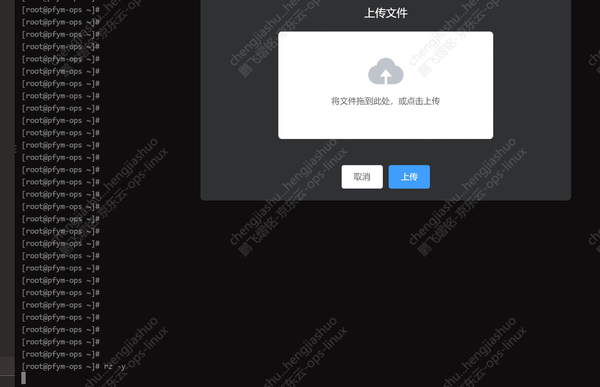
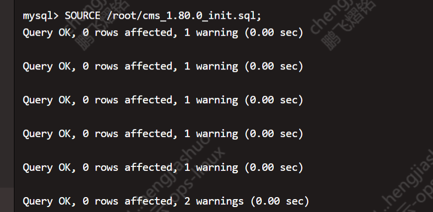

# 新增cms-service组件 

## 修改仓库配置
### phoenix.yaml
```commandline
  - rdsid: mysql0
    dbname: cms
    images:
      - cms-service

  # mongo
  mongo:
    - id: mongo
      hostid: middle0
      27017port: 27017
      username: root
      password: Qmy6nNjCDV6uth5E
      cfg_db: cms
      cfg_user: cms
      cfg_pass: 354iRlyNrNcDxWnL


      
  # cms服务组件，按需配置
  cms-service:
    - hostid: app0
      id: app0_cms-service-int_0
      port: 8018
      portjvm: 8618
      portssl: 8318
      tags: blue


```
### docker_environments.yaml
```commandline

phoenix-service-core.remote.cms.server: http://172.21.14.75:8018 # cms服务地址

cms-service:
  spring.security.user.name: cms
  spring.security.user.password: 354iRlyNrNcDxWnL
  mongo.config.db-name: cms
  mongo.config.url: mongodb://172.21.14.75:27017
  mongo.config.user: cms
  mongo.config.password: 354iRlyNrNcDxWnL


```

### 执行脚本 [cms_1.80.0_init.sql](https://gitlab.hd123.com/phoenix/doc/-/blob/master/%E8%BF%90%E7%BB%B4/cms_1.80.0_init.sql)

用rz -y 上传脚本"D:\Netease\桌面\jiaoben\cms_1.80.0_init.sql"到一台有mysql的机器

如果没有就装
```commandline
yum -y install mysql
```

然后进入cms库
```
mysql -u phoenix -pKlWdyRD1mXQnbBjT -h mysql-cn-north-1-9085950b6328418c.rds.jdcloud.com -P 3306 cms
```


```commandline
-- 查看当前数据库
SELECT DATABASE();

--  使用绝对路径执行脚本文件
 
SOURCE /root/cms_1.80.0_init.sql;
```



### 4、cms-service服务没有setup镜像;需要单独执行[cms_1.80.0_init.sql](https://gitlab.hd123.com/phoenix/doc/-/blob/master/%E8%BF%90%E7%BB%B4/cms_1.80.0_init.sql) 以及部署mongodb 
### 5.使用CRM_deploy_one部署应用

 
###  6.网关初始化 JOB CRM_Gateway
```
使用Jenkins JOB: 
（action参数选择update）
 ```
 
###  7、使用GLOBLE_deploy_nginx部署nginx
 
##### 部署Job：`GLOBLE_deploy_nginx`
- 产品选型：crm
- 环境：integration_test
- 提交tags：update

