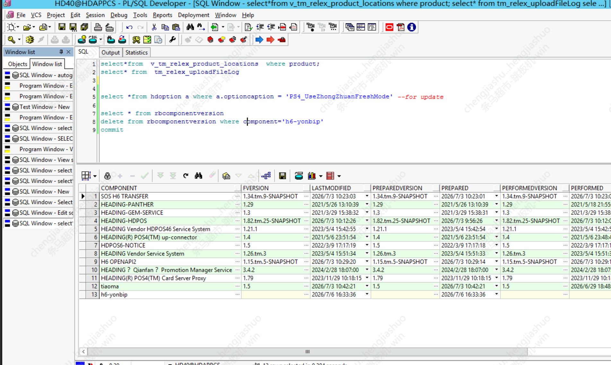

 
## 条马超市-新增组件 

## 1.前期配置修改

 
## 1.1 Jenkins 
#### project-app.yml：
#### project-db.yml： 

## 1.2erp分支
### 1.2.1 int
#### erp.csv
#### apollo.yaml(namespace_admins和project_admins加上提单人)
#### app.yaml 加上

```commandline
#################################################
#h6-yonbip-service版本
h6yonbipservice_version: "1.0"
#h6-yonbip-service端口
h6yonbipservice_webport: 38341
#h6-yonbip-service管理端口
h6yonbipservice_managerport: 39341
#h6-yonbip-serviceJMX端口
h6yonbipservice_jmxport: 37341
#h6-yonbip-serviceJVM配置，可选值[jvm_2G,jvm_3G,jvm_4G,jvm_5G,jvm_6G,jvm_7G,jvm_8G]
h6yonbipservice_jvm: "jvm_4G"
#################################################

 
```


### 1.2.2 production

#### erp.csv
#### apollo.yaml(namespace_admins和project_admins加上提单人)
#### app.yaml 加上
 
```commandline
#################################################
#h6-yonbip-service版本
h6yonbipservice_version: "1.0"
#h6-yonbip-service端口
h6yonbipservice_webport: 18341
#h6-yonbip-service管理端口
h6yonbipservice_managerport: 19341
#h6-yonbip-serviceJMX端口
h6yonbipservice_jmxport: 17341
#h6-yonbip-serviceJVM配置，可选值[jvm_2G,jvm_3G,jvm_4G,jvm_5G,jvm_6G,jvm_7G,jvm_8G]
h6yonbipservice_jvm: "jvm_4G"
#################################################
```
(注意端口号，测试用3xxxx，正式用1xxxx)
(注意和erpcmdb.yaml文件里的host_id对应，是部署在哪一台机器)


## 1.3 deveop分支 
###  openresty_config/erp/integration_test

#### hdpos.conf：
#### upstream.conf

###  openresty_config/erp/production

#### hdpos.conf：
#### upstream.conf：

注意端口号不一样 测试3xxxx，正式1xxxx


## 2.执行 GLOBLE_update_jenkins_config，
##执行 http://ci.hddomain.cn/job/ka_gen_cmdb/

## 3.数据库部署（ERP_db_deploy_int） 
## 4.应用部署（ERP_app_deploy_int）
## 5.执行 GLOBLE_deploy_nginx(不发布公网就不需要)
## 6.提交wiki


## 可能遇到的问题:

如果第一次执行setup 报错，出现 SQL 异常等问题。研发修复后需要再次执行setup的


小齿轮执行

需要先进h6 的数据库(注意是正式环境还是测试)，查询出要安装的应用在数据库中记录的component名称是什么，
如：h6-yonbip
先进入文件file-New-SQL-Windows

```
select * from rbcomponentversion;
```


删除这个应用在数据库的rbcomponentversion 的记录
```delete from rbcomponentversion where component='h6-yonbip';
```

注意在oracle 中，进行了增删改的动作后，一定要 commit 提交事务(否则增删改不生效)
```commit;
```
