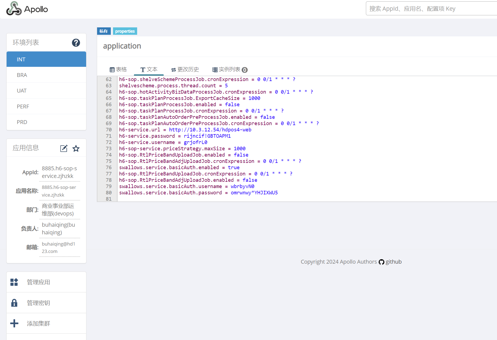
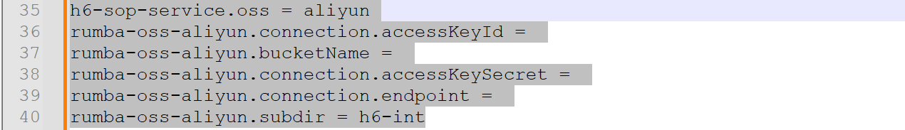

# 新增组件h6-sop-service

## 1.前期配置修改

 
## 1.1 Jenkins 
#### project-app.yml：
#### project-db.yml： 

## 1.2erp分支
### 1.2.1 int
#### erp.csv
 
#### app.yaml 加上这个组件(一般都有)
 
(注意端口号，测试用3xxxx，正式用1xxxx)
(注意和erpcmdb.yaml文件里的host_id对应，是部署在哪一台机器)


## 1.3 deveop分支 
###  openresty_config/erp/integration_test

#### hdpos.conf：
#### upstream.conf
 

注意端口号不一样 测试3xxxx，正式1xxxx


## 2.执行 GLOBLE_update_jenkins_config，
 
## 3.数据库部署（ERP_db_deploy_int） 
## 4.应用部署（ERP_app_deploy_int）(勾选首次安装)
## 5.执行 GLOBLE_deploy_nginx
## 6.删除Apollo的关于oss的相关配置(否则502)
 

```commandline
h6-sop-service.oss = aliyun
rumba-oss-aliyun.connection.accessKeyId = 
rumba-oss-aliyun.bucketName = 
rumba-oss-aliyun.connection.accessKeySecret = 
rumba-oss-aliyun.connection.endpoint = 
rumba-oss-aliyun.subdir = h6-int
```

## 7.重新应用部署（ERP_app_deploy_int）(不要勾选首次安装)
## 8.提交wiki


 