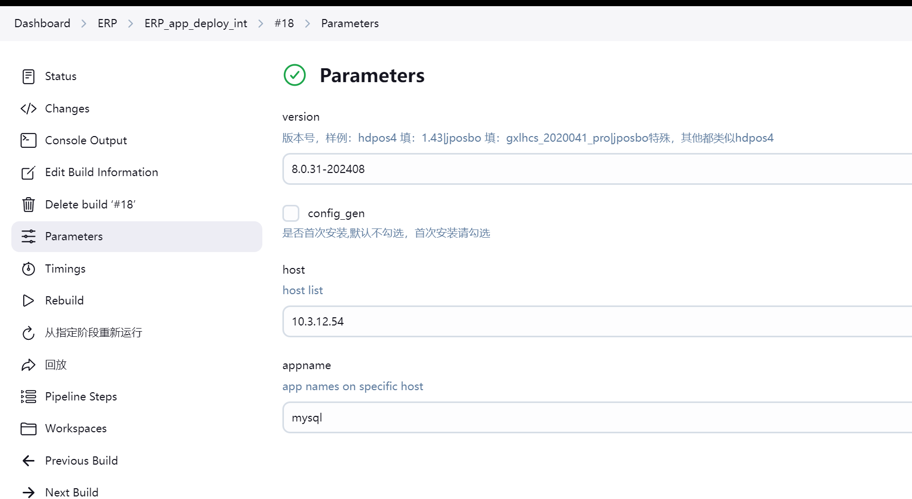
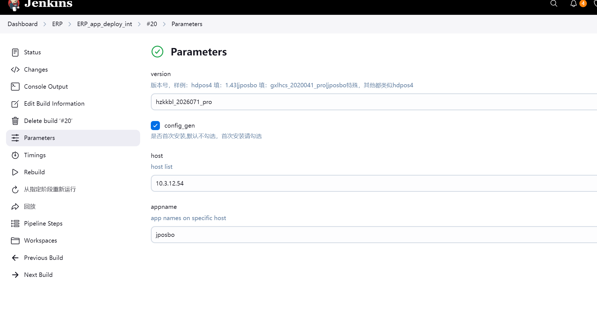
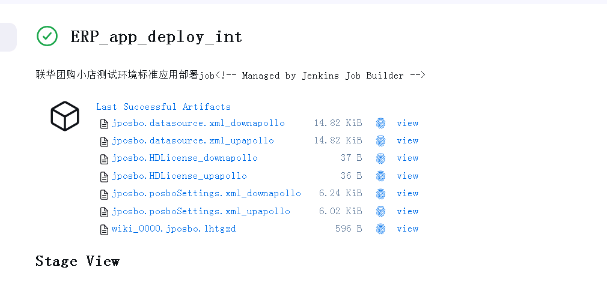
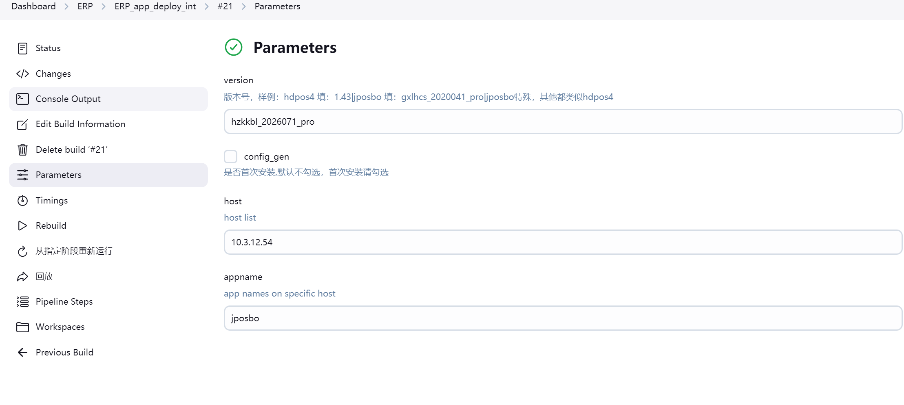
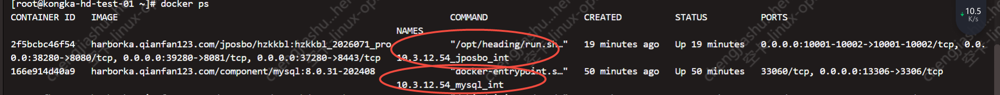
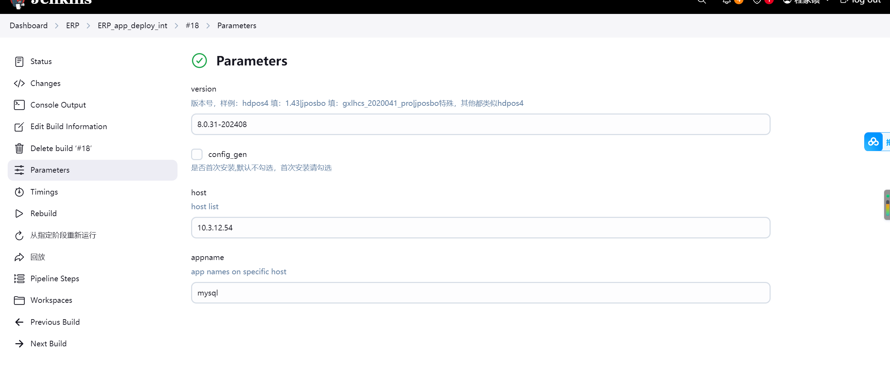

# 新增组件——jposbo


#### 1、基于https://gitlab.hd123.com/JPOS/jpos-git/-/tree/develop/docker/release/{客户编码} 的
datasource.xml、posboSettings.xml、HDLicense.properties 文件模板
#### 2、在http://github.app.hd123.cn/qianfanops/ka-toolset 基于cd_new 分支新拉分支
#### 3、在http://github.app.hd123.cn/qianfanops/ka-toolset/-/tree/新分支/ka_deploy/roles/jposbo/templates/{客户编码}/补充datasource.xml.j2、posboSettings.xml.j2、HDLicense.properties.j2 的部署模板，注意替换关键信息：数据库、服务地址等。替换为j2 变量
#### 4、在新分支补充模板配置后，合并到cd_new 分支，可参考http://github.app.hd123.cn/qianfanops/ka-toolset/-/merge_requests/1824
#### 5、查看http://ci.hddomain.cn/job/pack-ka-toolset-oss/是否打包完成
#### 6、打包完成后，即可生成 apollo 配置


## 1.前期配置修改


## 1.1 Jenkins 
#### project-app.yml：

## 1.2erp分支
### 1.2.1 int
#### erp.csv
#### apollo.yaml(namespace_admins和project_admins加上提单人)
#### app.yaml 加上


```commandline
jposbo_client: "hzkkbl"
 
jposbo_version: "hdpos46std_2018121_pro"
 
####-Mysql的配置###########################
#-Mysql服务ip,默认本机
jposbo_mysql_host: "172.16.65.236"
#-Mysql端口
jposbo_mysql_port: '{{mysql_port}}'
#-Mysql创建数据库名称
jposbo_mysql_database: '{{mysql_database}}'
#-Mysql创建数据库用户
jposbo_mysql_user: '{{mysql_user}}'
#-Mysql创建数据库用户密码
jposbo_mysql_password: '{{mysql_password}}'
#是否要skip license check, 公司内部将这个参数设置为true不做验证，默认为false
skip_license_check: false
```  
## 1.3 deveop分支
#### hdpos.conf：
#### upstream.conf

## 2.执行 GLOBLE_update_jenkins_config，
 

 
## 3.应用部署(ERP_app_deploy_int)
#### 3.1先部署mysql(依赖数据库mysql)

#### 3.2 应用部署 jposbo(执行首次安装)

#### 3.3 手动上传渲染后的配置


#### 3.4 应用部署 jposbo(不执行首次安装)
 

## 5.执行 GLOBLE_deploy_nginx(h6_full_table这个文件判断要不要发布公网)
## 6.提交wiki




