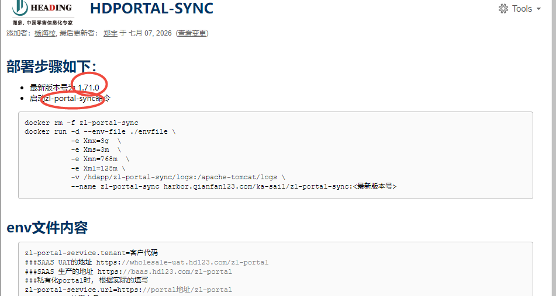

##  版本号和组件名称



## 1.前期配置修改

 
## 1.1 Jenkins 
#### project-app.yml：
#### project-db.yml： 


## 1.2erp分支
### 1.2.1 int
#### erp.csv
#### apollo.yaml(namespace_admins和project_admins加上提单人)
#### app.yaml 添加数据库的信息

```commandline


#################################################
#zl-portal-sync版本
zlportalsync_version: "1.13.0"
#zl-portal-sync端口
zlportalsync_webport: 38298
#zl-portal-syncjmx端口
zlportalsync_jmx_port: 39298
#zl-portal-sync管理端口
zlportalsync_managerport: 9837
#zl-portal-sync数据库地址
zlportalsync_rdb_url: 'jdbc:oracle:thin:@10.3.12.54:1521:hdposcs'
#zl-portal-sync数据库用户
zlportalsync_rdb_user: 'hd40'
#zl-portal-sync数据库密码
zlportalsync_rdb_pwd: 'h*aoyd0njRN0l'
#################################################

```