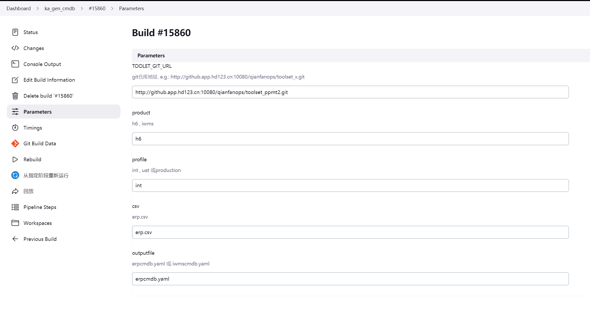

## 泡泡玛特-新增节点spms

## 1.前期配置修改
 
## 1.1 Jenkins 
#### project-app.yml：
```commandline

               groovy: |-
                    return (host.equals('172.28.18.181'))? ["license-server","redis","spms-hdpos-web","rumba-oss-server","oss-mysql","hdpos4-dist","jposbo","gem-service","hdpos6-notice-service","ppmt-web",'ppmt-webexternal',"mysql","panther-dts-server","panther-taskweb","h6-openapi2-service",'h6-openapi2-serviceexternal',"pasoreport-web","vss-spider-server","bpfm-app-service","ppmt-product-web-service","card-server-proxy-service","door-service",'init-tool','pasoreport-webauth','ras-h4-transfer','sas-h4-transfer','spms-stdpms-transfer','gateway-service',"zl-portal-sync","mkh-mas-transfer-server","sos-h6-transfer-service"]:
                    (host.equals('172.28.18.183'))? ['gateway-service',"spms-hdpos-web"]:
                    (host.equals('172.28.18.100'))? ['ppmt-web']:[]
```

## 1.2erp分支
### 1.2.1 int
#### erp.csv(注意和erpcmdb.yaml文件里的host_id对应，是部署在哪一台机器)
``` 9756,bjppmt,app-01,1.54.0,blue,zl-portal-sync,harbor.qianfan123.com/ka-sail/zl-portal-sync,backend,38298,9837,39298,15
9756,bjppmt,app-03,1.48-alpha.202511201906,blue,ppmt-web,harborka.qianfan123.com/component/ppmt-web,backend,38092,39092,9784,15
9756,bjppmt,app-01,1.65.2,blue,sos-h6-transfer-service,harborka.qianfan123.com/hdpos46/sos-h6-transfer-service,backend,38135,19135,9773,15
9756,bjppmt,app-01,1.31.0,blue,mkh-mas-transfer-server,harbor.qianfan123.com/mas/mkh-mas-transfer-server,backend,38201,39201,37201,15
9756,bjppmt,app-02,3.31.ppmt.2,blue,spms-hdpos-web,harborka.qianfan123.com/component/spms-hdpos-web,backend,38115,39115,9752,15
```
 
## 1.3 deveop分支 
###  openresty_config/erp/integration_test

#### hdpos.conf：


#### upstream.conf

```commandline

upstream spms-hdpos-web {
      server 172.28.18.181:38115;#spms-web应用的服务器ip和端口
      server 172.28.18.183:38115;#spms-web应用的服务器ip和端口
}

```


## 2.执行 GLOBLE_update_jenkins_config

 
## 3.执行 http://ci.hddomain.cn/job/ka_gen_cmdb/



## 4.应用部署（ERP_app_deploy_int）
## 5.执行 GLOBLE_deploy_nginx 
## 6.提交wiki


 