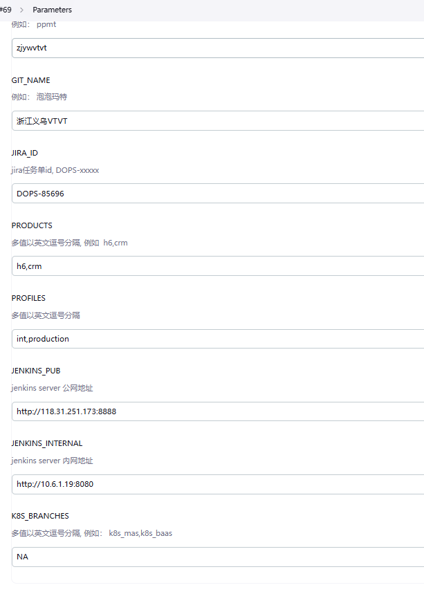
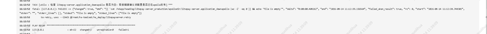

# ERP部署问题排查手册

## 一、数据库相关问题

### 问题1：ORA-01017 – 用户名/密码无效

现象 
执行`ERP_db_deploy_int` Job时报错：
> ORA-01017: invalid username/password; logon denied

**原因**
- 数据库用户`hd40`的密码与配置文件中不一致。  
- 可能是密码被修改过，或初始密码未正确设置。

**完整解决步骤**

方法一：

1. **登录数据库服务器**

erp -all.yaml查看正确密码

2. **重新执行ERP_db_deploy_int Job**


### 问题2：hd40用户状态异常需重建

**现象**  
- Job构建失败，日志提示用户`hd40`相关错误。  
- 密码正确但仍无法执行初始化脚本。

**原因**  
- 用户对象损坏或权限混乱。  
- 之前部署中断导致用户处于不一致状态。

**完整解决步骤**  
1. **以sysdba登录**  
   ```bash
   sqlplus / as sysdba
   ```
2. **强制删除用户及其所有对象**  
   ```sql
   drop user hd40 cascade;
   ```
3. **重新执行ERP_db_deploy_int**  
   - 该Job会自动重建用户并初始化表结构。

---

## 二、Jenkins配置与构建问题

### 问题4：JSON解析失败 + Docker挂载异常

**现象**  
执行`GLOBLE-update-jenkins-jobs`或类似脚本时，先后出现：
- JSON解析失败
- Docker容器挂载异常（如`cannot mount file over directory`）

**原因**  
- Jenkins Job Builder (JBJ)配置中的Jenkins地址非法（如`<input>`未被替换）。  
- `/jenkins_jobs.ini`被错误生成为**目录**而不是普通文件，导致Docker无法将其作为文件挂载。

**完整解决步骤**  
1. **检查并删除异常目录**  
   ```bash
   ls -ld /jenkins_jobs.ini   # 如果是目录，则删除
   rm -rf /jenkins_jobs.ini
   ```
2. **在根目录重建配置文件**  
   ```bash
   touch /jenkins_jobs.ini
   vim /jenkins_jobs.ini
   ```
3. **填充有效配置**（至少包含正确的Jenkins URL和认证信息）  
   ```ini
   [jenkins]
   url=http://172.17.12.179:8080/
   user=admin
   password=xxx
   ```
4. **重新执行构建脚本**，观察日志确认Git拉取、容器启动、任务编译均正常。

---

### 问题5：yaml.load废弃警告

**现象**  
Jenkins构建日志中出现：
> DeprecationWarning: yaml.load() without Loader=... is deprecated

**原因**  
- 新版`pyyaml`库要求显式指定Loader。  
- 旧脚本使用了`yaml.load()`的旧写法。

**解决**  
- **警告不影响配置写入**，凭据、系统变量、Jenkins配置均正常生效。  
- 无需修改代码，可忽略。  
- 若未来版本升级导致报错，则需改为：
  ```python
  yaml.load(stream, Loader=yaml.FullLoader)
  ```

---

### 问题6：all.yaml配置错误导致构建失败

**现象**  
`ERP_db_deploy_int`或`ERP_app_deploy_int`构建失败，日志提示参数解析错误或空值。

**原因**  
- `all.yaml`中存在多处错误：
  - 数据库实例名有多余字符（如`hdposcs`写成了`hdposcs_extra`）
  - 大量`<input>`空参数未填写
  - 地址/端口格式不正确

**完整解决步骤**  
1. **检查`all.yaml`中的关键参数**  
   - `version`
   - `mode`（如`setup_db`）
   - `appname`
   - `db_url`
   - `rdbuser`
   - `rdbpwd`

2. **修正为标准配置**（示例）  

| 参数 | 取值 |
|------|------|
| version | 根据实际版本填写 |
| mode | setup_db |
| appname | hdpos4-dist |
| db_url | jdbc:oracle:thin:@172.17.12.179:1521:hdposcs |
| rdbuser | hd40 |
| rdbpwd | 实际密码 |

3. **保存后重新触发Job**

---

### 问题7：project-app.yml / project-db.yml下拉列表内容缺失

**现象**  
Jenkins Job页面中，应用名称或数据库连接下拉框为空或缺少部分组件。

**原因**  
- Groovy脚本中的条件判断不完整。  
- 新增组件未加入清单。  
- 数据库连接未按应用名正确映射。

**完整解决步骤**  

**project-app.yml修正示例**  
```groovy
groovy: |-
    return (host.equals('172.17.12.179')) ? 
        ["hdpos4-dist","panther-dts-server","h6-crm-service","redis","oss-mysql"] : 
        []
```

**project-db.yml修正示例**  
```groovy
groovy: |-
    return (appname.equals("hdpos4-dist")) ? ["jdbc:oracle:thin:@172.17.12.179:1521:hdposcs"] :
           (appname.equals("h6-crm-service")) ? ["jdbc:oracle:thin:@172.17.12.179:1521:hdposcs"] :
           []
```

**后续操作**  
1. 修改配置文件并提交到配置仓库（如`toolset_chengjiashuo`）  
2. 执行`GLOBLE-update-jenkins-jobs`刷新Job  
3. 重新打开Job页面，验证下拉列表正常显示

---

### 问题8：rumba-oss-server部署失败（首次安装选项问题）

**现象**  
`ERP_app_deploy_int`中构建`rumba-oss-server`失败，日志无明显SQL或网络错误。

**原因**  
- 部署逻辑发生过变更：该组件在集成环境中不允许勾选“首次安装”。  
- 勾选后会重复执行初始化操作，导致冲突。

**解决**  
- 在`ERP_app_deploy_int`构建页面中，**不勾选**`首次安装`选项。  
- 重新触发构建。

---

### 问题9：extranetip不能为空

**现象**  
`ERP_app_deploy_int`构建失败，日志显示：
> failed: [127.0.0.1] (item=extranetip)  
> msg: "extranetip 不能为空或者<input"

**原因**  
- 配置文件`erpcmdb.yaml`中的`extranetip`字段保留了默认占位符`<input>`，未被实际IP替换。

**完整解决步骤**  
1. **打开环境配置文件**  
   ```bash
   vim int/erpcmdb.yaml
   ```
2. **修改`extranetip`**  
   ```yaml
   extranetip: 172.17.12.179   # 替换为实际部署主机IP
   ```
3. **提交代码到配置仓库**  
4. **重新执行ERP_app_deploy_int**

---

## 三、Nginx/网关相关问题

### 问题10：GLOBLE_deploy_nginx部署失败

**现象**  
执行网关部署Job失败，日志提示连接超时或目标不可达。

**原因**  
- `erpcmdb.yaml`中配置的Nginx目标服务器IP错误或不可达。  
- 例如写成了`172.17.12.225`，而实际部署机器是`172.17.12.179`。

**完整解决步骤**  
1. **检查`erpcmdb.yaml`中的主机配置**  
   ```yaml
   hosts:
     - host_id: erp_nginx
       ip: 172.17.12.179   # 确保IP正确
   ```
2. **修正错误的IP地址**  
3. **提交代码**  
4. **重新执行`GLOBLE_deploy_nginx`**  
5. **验证**：`curl`测试各个应用的访问域名，确认反向代理生效

---

## 四、其他环境/工具问题

### 问题11：PyCharm启动失败 – PID占用锁文件

**现象**  
启动PyCharm时弹出Internal Error，提示：
> Process ... is still running and does not respond  
> Address already in use  
> .lock file is corrupted

**原因**  
- PyCharm异常闪退后，后台残留进程（`pycharm64.exe`/`java.exe`）。  
- 锁文件未被清理。

**完整解决步骤（Windows）**  
1. **强制结束残留进程**  
   ```cmd
   taskkill /F /IM pycharm64.exe
   taskkill /F /IM java.exe
   ```
2. **删除锁文件**（通常在IDE缓存目录下，如`%USERPROFILE%\.PyCharm版本\system\caches`）  
3. **重新启动PyCharm**

---

### 问题12：远程连接工具闪退

**现象**  
安装或操作过程中，Xshell/SecureCRT等工具突然退出，会话断开。

**注意**  
- **不要删除会话和日志**，后续排查问题需要回溯操作记录。  
- 建议重新连接后，检查是否触发了某些脚本导致会话被杀。

---
### 问题13：本地修改配置 未提交远程（vtvt）
 
--- 

 
## 1. OOM（内存溢出）导致实例重启
### 现象：阿里云控制台显示“实例因操作系统内出现了OOM”
### 原因：16GB 内存同时运行 Oracle + 多个微服务 + 中间件，内存不足
### 解决办法：将 ECS 实例从 4核16GB 升级到 8核32GB
### 验证：free -h 确认内存变为 32GB
### 注意：后续购买机器的话 要参考已有项目


 ## 2. GLOBLE_deploy_nginx执行失败
### 原因：hdpos.conf配置错误
### 解决办法：

#### 1.首先考虑容器openresty看日志
```commandline
docker ps -a|grep openresty_check
docker logs openresty_check
```
#### 2.修改hdpos.conf配置
#### 3.重新执行job
 

 ## 3. 服务pasoreport-web没起来
### 原因：依赖的redis地址写错
如图：


### 解决办法：修改redis地址(文本拉到本地统一替换地址),要点发布


 

 ## 4. 部署hdpos4 job执行失败
### 原因：许可证字段问题
### 解决办法：
#### 1.去如下目录的updatelic.sh文件改一下user字段

- /hdapp/heading/hdpos4-dist_int/rdb/setup
####  如图
 
#### 连接数据库去改(注意要提交)
```bash
SELECT * FROM store
```

 


  ## 4.  检查应用是否部署成功
#### 组件hdpos6-notice-service.访问即可
http://47.96.228.102/notice
####  其他带公网的直接公网加域名，如
http://47.96.228.102/pasoreport-web

  
## 问题 、Jenkins 部署报错：Permission denied


**现象**：线下产品（ERP、CRM）Jenkins 部署时报错 `Permission denied, please try again.`

**原因**：一般是 Jenkins 服务器到本机以及各个应用服务器的免密登录失效导致的。


## 前置知识：SSH 公钥/私钥是什么

> 记住核心类比：**私钥=钥匙（揣兜里不外传）**，**公钥=锁（装别人门上）**，**`authorized_keys`=门上的锁孔集合**。

### 三个关键文件

| 文件 | 类比 | 位置 | 说明 |
|------|------|------|------|
| `id_rsa` | 🔑 钥匙 | 自己兜里 | 私钥，绝不外传，用于解锁 |
| `id_rsa.pub` | 🔒 锁 | 拿给别人装 | 公钥，可以到处分发 |
| `authorized_keys` | 🚪 锁孔集合 | 目标机器门上 | 里面装谁的锁，谁就能免密进来 |
### 工作流程

```
Jenkins 容器（发起方）              应用服务器（接收方）
┌────────────────────┐            ┌──────────────────────────┐
│ id_rsa（钥匙揣兜里） │ ─ssh连接─▶ │ authorized_keys（锁孔集合）  │
│ id_rsa.pub（锁亮出来）│            │ 必须装有 Jenkins 的锁才行     │
└────────────────────┘            └──────────────────────────┘
```

- **配对上了** → 免密登录成功，Jenkins 部署正常
- **配对不上** → `Permission denied, please try again.`

### Shell 小技巧：`>` 和 `>>` 的区别

| 符号 | 含义 | 效果 |
|------|------|------|
| `>` | 覆盖重定向 | **清空原内容**，写入新内容（危险！慎用！） |
| `>>` | 追加重定向 | **保留原内容**，在末尾追加新内容 |

> 往 `authorized_keys` 追加公钥时必须用 `>>`，否则会把已有的锁全删掉。

---

### 排查步骤

#### 1. 进入 Jenkins 容器，测试免密登录

```bash
docker exec -it jenkins-server bash
```

#### 2. 尝试免密登录 Jenkins 服务器本机

以 IP `192.168.1.1` 为例：

```bash
ssh 192.168.1.1
```

- **2.1 若提示需要输入密码**，则需给 Jenkins 本机做免密（将 ssh 公钥追加到本机的 `authorized_keys` 文件内）：

  ```bash
  cat ~/.ssh/id_rsa.pub >> ~/.ssh/authorized_keys
  ```

- **2.2 再次 ssh 到本机**，查看是否已可以免密登录。

#### 3. 尝试免密登录各个应用服务器

以应用服务器 IP `192.168.1.2` 为例：

```bash
ssh 192.168.1.2
```

- **3.1 若提示需要输入密码**，则需要把 Jenkins 服务器的 ssh 公钥内容追加到应用服务器中（在 Jenkins 容器内执行）：

  ```bash
  cat ~/.ssh/id_rsa.pub
  # 返回的内容一般是 ssh-rsa AAAA...
  ```

- **3.2 登录应用服务器**，将 Jenkins 容器内拿到的 ssh 公钥内容复制追加到应用服务器内：

  ```bash
  vim ~/.ssh/authorized_keys
  ```

  新起一行，增加内容：

  ```
  ssh-rsa AAAA....
  ```

  > 这里为了篇幅后半部分内容使用 `....` 代替，实际则需要把全部内容复制粘贴。

#### 4. 再次尝试免密登录

如果免密没有问题，则 Jenkins 部署恢复正常。

#### 5. 上述尝试仍无法通过 Jenkins 部署的排查思路

- **5.1 检查各个服务器的受信任文件路径**

  确认是否为 `~/.ssh/authorized_keys`，如果不是则需要修改：

  ```bash
  grep 'AuthorizedKeysFile' /etc/ssh/sshd_config
  ```

- **5.2 重新设置 .ssh 目录及文件权限**

  ```bash
  # 700 表示只有 owner 有读写执行权限，其他人无权访问
  chmod 700 ~

  # 确保 .ssh 目录权限正确
  chmod 700 ~/.ssh

  # 确保 authorized_keys 文件权限正确
  chmod 600 ~/.ssh/authorized_keys
  ```
 ## 6. 部署nginx拉镜像不成功执行失败
### 报错：

### 原因： 无权限
### 解决办法：
 

#### 步骤1: 登录Harbor
docker login harbor.qianfan123.com
#### 输入用户名和密码

#### 步骤2: 手动拉取镜像
docker pull harbor.qianfan123.com/base/openresty:1.25-202504


 ## 6. app部署不成功
### 报错：检查Apollo配置empty
  
 
### 解决办法：

#### 步骤1: 登录Harbor
curl http://apollo-portal.hd123.com/openapi/v1/envs/PRD/apps//clusters/default/namespaces/application/releases/latest
 

#### 步骤2: 开放白名单

 


## 用到命令：


## 查看容器日志（最后50行）
docker logs --tail 50 <容器名或ID>

## 实时查看日志
docker logs -f <容器名或ID>
docker logs --tail 50 -f <容器名或ID>

## 进入容器内部
docker exec -it <容器名> bash

## 在容器内执行命令
docker exec <容器名> <命令>


# 查看db安装日志

/hdapp/heading/hdpos4-dist_int/rdb/setup/hdpos4-dist-setup-2.15.log
tail -50 hdpos4-dist-setup-2.15.log 

