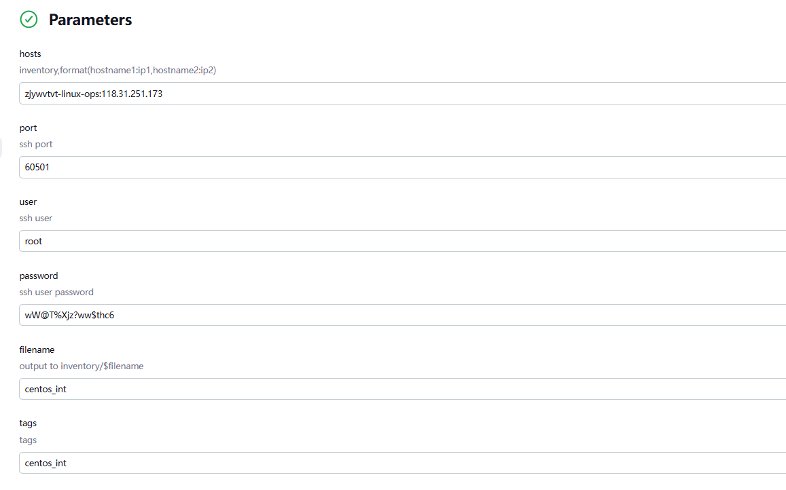
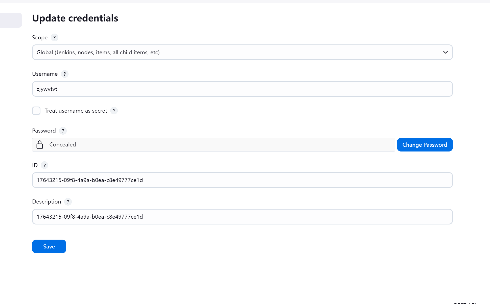
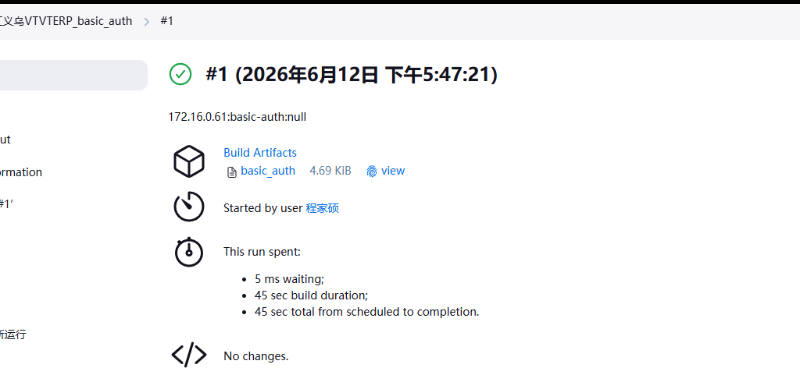

# ERP全流程部署实施文档


### 6.2.1 中间件安装
  - redis：必须部署。版本为：2.8
  - license-server：必须部署。版本为：1.2.5
  - oss-mysql：如果部署oss则必须要部署此中间件。版本为5.7.14
  - rumba-oss-server：如果部署spms组件才需要部署此中间件。版本为：2.17.1
  -  mongo版本 mongo_version: '4.4.10-hd'(hdpos-wms-service这个组件需要)
  -  jposbo需要mysql(5.7.14)


  
### 1.1 部署架构
`Git配置仓库 → Jenkins自动化流水线 → Harbor镜像仓库 → OpenResty反向代理网关 → 前端访问`
### 1.2 核心组件与角色映射
#### 1.2.1 Apollo (统一配置中心)：
在服务拉起前预先创建，为后续启动的各个微服务提供统一的动态配置(通过 apollo_token 鉴权)。
#### 1.2.2 Git (Toolset 仓库)：
 包含三个核心分支
- jenkins 分支：管理 Jenkins 本身的配置(JCasC)以及自动化 Job 的生成模板
- erp 分支：管理微服务的部署清单(erp.csv 记录版本、镜像、端口)和全局基础参数(all.yaml、app.yaml
- develop 分支：管理网关路由转发规则(OpenResty 的 hdpos.conf 和 upstream.conf)
#### 1.2.3 jenkins (执行引擎)： 部署在 OPS 宿主机上(Docker 容器化)，通过免密登录(SSH)控制目标应用服务器。它读取 Git 仓库中的“图纸”，自动生成 Job，并执行具体的拉取镜像、启动容器等动作
#### 1.2.4 Harbor (镜像仓库)： 存储所有中间件和业务微服务(如 hdpos4-dist, jposbo)的 Docker 镜像
#### 1.2.5目标服务器 (如 172.16.0.61)：承载 Oracle 数据库、中间件(Redis, OSS-MySQL, License-server)以及最终运行的业务容器
#### 1.2.6 OpenResty (流量网关)：作为反向代理，接收外部前端的 HTTP 请求，并根据配置路由到后端目标服务器上对应的微服务端口(如将流量打到 38180 端口的 hdpos4-dist)。

## 2. 前期资源筹备工作
 
提前需要知道的信息:
 apollo创建

- 客户编码(如:zjywvtvt)
- 客户代码(如: 8881)
- openapi_token (apollo token)
- 各个应用组件名称
- 授权用户信息即可

Toolset仓库申请

- 客户编码(如:zjywvtvt)
- GIT_NAME(如：浙江义乌VTVT)
- JIRA_ID (任务单号)
- PRODUCTS (需要部署的产品)
- PROFILES (需要部署的环境)
- JENKINS_PUB (Jenkins的公网地址)
- JENKINS_INTERNAL (Jenkins的内网地址)
- K8S_BRANCHES (toolset_x中需要增加的k8s分支)


### 2.1 apollo创建
 
| 参数名           | 说明                                                         | 当前值                                                                                                                                                                                                                                   |
| ---------------- | ------------------------------------------------------------ |---------------------------------------------------------------------------------------------------------------------------------------------------------------------------------------------------------------------------------------|
| apps             | 定义需要申请开通Apollo的应用组件列表，多值以英文逗号分隔，如：hdpos4-dist,jposbo | `hdpos4-dist、jposbo、pasoreport-web、sos-h6-transfer-service、spms-hdpos-web、h6-crm-service、panther-dts-server、panther-taskweb、up-connector-service、gem-service、init-tool、h6-openapi2-service、openapi-doc-service、hdpos6-notice-service` |
| alias            | 客户简称，比方nmgIkbl                                         | `zjywvtvt`                                                                                                                                                                                                                            |
| custom_code      | 客户编码，比方9999                                            | `8881`                                                                                                                                                                                                                                |
| jira_id          | Jira任务单ID，如：DOPS-75558                                  | `DOPS-85786`                                                                                                                                                                                                                          |
| openapi_token    | Apollo开放平台token                                          | 创建Apollo时候openapi_token要写git里的 不要默认                                                                                                                                                                                                                          |
| project_admins   | 项目管理员权限，多值以英文逗号分隔                            | shujun,yaobohai,zhaochenhao,chengjiashuo,提单人                                                                                                                                                                                          |
| namespace_admins | namespace可修改、发布权限，多值以英文逗号分隔                  | shujun,yaobohai,zhaochenhao,chengjiashuo,提单人(同上)                                                                                                                                                                                      |

地址：
http://ci.hddomain.cn/job/create_ka_apollo_appid/


### 2.1 私有化Toolset仓库申请
申请专属私有化配置仓库：`http://github.app.hd123.cn/qianfanops/toolset_zjywvtvt `

申请地址：
http://ci.hddomain.cn/view/%E8%BF%90%E7%BB%B4/job/create_new_toolset/

| 参数名             | 说明                                       | 当前值                                |
| ------------------ | ------------------------------------------ |------------------------------------|
| `GIT_USERNAME`     | -                                          | `zjywvtvt`                         |
| `GIT_NAME`         | 例如：泡泡玛特                             | `浙江义乌VTVT`                         |
| `JIRA_ID`          | jira任务单id, DOPS-xxxxx                  | `DOPS-85696`                       |
| `PRODUCTS`         | 多值以英文逗号分隔, 例如 h6,crm            | `h6,crm`                           |
| `PROFILES`         | 多值以英文逗号分隔                         | `int,production`                   |
| `JENKINS_PUB`      | jenkins server 公网地址                    | `http://118.31.251.173:8888`(项目清单) |
| `JENKINS_INTERNAL` | jenkins server 内网地址                    | `http://10.6.1.19:8080`(项目清单)      |
| `K8S_BRANCHES`     | 多值以英文逗号分隔, 例如: k8s_mas,k8s_baas | `NA`                               |


 

## 3. OPS宿主机环境初始化(用jenkins——global_centos_int这个job 不用docker run命令)
## http://172.17.11.182:8888/job/GLOBLE_Centos_Init/ 
  


 

### 3.1 部署Jenkins(在ops机器上手工执行命令 在dnet用户下面)
dnet用户下面
dnet用户下面


```shell
docker pull harbor.qianfan123.com/jenkins/jenkins-server:2.492.1-lts-hd
docker rm -f jenkins-server
docker run -d --restart always --security-opt seccomp=unconfined --name jenkins-server\
  -p 8080:8080 \
  -p 50000:50000 \
  -e JAVA_OPTS="-Xms256m -Xmx2048m -XshowSettings:vm -Dhudson.slaves.NodeProvisioner.initialDelay=0 -Dhudson.slaves.NodeProvisioner.MARGIN=50 -Dhudson.slaves.NodeProvisioner.MARGIN0=0.85 -Djenkins.install.runSetupWizard=false -Dorg.jenkinsci.plugins.gitclient.Git.timeOut=30 -Dorg.apache.commons.jelly.tags.fmt.timeZone=Asia/Shanghai" \
  -e JAVA_TOOL_OPTIONS="-Dfile.encoding=UTF-8 -Dsun.jnu.encoding=UTF-8" \
  -v /hdapp/jenkins/jenkins_home:/var/jenkins_home \
  -v ~:/root \
  -v ~:/home/dnet \
  -v $(which docker):/usr/bin/docker \
  -v /var/run/docker.sock:/var/run/docker.sock \
  harbor.qianfan123.com/jenkins/jenkins-server:2.492.1-lts-hd
docker exec jenkins-server sh /var/jenkins_home_tmp/setup.sh
sudo ln -s /hdapp/jenkins/jenkins_home /var/jenkins_home
docker restart jenkins-server
```

## 3.2 部署完成后发布公网
- 白名单添加公司固定通道ip：116.228.14.192/29,116.228.14.96/29,117.144.176.248/29,58.246.166.14,117.184.130.206**


## 3.2 部署完成后负载均衡发布公网
部署完jenkins之后应该通过负载均衡发布到公网，并且添加白名单，如果不做就需要使用windows服务器内网访问


## 3.3 配置凭证和git仓库地址
####   地址：http://1xxxx:8080/manage/credentials/
 
####  仓库密码：http://gitlab.app.hd123.cn/-/ide/project/qianfanops/toolset_zjywvtvt/tree/jenkins/-/config/jenkins.yaml/

####  仓库地址：http://11xxxx:8080/job/GLOBLE_update_jenkins_config/configure

####  仓库地址 http://1xxxx:8080/job/GLOBLE-update-jenkins-jobs/configure

64解码 https://base64.us/

### 3.4 配置免密登录(ERP 应用均使用普通用户 dnet 执行部署升级)

#### 3.4.1ops服务器执行

## 已更新优化,不需要分发密钥，但仍然需要手动执行下vim /home/dnet/.ssh/config
```commandline
    docker exec -it jenkins-server ssh-keygen

    docker exec -it jenkins-server ssh-copy-id dnet@172.16.0.61(应用服务器1)

    docker exec -it jenkins-server ssh-copy-id dnet@应用服务器2
```

## centos_init 这个 Ansible 任务需要复制 SSH 公钥到目标机器在 Jenkins 容器中找到对应的公钥文件。
## 要ops机器root用户下执行一下来创建公钥(如果是老项目 不要执行如下)
root用户
root用户
```
sudo su -
```
#### 注意 如果是老项目 不要执行如下
```
ssh-keygen
```
#### 老项目，执行这个就可以s
```
ssh-copy-id dnet@172.31.1.120
ssh-copy-id root@172.31.1.12
```
如果没执行 会有报错信息：
```
TASK [centos_init : copy ssh key root] *****************************************
fatal: [cjs-app]: FAILED! => {"msg": "No file was found when using first_found. Use errors='ignore' to allow this task to be skipped if no files are found"}

```
```bash
vim /home/dnet/.ssh/config
Host 192.168.5.3
    HostName 192.168.5.3
    Port 22
    User dnet
    IdentityFile ~/.ssh/id_rsa
    
Host 172.16.65.229
    HostName 172.16.65.229
    Port 22
    User dnet
    IdentityFile ~/.ssh/id_rsa

```

## 3.app机器初始化(用ops机器把app的主机初始化 jenkins——global_centos_int这 )

## 要先在ops机器手动执行 root用户生效
```bash
ssh-keygen
```
## http://xxx:8080/job/GLOBLE_Centos_Init/ 

#### 3.4.2校验免密是否配置成功
执行以下命令，不需要输入密码，即可返回ok，则配置成功

```BASH
docker exec -it jenkins-server ssh dnet@10.0.1.31 echo 'ok'
```
## 4.toolset配置修改
### 4.1  jenkins分支修改内容
#### 涉及文件：

- `config/jenkins.yaml` //Jenkins 全局基础配置，内网地址，基础连接信息 + Git 仓库凭证 (toolset申请时候自动写入)
Jenkins 自动化 Job 在执行时，需要用这个账号密码来调用自己的 API（比如创建新 Job、更新配置、审批 Groovy 脚本等）。
jenkins_jobs.ini 里的 url / user / password 就是从这提取的

- `config/jenkins-jcac-plugin.yaml` // 自动化初始化 Jenkins 的全局插件和权限配置 (toolset申请时候自动写入);
GLOBLE_update_jenkins_config Job 执行时，会读取这个文件来自动刷写 Jenkins 的全局配置

- `jenkins/h6/int/project-db.yml` //h6数据库安装和升级的JOB

- `jenkins/h6/int/project-app.yml`//h6应用安装和升级的JOB

- `jenkins/h6/tool/project-basic.yml ` //生成h6应用认证凭证JOB

- `jenkins/h6/view.yml`//创建 ERP 分组视图，自动归类所有 ERP 相关 Job，方便页面查找。

- `jenkins_jobs.ini`//刷新 Jenkins 部署 Job 的基础配置

- `jenkins_update.sh`//批量创建更新 Jenkins 所有ERP自动化 Job 

- `jenkins/h6/tool/approve-scripts.sh`//自动批量审批所有的groovy语法

- **config/jenkins.yaml**(toolset申请时候自动写入)

| 序号 | 配置层级       | 参数名        | 说明          | 当前配置值                  |
| :--- | :------------- | :------------ |:------------| :-------------------------- |
| 4    | `baseinfo`     | `url`         | Jenkins内网地址 | `http://172.16.1.66:8080/`  |
| 9    | `env`          | `jenkinsUrl`  | Jenkins内网地址 | `http://172.16.1.66:8080/`  |

- **config/jenkins-jcac-plugin.yaml** (toolset申请时候自动写入)
- 
```angular2html
unclassified:
  location:
    adminAddress: "浙江义乌VTVT <top@hd123.net>"
    url: "http://118.31.170.111:8888"

```


- **jenkins/h6/int/project-app.yml**
```bash
groovy: |-
  return [
  '<input|样例：172.17.0.1>' #填写应用服务器地址
  ]

return (host.equals('<input|样例：172.17.0.1>'))? [<input| 从同级目录imagelist获取>]:[] # 填写应用服务器地址和在这台服务器上部署的应用
```

vtvt：
```angular2html

groovy: |-
                    return [
                    '172.16.0.61'
                    ]

groovy: |-

 return (host.equals('172.16.0.61')) ? ["hdpos4-dist","jposbo","pasoreport","sos-h6-transfer-service","spms-hdpos-web","h6-crm-service","panther-dts-server","panther-taskweb","up-connector-service","gem-service","init-tool","h6-openapi2-service","openapi-doc-service","hdpos6-notice-service","zl-portal-sync","rumba-oss-server","oss-mysql","license-server","redis"]:[]
```

- **jenkins/h6/int/project-db.yml**
配置各业务服务与Oracle hdposcs实例JDBC映射地址，统一数据库连接串：

注意："panther-dts-server"和"panther-taskweb"统一用"pather"这一项数据库
```bash
rdbhost: "172.16.0.61" 

groovy: |-
  return ["hdpos4-dist","panther","card-server-proxy-service","hdpos6-mdata-service","up-connector-service","h4cs-dist","h6-wos-service","h6-openapi2-service","config-service","hdpos6-notice-service"] # 这里面的组件根据当前任务单中的服务进行多删少补

  groovy: |-
                    return (appname.equals("hdpos4-dist"))? ["jdbc:oracle:thin:@172.16.0.61:1521:hdposcs"]:
                    (appname.equals("panther"))? ["jdbc:oracle:thin:@172.16.0.61:1521:hdposcs"]:
                    (appname.equals("card-server-proxy-service"))? ["jdbc:oracle:thin:@172.16.0.61:1521:hdposcs"]:
                    (appname.equals("hdpos6-mdata-service"))? ["jdbc:oracle:thin:@172.16.0.61:hdposcs"]:
                    (appname.equals("vss-spider-server"))? ["jdbc:oracle:thin:@172.16.0.61:1521:hdposcs"]:
                    (appname.equals("vss-spider-46"))? ["jdbc:oracle:thin:@172.16.0.61:1521:hdposcs"]:
                    (appname.equals("up-connector-service"))? ["jdbc:oracle:thin:@172.16.0.61:1521:hdposcs"]:
                    (appname.equals("h4cs-dist"))? ["jdbc:oracle:thin:@172.16.0.61:1521:hdposcs"]:
                    (appname.equals("h6-wos-service"))? ["jdbc:oracle:thin:@172.16.0.61:1521:hdposcs"]:
                    (appname.equals("h6-openapi2-service"))? ["jdbc:oracle:thin:@172.16.0.61:1521:hdposcs"]:
                    (appname.equals("config-service"))? ["jdbc:oracle:thin:@172.16.0.61:1521:hdposcs"]:
                    (appname.equals("pasoreport"))? ["jdbc:oracle:thin:@172.16.0.61:1521:hdposcs"]:
                    (appname.equals("h6-crm-service"))? ["jdbc:oracle:thin:@172.16.0.61:1521:hdposcs"]:
                    (appname.equals("hdpos6-notice-service"))? ["jdbc:oracle:thin:@172.16.0.61:1521:hdposcs"]:[]
```
 
```

  
- **jenkins/h6/tool/project-basic.yml**
  - 用于生成ERP产品各个组件的接口认证信息 

改两处

```angular2html

  return [
                    '<input|样例：172.17.0.1>'
                    ]
  
  
  groovy: |-
                    return (host.equals('<input|样例：172.17.0.1>'))? ["basic-auth"]:[]

```


vtvt：
```bash
                  groovy: |-
                    return [
                       '172.16.0.61'
                    ]
        
                                     groovy: |-
                   return (host.equals('172.16.0.61'))? ["basic-auth"]:[]

```


- **jenkins/h6/view.yml**

```bash
regex: '<input>ERP.*' # 填写job名字
<input> ERP # 填写job名字
```
vtvt：
```angular2html
- view:
    name: ERP
    view-type: list
    regex: 'ERP.*'
    description: |
        ERP
        Apollo站点 https://apollo-portal.hd123.com

```
- **jenkins_jobs.ini**(单个文件，无外层目录)

```bash
url=<input> # jenkins内网地址
```
vtvt：
```angular2html
url=http://172.16.1.66:8080
```

- **jenkins_update.sh**(按照需求，加上自动批量审批所有的groovy语法)
 
vtvt：
```angular2html

#h6
docker run -i --rm -v $WORKSPACE/jenkins:/root/jenkins -v $WORKSPACE/jenkins_jobs.ini:/root/jenkins_jobs.ini harbor.qianfan123.com/base/jenkins-job-builder:0.1.0 jenkins-jobs --conf jenkins_jobs.ini update --workers 3 jenkins/h6/view.yml
docker run -i --rm -v $WORKSPACE/jenkins:/root/jenkins -v $WORKSPACE/jenkins_jobs.ini:/root/jenkins_jobs.ini harbor.qianfan123.com/base/jenkins-job-builder:0.1.0 jenkins-jobs --conf jenkins_jobs.ini update --workers 3 jenkins/h6/tool/project-basic.yml
docker run -i --rm -v $WORKSPACE/jenkins:/root/jenkins -v $WORKSPACE/jenkins_jobs.ini:/root/jenkins_jobs.ini harbor.qianfan123.com/base/jenkins-job-builder:0.1.0 jenkins-jobs --conf jenkins_jobs.ini update --workers 3 jenkins/h6/int/project-app.yml
# docker run -i --rm -v $WORKSPACE/jenkins:/root/jenkins -v $WORKSPACE/jenkins_jobs.ini:/root/jenkins_jobs.ini harbor.qianfan123.com/base/jenkins-job-builder:0.1.0 jenkins-jobs --conf jenkins_jobs.ini update --workers 3 jenkins/h6/int/project-app-multi.yml
docker run -i --rm -v $WORKSPACE/jenkins:/root/jenkins -v $WORKSPACE/jenkins_jobs.ini:/root/jenkins_jobs.ini harbor.qianfan123.com/base/jenkins-job-builder:0.1.0 jenkins-jobs --conf jenkins_jobs.ini update --workers 3 jenkins/h6/int/project-db.yml

# 自动批量审批所有的groovy语法
docker run -i --rm -v $WORKSPACE/jenkins:/root/jenkins -v $WORKSPACE/jenkins_jobs.ini:/root/jenkins_jobs.ini harbor.qianfan123.com/base/jenkins-job-builder:0.1.0 sh jenkins/h6/tool/approve-scripts.sh jenkins_jobs.ini


```


### 4.2 erp分支修改内容
#### ERP环境基础参数配置

涉及文件：
- `all.yaml`：全环境公共参数统一配置
- `apollo.yaml`：存储平台 token，所有服务启动时拉取远程配置使用。
- `app.yaml`：执行 basic_auth 后把认证密钥填入此文件供服务读
- ` erp.csv`应用部署清单表格：记录每个微服务客户编码、部署主机、镜像版本、镜像仓库、内外端口、健康检查超时，自动化部署脚本读取本表批量拉起容器
- `erpcmdb.yaml`(已优化)


- **all.yaml**
  
| 行号| 参数名             | 说明                                                       | 当前配置值              |
|:----| :----------------- | :------------------------------------------------------------------- | :---------------------- |
| 6   | `ClientCode`       | 客户代码(对应apollo的前4位数字，一般在任务单上有提供)               | `8881`                  |
| 8   | `ClientName`       | 客户名称(许可证xml文件，里面的user字段)                            | `义乌市拾夏商贸有限公司`|
| 10  | `ClientenName`     | 客户简称(对应apollo的最后一段，alias)                               | `zjywv`               |
| 39  | `extranetip`       | 公网地址(有域名写域名，无域名写负载均衡公网IP)                      | `118.31.170.111`        |
| 41  | `access_protocol`  | 公网协议(有证书写https，没有写http)                                | `http`                  |
| 43  | `openresty_ip`     | h6部署的openresty服务器地址                                          | `172.16.0.61`           |
| 95  | `app_license`      | 许可证部署的服务器地址                                               | `172.16.0.61`           |
| 102 | `dbserver`         | Oracle数据库服务器ip                                                 | `172.16.0.61`           |
| 103 | `dbport`           | Oracle数据库端口                                                     | `1521`                  |
| 106 | `dbname`           | Oracle数据库实例名(测试一般是hdposcs，正式一般是hdposzs)           | `hdposcs`               |
| 108 | `dbuser`           | Oracle数据库hd40用户                                                 | `hd40`                  |
| 110 | `dbpwd`            | Oracle数据库hd40用户密码                                            | `h*id9bjCNdj8u`         |


- **apollo.yaml**
一般不用改
```bash
apollo_token: 对应上面apollo开仓时用的token
```
- **app.yaml**

| 行号 | 参数名               | 说明                                   | 当前配置值    |
| :--- | :------------------- | :------------------------------------- | :------------ |
| 29   | `redis_host`         | redis部署主机ip                        | `172.16.0.61<br/>` |
| 298  | `jposbo_client`      | 项目客户简称，与版本前一部分客户名称匹配 | `vtvt`        |
| 316  | `jposbo_mysql_host`  | Mysql服务ip，默认本机 jposbo使用的数据库地址，如果不使用云的话则自建，与jposbo部署在同一台服务器上                | `172.16.0.61` |

在下方toolset jenkins分支修改提交后，在jenkins中刷新job时会有一个basic_auth的job，
执行后会生成各组件的认证信息，
把这些认证信息放到app.yaml中，一般放在最后
 



- **erp.csv**

#### 仓库模板路径：http://github.app.hd123.cn/qianfanops/private_template/-/blob/erp/int/erp.csv
```bash
示例：
customer_code,project,host_id,c_version,c_tags,image_name,docker_repository,app_type,c_port,c_managerport,c_jmxport,c_health_timeout
8881,zjywvtvt,app-01,2.17.1,blue,hdpos4-dist,harborka.qianfan123.com/hdpos46/hdpos4-dist,backend,38180,39180,9744,45
 
字段解析：
customer_code: 客户代码
project: 客户简称
c_version: 应用版本
部署的服务器
版本
镜像名
镜像地址
后面默认

```
(注意端口号，测试用3xxxx，正式用1xxxx)
(注意和erpcmdb.yaml文件里的host_id对应，是部署在哪一台机器app-01 or app-02)

vtvt：
```bash
customer_code,project,host_id,c_version,c_tags,image_name,docker_repository,app_type,c_port,c_managerport,c_jmxport,c_health_timeout
8881,zjywvtvt,app-01,2.17.1,blue,hdpos4-dist,harborka.qianfan123.com/hdpos46/hdpos4-dist,backend,38180,39180,9744,45
8881,zjywvtvt,app-01,2026051.16,blue,jposbo,harborka.qianfan123.com/jposbo/jposbo,backend,38280,39280,10001,30
8881,zjywvtvt,app-01,1.88,blue,pasoreport-web,harborka.qianfan123.com/component/pasoreport-web,backend,38980,39980,9756,45
8881,zjywvtvt,app-01,1.69.2,blue,sos-h6-transfer-service,harborka.qianfan123.com/hdpos46/sos-h6-transfer-service,backend,38135,19135,9773,15
8881,zjywvtvt,app-01,3.36.0,blue,spms-hdpos-web,harborka.qianfan123.com/component/spms-hdpos-web,backend,38115,39115,9752,15
8881,zjywvtvt,app-01,1.30,blue,h6-crm.md-service,harborka.qianfan123.com/hdpos46/h6-crm.md-service,backend,38169,39169,9845,15
8881,zjywvtvt,app-01,1.92,blue,panther-dts-server,harborka.qianfan123.com/dts-store/panther-dts-server,backend,38480,39480,9755,30
8881,zjywvtvt,app-01,1.92,blue,panther-taskweb,harborka.qianfan123.com/dts-store/panther-taskweb,backend,38380,39380,9754,30
8881,zjywvtvt,app-01,1.65,blue,up-connector-service,harborka.qianfan123.com/component/up-connector-service,backend,38110,39110,9758,15
8881,zjywvtvt,app-01,2.9,blue,gem-service,harborka.qianfan123.com/hdpos46/gem-service,backend,38105,39105,9788,15
8881,zjywvtvt,app-01,2.4,blue,init-tool,harborka.qianfan123.com/component/init-tool,backend,38093,0,9787,15
8881,zjywvtvt,app-01,1.50.1,blue,h6-openapi2-service,harborka.qianfan123.com/hdpos46/h6-openapi2-service,backend,38176,39176,9768,15
8881,zjywvtvt,app-01,1.50.1,blue,openapi-doc-service,harborka.qianfan123.com/hdpos46/openapi-doc-service,backend,38210,39210,9792,15
8881,zjywvtvt,app-01,2.0,blue,hdpos6-notice-service,harborka.qianfan123.com/hdpos46/hdpos6-notice-service,backend,38136,39136,9789,15
8881,zjywvtvt,app-01,1.65.0,blue,zl-portal-sync,harbor.qianfan123.com/ka-sail/zl-portal-sync,backend,38298,9837,39298,15

```
- **erpcmdb.yaml** 
- 刚开始拉新分支的时候，只有个erpcmdb.yaml.j2，要先改一下名字(去掉.j2)
- **代码提交后，通过job jenkins ka_gen_cmdb 将erpcmdb.yaml中的配置更新**
```bash
apiVersion: 0.1
hosts:
- host_id: app-01
  host_name: app-int01
  host_ip: 172.16.0.61
  host_sshport: 22
```

### 4.3  develop分支修改内容
#### 涉及文件
- `hdpos.conf` //OpenResty 站点核心规则，配置监听 80 端口、URL 路径location匹配、日志、超时、文件上传限制；根据路径转发到 upstream.conf 里定义的后端服务，对外提供访问路由。

- `upstream.conf` //存储所有微服务的内网 IP + 容器端口映射，定义upstream块，是 hdpos.conf 转发的目标地址来源，一一对应所有 ERP 业务组件。

- `inventory`//记录 OpenResty 网关部署服务器 IP，推送配置时 Ansible 识别目标机器，确定把 hdpos/upstream 配置推送到哪台业务服务器。

- `main.yml`//指定当前环境为integration_test，区分测试 / 生产环境，控制 Ansible 部署脚本的执行逻辑、环境变量加载。
 


- **openresty_config/erp/integration_test/conf.d/hdpos.conf**
- panther有三个：
panther-web、panther-task-server、panther-dts-server
 


```bash
# 将nginx的配置与待部署的组件进行匹配，多删少补
    location /panther-web {
            proxy_pass    http://panther-taskweb;
            proxy_pass_header Server;
            proxy_set_header Host $host;
            proxy_redirect off;
            proxy_set_header X-Real-IP $remote_addr;
            proxy_set_header X-Scheme $scheme;
            client_max_body_size 100m;    #允许客户端请求的最大单文件字节数
          client_body_buffer_size 128k;  #缓冲区代理缓冲用户端请求的最大字节数，
          proxy_connect_timeout 30m;  #nginx跟后端服务器连接超时时间(代理连接超时)
          proxy_send_timeout 10m;        #后端服务器数据回传时间(代理发送超时)
          proxy_read_timeout 30m;         #连接成功后，后端服务器响应时间(代理接收超时)
          proxy_buffering on;                   # 是否打开后端响应内容的缓冲区
          proxy_buffer_size 128k;             #设置代理服务器(nginx)保存用户头信息的缓冲区大小
          proxy_buffers 4 256K;               #proxy_buffers缓冲区，网页平均在32k以下的话，这样设置
          proxy_busy_buffers_size 512k;    #高负荷下缓冲大小(proxy_buffers*2)
          proxy_max_temp_file_size 0;    #关闭磁盘缓冲
                  proxy_ignore_client_abort on;         #如果客户端断开请求,也保持与后端服务器的连接，防止服务器出现BUG
       }

        location /panther-task-server {
            proxy_pass    http://panther-taskweb;
            proxy_pass_header Server;
            proxy_set_header Host $host;
            proxy_redirect off;
            proxy_set_header X-Real-IP $remote_addr;
            proxy_set_header X-Scheme $scheme;
            client_max_body_size 100m;    #允许客户端请求的最大单文件字节数
          client_body_buffer_size 128k;  #缓冲区代理缓冲用户端请求的最大字节数，
          proxy_connect_timeout 30m;  #nginx跟后端服务器连接超时时间(代理连接超时)
          proxy_send_timeout 10m;        #后端服务器数据回传时间(代理发送超时)
          proxy_read_timeout 30m;         #连接成功后，后端服务器响应时间(代理接收超时)
          proxy_buffering on;                   # 是否打开后端响应内容的缓冲区
          proxy_buffer_size 128k;             #设置代理服务器(nginx)保存用户头信息的缓冲区大小
          proxy_buffers 4 256K;               #proxy_buffers缓冲区，网页平均在32k以下的话，这样设置
          proxy_busy_buffers_size 512k;    #高负荷下缓冲大小(proxy_buffers*2)
          proxy_max_temp_file_size 0;    #关闭磁盘缓冲
                  proxy_ignore_client_abort on;         #如果客户端断开请求,也保持与后端服务器的连接，防止服务器出现BUG
       }
	   
        location /panther-dts-server {
            proxy_pass    http://panther-dts-server;
            proxy_pass_header Server;
            proxy_set_header Host $host;
            proxy_redirect off;
            proxy_set_header X-Real-IP $remote_addr;
            proxy_set_header X-Scheme $scheme;
            client_max_body_size 100m;    #允许客户端请求的最大单文件字节数
          client_body_buffer_size 128k;  #缓冲区代理缓冲用户端请求的最大字节数，
          proxy_connect_timeout 30m;  #nginx跟后端服务器连接超时时间(代理连接超时)
          proxy_send_timeout 10m;        #后端服务器数据回传时间(代理发送超时)
          proxy_read_timeout 30m;         #连接成功后，后端服务器响应时间(代理接收超时)
          proxy_buffering on;                   # 是否打开后端响应内容的缓冲区
          proxy_buffer_size 128k;             #设置代理服务器(nginx)保存用户头信息的缓冲区大小
          proxy_buffers 4 256K;               #proxy_buffers缓冲区，网页平均在32k以下的话，这样设置
          proxy_busy_buffers_size 512k;    #高负荷下缓冲大小(proxy_buffers*2)
          proxy_max_temp_file_size 0;    #关闭磁盘缓冲
                  proxy_ignore_client_abort on;         #如果客户端断开请求,也保持与后端服务器的连接，防止服务器出现BUG
       }

        location /spms-web {
        proxy_pass    http://spms-hdpos-web;
                proxy_pass_header Server;
            proxy_set_header Host $host;
            proxy_redirect off;
            proxy_set_header X-Real-IP $remote_addr;
            proxy_set_header X-Scheme $scheme;
            client_max_body_size 100m;    #允许客户端请求的最大单文件字节数
          client_body_buffer_size 128k;  #缓冲区代理缓冲用户端请求的最大字节数，
          proxy_connect_timeout 30m;  #nginx跟后端服务器连接超时时间(代理连接超时)
          proxy_send_timeout 10m;        #后端服务器数据回传时间(代理发送超时)
          proxy_read_timeout 30m;         #连接成功后，后端服务器响应时间(代理接收超时)
          proxy_buffering on;                   # 是否打开后端响应内容的缓冲区
          proxy_buffer_size 128k;             #设置代理服务器(nginx)保存用户头信息的缓冲区大小
          proxy_buffers 4 256K;               #proxy_buffers缓冲区，网页平均在32k以下的话，这样设置
          proxy_busy_buffers_size 512k;    #高负荷下缓冲大小(proxy_buffers*2)
          proxy_max_temp_file_size 0;    #关闭磁盘缓冲
       }
        location ~* ^/rumba-oss-server/rs/oss/v1/[^/]+/o/[^/]+$ {
          if ($request_method != GET) {
              return 403;
          }

          proxy_pass http://rumba-oss-server;
          proxy_pass_header Server;
          proxy_set_header Host $host;
          proxy_redirect off;
          proxy_set_header X-Real-IP $remote_addr;
          proxy_set_header X-Forwarded-For $proxy_add_x_forwarded_for;
          client_max_body_size 100m;
          client_body_buffer_size 128k;
          proxy_connect_timeout 30m;
          proxy_send_timeout 10m;
          proxy_read_timeout 30m;
          proxy_buffering on;
          proxy_buffer_size 128k;
          proxy_buffers 4 256K;
          proxy_busy_buffers_size 512k;
          proxy_max_temp_file_size 0;
          proxy_ignore_client_abort on;  
      }

      location ~* ^/rumba-oss-server/rs/oss/v1/[^/]+/o {
          return 403;
      }

```


- **openresty_config/erp/integration_test/conf.d/upstream.conf**

```bash
# 与hdpos.conf中转发的服务一一对应，配置服务相关的ip加端口


upstream hdpos4-dist {
      server 172.16.0.61:38180;#hdpos4-web应用的服务器ip和端口
} 

upstream pasoreport-web {
      server 172.16.0.61:38980;#pasoreport-web应用的服务器ip和端口
}

upstream spms-hdpos-web {
      server 172.16.0.61:38115;#spms-web应用的服务器ip和端口
}

upstream gem-service {
          server 172.16.0.61:38105;#gem-service应用的服务器ip和端口
}

upstream jposbo {
          server 172.16.0.61:38280;#jposbo应用的服务器ip和端口
}

upstream panther-taskweb {
          server 172.16.0.61:38380;  #panther-web应用的服务器ip和端口，panther访问用
}

upstream panther-dts-server {
          server 172.16.0.61:38480;  #panther-task-server应用的服务器ip和端口,前置机专用
}

upstream hdpos6-notice-service {
          server 172.16.0.61:38136;  #notice应用的服务器ip和端口
}

upstream up-connector-service {
          server 172.16.0.61:38110;  #up-connector应用的服务器ip和端口
}

upstream init-tool {
    server 172.16.0.61:38093;  #init-tool应用的服务器ip和端口
}

upstream card-server-proxy-service {
    server 172.16.0.61:38119; 
}

upstream sos-h6-transfer-service {
      server 172.16.0.61:38135;
}

upstream h6-openapi2-service {
      server 172.16.0.61:38176;
}

upstream h6-crm.md-service {
      server 172.16.0.61:38169;
}

upstream openapi-doc-service {
      server 172.16.0.61:38210;
}

upstream rumba-oss-server {
      server 172.16.0.61:38112;
}

```

 
- **openresty_config/erp/integration_test/inventory**
 
 
```bash
openresty ansible_ssh_host={openresty部署的服务器地址}
```

- **openresty_config/erp/integration_test/main.yml**

```bash
base_update_config_environment: {环境信息} # 仅允许以下参数：integration_test,branch_test,uat,production
```

vtvt:
```bash

base_update_config_environment: "integration_test"

```

## 5.执行job

## 5.1 执行GLOBLE_update_jenkins_config
更新jenkins站点的描述信息，包括凭证、权限管理等(与各个业务产品无关)


## 5.2刷新部署job GLOBLE-update-jenkins-jobs
配置完成后执行`GLOBLE-update-jenkins-jobs`，自动生成ERP两条核心流水线：
- ERP_db_deploy_int：数据库初始化部署任务
- ERP_app_deploy_int：业务应用容器部署任务


## 5.2.1
把 /hdapp 目录的所有者改成 dnet 用户
把 /opt 目录的所有者改成 dnet 用户

```commandline

sudo chown dnet /hdapp/
sudo chown dnet /opt


```

## 5.3.执行 ERP_basic_auth
生成h6各个应用的接口认证信息
——jenkins/h6/tool/project-basic.yml 对应JOB名称：ERP_basic_auth
把这些认证信息放到app.yaml中，一般放在最后

## 6. ERP数据库&应用批量部署
### 6.1 数据库初始化任务(ERP_db_deploy_int)
任务地址： http://118.31.170.111:8888/job/ERP_db_deploy_int/
 


### 6.2 应用容器部署(ERP_app_deploy_int)
任务地址： http://118.31.170.111:8888/job/ERP_app_deploy_int/

### 6.2.1 中间件安装
  - redis：必须部署。版本为：2.8
  - license-server：必须部署。版本为：1.2.5
  - oss-mysql：如果部署oss则必须要部署此中间件。版本为5.7.14
  - rumba-oss-server：如果部署spms组件才需要部署此中间件。版本为：2.17.1
  -  mongo版本 mongo_version: '4.4.10-hd'(hdpos-wms-service这个组件需要)
  -  jposbo需要mysql(5.7.14)


### 上传许可证

// 部署后访问许可证地址，上传部署任务单中的许可证文件

1.启动上述容器后，许可证访问地址：
http://<ip>:9080(公网)
2.用户/密码(在app.yaml里)  


### 6.2.2组件安装

部署其余所有新增业务应用：正常勾选首次安装

## 7. OpenResty网关配置与发布
### 7.1 Nginx配置上线部署（第一次install 第二次update）
## 部署Job：`GLOBLE_deploy_nginx`
- 产品选型：erp
- 环境：integration_test
- 提交tags：install

## 部署Job：`GLOBLE_deploy_nginx`
- 产品选型：erp
- 环境：integration_test
- 提交tags：update

## 8. 部署验收结果


- **上述内容全部完成后，在wiki页面里把每一个应用的地址都打开看看，打开没问题，则提交项目验收**
- **在任务单上备注好wiki地址**

http://wiki.app.hd123.cn/wiki/pages/viewpage.action?pageId=205261507
查看wiki:
```bash
cat /hdapp/heading/*/apollodir/wiki*
```
## 9.部署监控
参考F:\Heading\工作\日报\监控

## 10.部署结构图
 