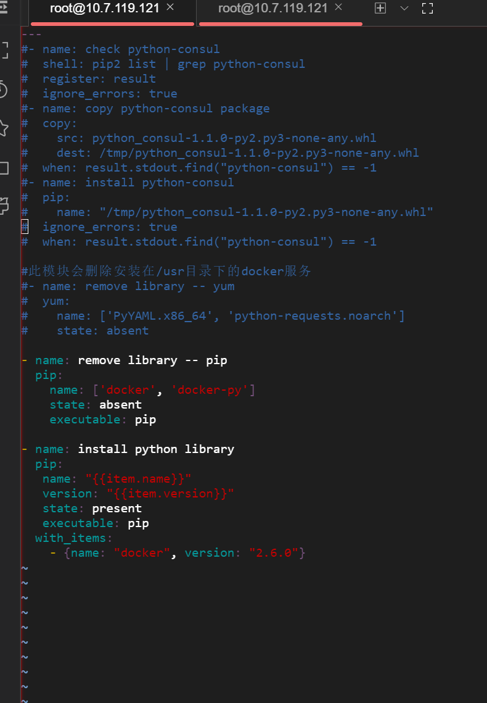
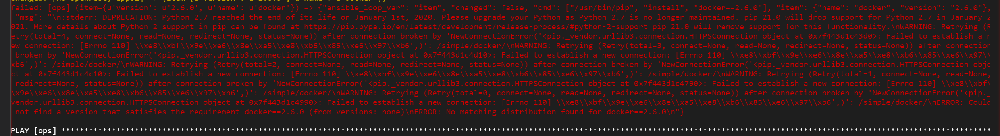
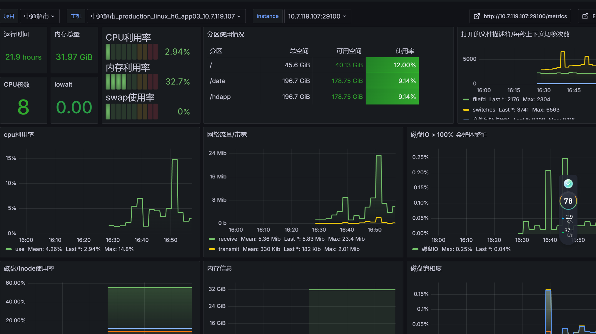

## 准备工作
```commandline
curl -O http://download.qianfan123.com/toolset/ka-toolset/prometheus_toolset.sh
```

## 以后这段配置都删除掉


```commandline
bash  prometheus_toolset.sh
```
 


mkdir -p ~/.docker && \
echo '{
        "auths": {
                "harbor.qianfan123.com": {
                        "auth": "cm9ib3Qka2FfZG9ja2VycHVsbDpTUTloTmFtUU5nTjM5OU9acnQzWGVjMXB3RHhTUGdrTA=="
                },
                "harborka.qianfan123.com": {
                        "auth": "cm9ib3Qka2FfZG9ja2VycHVsbDpaS0N1TkNBUFdwY0lrVWRBTVpmVkM2N3M0MmVidElsbQ=="
                }
        }
}' > ~/.docker/config.json && chmod 600 ~/.docker/config.json

参考文档 

## https://gitlab.hd123.com/yaobohai/notes/-/blob/develop/ops/monitor/%E9%83%A8%E7%BD%B2%E7%9B%91%E6%8E%A7.md

### 修改文件 提交
### monitor.yaml
```commandline

[app]
h6_app01            ansible_host=10.7.119.115   product=h6
h6_app02            ansible_host=10.7.119.114   product=h6
h6_pos_app01        ansible_host=10.7.119.117   product=h6
h6_pos_app02        ansible_host=10.7.119.116   product=h6
h6_openresty_app01  ansible_host=10.7.119.119   product=h6
h6_openresty_app02  ansible_host=10.7.119.120   product=h6
h6_app03            ansible_host=10.7.119.107   product=h6
h6_app04            ansible_host=10.7.119.159   product=h6
h6_app05            ansible_host=10.7.119.160   product=h6


```
http://github.app.hd123.cn/qianfanops/prometheus 提交master 分支后，会自动触发 http://ci.hddomain.cn/job/pack-prometheus-oss/

# 部署app的监控
## ops机器操作(注意拉仓库不是在容器内)
### 下载toolset；并运行 prometheus_toolset  容器
 curl http://download.qianfan123.com/toolset/ka-toolset/prometheus_toolset.sh | bash
### 获取git的配置
 curl http://download.qianfan123.com/toolset/ka-toolset/prometheus_config.sh | bash -s -- -c 云南昆明优鲜美佳

### 进入toolset容器
 docker exec -it prometheus_toolset bash -c "cd ../iac && exec bash"

### 查看ssh秘钥是否存在，不存在则生成
[root@prometheus_toolset ka_deploy]# ls /root/.ssh/id_rsa.pub

### 在toolset容器中生成公钥
## [root@prometheus_toolset ka_deploy]# ssh-keygen -t rsa -f /root/.ssh/id_rsa -N ''

### 免密登录到应用服务器 （部署监控组件均走ssh）
 [root@prometheus_toolset ka_deploy]# ssh-copy-id root@<<运维服务器IP地址>>

### 一键部署所有主机的监控组件
ansible-playbook -i inventory/monitor monitor.yml -e @monitor_vars.yml --tags monitor


### 部署数据库的db
ansible-playbook -i inventory/monitor monitor.yml -e @monitor_vars.yml --tags node_exporter --limit db

###  检查：
### https://grafana-ka.hd123.com/d/nCQ5c8cGz1/linux?orgId=1&var-project=%E5%90%8D%E5%88%9B%E4%BC%98%E5%93%81WOWCOLOUR&var-server=%E5%90%8D%E5%88%9B%E4%BC%98%E5%93%81WOWCOLOUR_production_linux_crm_app01_172.29.15.43&var-instance=172.29.15.43:9100&var-maxmount=&var-env=&var-name=
 
### 如果遇到pip缺失，按照以下方法解决

###  注释掉任务
```
vim roles/pre_check/tasks/ecs_python_libs.yml 
```






###  手动执行

```commandline

pip install docker==2.6.0 -i https://mirrors.aliyun.com/pypi/simple/ --trusted-host mirrors.aliyun.com

```


```
curl http://download.qianfan123.com/toolset/ka-toolset/prometheus_config.sh | bash -s -- -c 中通超市
```
```
docker exec -it prometheus_toolset bash -c "cd ../iac && exec bash"
```

```
ansible-playbook -i inventory/monitor monitor.yml -e @monitor_vars.yml --tags monitor
```



## monitor_vars.yml 加上auth_enable: False
```commandline
#Docker仓库登录信息
 
auth_enable: False

 
 
#docker镜像版本
prometheus_docker_version: 2.53.0
#prometheus镜像名称

```


## 网站域名监控

### blackbox_exporter检测的服务地址
blackbox_probe:
  - name: jenkins
    product: h6
    url: http://172.30.112.233:8080/login?from=%2F
  - name: H6
    product: h6
    url: https://h6.ynyxmj.com/hdpos4-web/www/view/entry3.html
  - name: jposbo
    product: h6
    url: https://jposbo.ynyxmj.com/jposbo
  - name: csp
    product: h6
    url: https://csp.ynyxmj.com/cardserver
 


