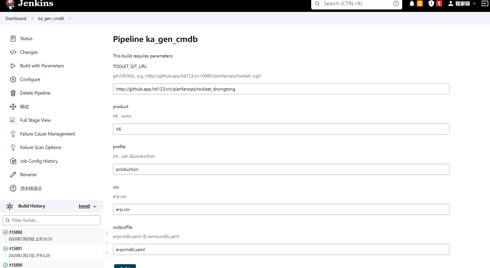
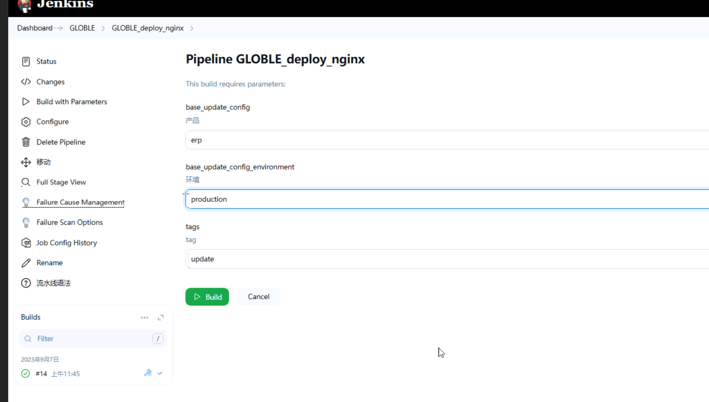

更换yum源(centos7需要)
```commandline
sudo mkdir /etc/yum.repos.d/bak
sudo mv /etc/yum.repos.d/*.repo /etc/yum.repos.d/bak
sudo wget -O /etc/yum.repos.d/CentOS-Base.repo http://mirrors.aliyun.com/repo/Centos-7.repo
```

## 配置目录共享

> 用于多服务器之间共用一份数据目录

### 服务端配置

目标:
- 10.7.119.114的/hdapp/heading/hdpos4-dist_production/Enclosure/
- 10.7.119.115的/hdapp/heading/jposbo_production/(data、pic、upload)
- 10.7.119.116的/hdapp/heading/panther_production/

以上目录共享给10.7.119.0/24挂载使用

#### 10.7.119.114

```
# 安装nfs插件
$ yum install -y nfs-utils

# 启动nfs服务端
$ systemctl enable nfs-server --now

# 配置共享目录(新增内容)
$ vim /etc/exports
/hdapp/heading/hdpos4-dist_production/Enclosure/  10.7.119.0/24(rw,sync,no_root_squash,no_subtree_check)

# 生效共享目录
$ exportfs -av
```

#### 10.7.119.115

```
# 安装nfs插件
$ yum install -y nfs-utils

# 启动nfs服务端
$ systemctl enable nfs-server --now

# 配置共享目录(新增内容)
$ vim /etc/exports
/hdapp/heading/jposbo_production/data  10.7.119.0/24(rw,sync,no_root_squash,no_subtree_check)
/hdapp/heading/jposbo_production/pic  10.7.119.0/24(rw,sync,no_root_squash,no_subtree_check)
/hdapp/heading/jposbo_production/upload  10.7.119.0/24(rw,sync,no_root_squash,no_subtree_check)

# 生效共享目录
$ exportfs -av
```

#### 10.7.119.116


```
# 安装nfs插件
$ yum install -y nfs-utils

# 启动nfs服务端
$ systemctl enable nfs-server --now

# 配置共享目录(新增内容)
$ vim /etc/exports
/hdapp/heading/gem-service_production/Enclosure/ 10.7.119.0/24(rw,sync,no_root_squash,no_subtree_check)

# 生效共享目录
$ exportfs -av
```

#### 10.7.119.117

```
# 安装nfs插件
$ yum install -y nfs-utils

# 启动nfs服务端
$ systemctl enable nfs-server --now

# 配置共享目录(新增内容)
$ vim /etc/exports
/hdapp/heading/panther_production/  10.7.119.0/24(rw,sync,no_root_squash,no_subtree_check)
# 生效共享目录
$ exportfs -av
```

### 客户端配置

目标:
- 10.7.119.107挂载10.7.119.114共享的/hdapp/heading/hdpos4-dist_production/Enclosure/目录
- 10.7.119.159挂载10.7.119.115共享的/hdapp/heading/jposbo_production/(data、pic、upload)目录
- 10.7.119.160挂载10.7.119.116共享的/hdapp/heading/panther_production/目录

#### 10.7.119.107

```
# 安装nfs插件
$ yum install -y nfs-utils

# 配置挂载远端共享目录到本地的/hdapp/heading/hdpos4-dist_production/Enclosure以及/hdapp/heading/jposbo_production/data、pic、upload
$ vim /etc/fstab
10.7.119.114:/hdapp/heading/hdpos4-dist_production/Enclosure   /hdapp/heading/hdpos4-dist_production/Enclosure      nfs     defaults        0 0
10.7.119.115:/hdapp/heading/jposbo_production/data   /hdapp/heading/jposbo_production/data      nfs     defaults        0 0
10.7.119.115:/hdapp/heading/jposbo_production/pic   /hdapp/heading/jposbo_production/pic      nfs     defaults        0 0
10.7.119.115:/hdapp/heading/jposbo_production/upload   /hdapp/heading/jposbo_production/upload      nfs     defaults        0 0
10.7.119.116:/hdapp/heading/gem-service_production/Enclosure/   /hdapp/heading/gem-service_production/Enclosure/     nfs     defaults        0 0

# 创建出需要挂载的目录
$ mkdir -p /hdapp/heading/hdpos4-dist_production/Enclosure
$ mkdir -p /hdapp/heading/jposbo_production/{data,pic,upload}

# 生效挂载
$ systemctl daemon-reload && mount -a

# 检查是否挂载(返回有内容及证明已挂载成功)
$ mount |grep nfs |grep /hdapp/heading/hdpos4-dist_production

# 检查是否挂载(返回有内容及证明已挂载成功)
$ mount |grep nfs |grep /hdapp/heading/jposbo_production/
```

#### 10.7.119.159

```
# 安装nfs插件
$ yum install -y nfs-utils

# 配置挂载远端共享目录到本地的/hdapp/heading/hdpos4-dist_production/Enclosure
$ vim /etc/fstab
10.7.119.115:/hdapp/heading/jposbo_production/data   /hdapp/heading/jposbo_production/data      nfs     defaults        0 0
10.7.119.115:/hdapp/heading/jposbo_production/pic   /hdapp/heading/jposbo_production/pic      nfs     defaults        0 0
10.7.119.115:/hdapp/heading/jposbo_production/upload   /hdapp/heading/jposbo_production/upload      nfs     defaults        0 0

# 创建出需要挂载的目录
$ mkdir -p /hdapp/heading/jposbo_production/{data,pic,upload}

# 生效挂载
$ systemctl daemon-reload && mount -a

# 检查是否挂载(返回有内容及证明已挂载成功)
$ mount |grep nfs |grep /hdapp/heading/jposbo_production/
```

#### 10.7.119.160

```
# 安装nfs插件
$ yum install -y nfs-utils

# 配置挂载远端共享目录到本地的/hdapp/heading/panther_production
$ vim /etc/fstab
10.7.119.117:/hdapp/heading/panther_production   /hdapp/heading/panther_production      nfs     defaults        0 0

# 创建出需要挂载的目录
$ mkdir -p /hdapp/heading/panther_production

# 生效挂载
$ systemctl daemon-reload && mount -a

# 检查是否挂载(返回有内容及证明已挂载成功)
$ mount |grep nfs |grep /hdapp/heading/panther_production
```

--- 

## 1.ops机器(10.7.119.121)分别初始化三台应用服务器
10.7.119.107，10.7.119.159，10.7.119.160
### http://10.7.119.121:8080/job/GLOBLE_Centos_Init/11/parameters/
 
 
## 2.修改toolset文件

#### jenkins/h6/prd/project-app.yml(已改)
http://gitlab.app.hd123.cn/-/ide/project/qianfanops/toolset_zhongtong/tree/jenkins/-/jenkins/h6/prd/


```commandline
     groovy: |-
                    return [
                   
                    '10.7.119.107',  
                    '10.7.119.159',
                    '10.7.119.160'

                    ]
 
                  groovy: |-
                      (host.equals('10.7.119.107'))? ["hdpos4-dist",'jposbo',"h6-openapi2-service",'gem-service']:
                    (host.equals('10.7.119.159'))? ['jposbo',"hdpos4-disttask","h6-sop-service",'spms-hdpos-web','bpfm-app-service']:
                    (host.equals('10.7.119.160'))? ['pasoreport-web','panther-dts-server','sos-h6-transfer-service','hdpos6-notice-service','init-tool']:[]

``` 

#### erp/production/erp.csv (已改)
```commandline
8591,ztcs,app-05,2.1.5,blue,hdpos4-dist,harborka.qianfan123.com/hdpos46/hdpos4-dist,backend,18180,19180,9744,45
8591,ztcs,app-05,shztsc_2023111.18_pro,blue,jposbo,harborka.qianfan123.com/jposbo/shztsc,backend,18280,0,10001,30
8591,ztcs,app-05,1.28,blue,h6-openapi2-service,harborka.qianfan123.com/hdpos46/h6-openapi2-service,backend,18176,19176,9768,15
8591,ztcs,app-05,1.13,blue,gem-service,harborka.qianfan123.com/hdpos46/gem-service,backend,18105,19105,9788,15
8591,ztcs,app-06,shztsc_2023111.18_pro,blue,jposbo,harborka.qianfan123.com/jposbo/shztsc,backend,18280,0,10001,30
8591,ztcs,app-06,2.1.5,blue,hdpos4-disttask,harborka.qianfan123.com/hdpos46/hdpos4-dist,backend,18180,19180,9744,45
8591,ztcs,app-06,1.33,blue,h6-sop-service,harborka.qianfan123.com/hdpos46/h6-sop-service,backend,18172,19172,9842,15
8591,ztcs,app-06,3.7.0,blue,spms-hdpos-web,harborka.qianfan123.com/component/spms-hdpos-web,backend,18115,19115,9752,15
8591,ztcs,app-06,1.12.2,blue,bpfm-app-service,harborka.qianfan123.com/component/bpfm-app-service,backend,18212,19212,9757,15
8591,ztcs,app-07,1.0,blue,pasoreport-web,harborka.qianfan123.com/component/pasoreport-web,backend,18980,19980,9756,45
8591,ztcs,app-07,1.64,blue,panther-dts-server,harborka.qianfan123.com/dts-store/panther-dts-server,backend,18480,19480,9755,30
8591,ztcs,app-07,1.43.4,blue,sos-h6-transfer-service,harborka.qianfan123.com/hdpos46/sos-h6-transfer-service,backend,18135,19135,9773,15
8591,ztcs,app-07,1.11,blue,hdpos6-notice-service,harborka.qianfan123.com/hdpos46/hdpos6-notice-service,backend,18136,19136,9789,15
8591,ztcs,app-07,1.6.8,blue,init-tool,harborka.qianfan123.com/component/init-tool,backend,18093,0,9787,15

```
#### erp/production/erpcmdb.yaml(已改)
```commandline
- host_id: app-05
  host_name: app-prd05
  host_ip: 10.7.119.107
  host_sshport: 22
  host_user: root
  host_sshpwd: ''
  host_group: erp
  host_sudo: false
- host_id: app-06
  host_name: app-prd06
  host_ip: 10.7.119.159
  host_sshport: 22
  host_user: root
  host_sshpwd: ''
  host_group: erp
  host_sudo: false
- host_id: app-07
  host_name: app-prd07
  host_ip: 10.7.119.160
  host_sshport: 22
  host_user: root
  host_sshpwd: ''
  host_group: erp
  host_sudo: false


```


#### erp/production/app.yaml
```commandline
#################################################
#Hdpos4.6版本
 
hdpos4disttask_mem: "10g"(修改)
#Hdpos4.6许可证地址
hdpos4disttask_license: '{{app_license}}'
#Hdpos4.6许可证端口,注意HDLicense服务默认端口为8088，不要轻易修改
hdpos4disttask_license_port: '{{app_license_port}}'
####JMX监控端口配置，为固定端口，无需修改########
hdpos4disttask_jmx_port: 9744
#是否开启万能验证码，仅为公司内部自动化测试用，默认是不开启的，开启设置为true
#万能验证码开启后，值为：6284
hdpos4disttask_enable_universal_captcha: false
#部署后等待健康检查时间,单位s(秒)
hdpos4disttask_check_after: 240(修改)
hdpos4distscenemode: "{{erpappname.split('hdpos4dist') | join('')}}"

#################################################

#################################################
#Hdpos4.6-Nome版本


#特殊配置
jposbonode: '{{ansible_host}}'
#################################################

```

#### develop/openresty_config/erp/production/conf.d/hdpos.conf  
```commandline

 location ~(/jposbo/uploadPosLogFile|/jposbo/getFile|/jposbo/backoffice/stockTakingBillService|/jposbo/uploadMultiMediaFile) {
	    access_log   /usr/local/openresty/nginx/logs/jposbo_access.log main;
      error_log   /usr/local/openresty/nginx/logs/jposbo_error.log;
      proxy_pass    http://jposbo;
      proxy_pass_header Server;
      proxy_set_header Host $host;
      proxy_redirect off;
      proxy_set_header X-Real-IP $remote_addr;
      proxy_set_header X-Scheme $scheme;
      client_max_body_size 500m;    #允许客户端请求的最大单文件字节数
      client_body_buffer_size 128k;  #缓冲区代理缓冲用户端请求的最大字节数，
      proxy_connect_timeout 30m;  #nginx跟后端服务器连接超时时间(代理连接超时)
      proxy_send_timeout 10m;        #后端服务器数据回传时间(代理发送超时)
      proxy_read_timeout 30m;         #连接成功后，后端服务器响应时间(代理接收超时)
      proxy_buffering on;                   # 是否打开后端响应内容的缓冲区
      proxy_buffer_size 128k;             #设置代理服务器（nginx）保存用户头信息的缓冲区大小
      proxy_buffers 4 256K;               #proxy_buffers缓冲区，网页平均在32k以下的话，这样设置
      proxy_busy_buffers_size 512k;    #高负荷下缓冲大小（proxy_buffers*2）
      proxy_max_temp_file_size 0;    #关闭磁盘缓冲
      proxy_ignore_client_abort on;		#如果客户端断开请求,也保持与后端服务器的连接，防止服务器出现BUG
      #proxy_temp_file_write_size 128k;  #设定缓存文件夹大小，大于这个值，将从upstream服务器传
   }

 location ~(/jposbo/backoffice/billReceiveService|/jposbo/backoffice/posBuysReceiveService) {
	    access_log   /usr/local/openresty/nginx/logs/jposbo_access.log main;
      error_log   /usr/local/openresty/nginx/logs/jposbo_error.log;
      proxy_pass    http://jposbobill;
      proxy_pass_header Server;
      proxy_set_header Host $host;
      proxy_redirect off;
      proxy_set_header X-Real-IP $remote_addr;
      proxy_set_header X-Scheme $scheme;
      client_max_body_size 500m;    #允许客户端请求的最大单文件字节数
      client_body_buffer_size 128k;  #缓冲区代理缓冲用户端请求的最大字节数，
      proxy_connect_timeout 30m;  #nginx跟后端服务器连接超时时间(代理连接超时)
      proxy_send_timeout 10m;        #后端服务器数据回传时间(代理发送超时)
      proxy_read_timeout 30m;         #连接成功后，后端服务器响应时间(代理接收超时)
      proxy_buffering on;                   # 是否打开后端响应内容的缓冲区
      proxy_buffer_size 128k;             #设置代理服务器（nginx）保存用户头信息的缓冲区大小
      proxy_buffers 4 256K;               #proxy_buffers缓冲区，网页平均在32k以下的话，这样设置
      proxy_busy_buffers_size 512k;    #高负荷下缓冲大小（proxy_buffers*2）
      proxy_max_temp_file_size 0;    #关闭磁盘缓冲
      proxy_ignore_client_abort on;		#如果客户端断开请求,也保持与后端服务器的连接，防止服务器出现BUG
      #proxy_temp_file_write_size 128k;  #设定缓存文件夹大小，大于这个值，将从upstream服务器传
   }

 location /jposbo {
	    access_log   /usr/local/openresty/nginx/logs/jposbo_access.log main;
      error_log   /usr/local/openresty/nginx/logs/jposbo_error.log;
      proxy_pass    http://jposbobill;
      proxy_pass_header Server;
      proxy_set_header Host $host;
      proxy_redirect off;
      proxy_set_header X-Real-IP $remote_addr;
      proxy_set_header X-Scheme $scheme;
      client_max_body_size 500m;    #允许客户端请求的最大单文件字节数
      client_body_buffer_size 128k;  #缓冲区代理缓冲用户端请求的最大字节数，
      proxy_connect_timeout 30m;  #nginx跟后端服务器连接超时时间(代理连接超时)
      proxy_send_timeout 10m;        #后端服务器数据回传时间(代理发送超时)
      proxy_read_timeout 30m;         #连接成功后，后端服务器响应时间(代理接收超时)
      proxy_buffering on;                   # 是否打开后端响应内容的缓冲区
      proxy_buffer_size 128k;             #设置代理服务器（nginx）保存用户头信息的缓冲区大小
      proxy_buffers 4 256K;               #proxy_buffers缓冲区，网页平均在32k以下的话，这样设置
      proxy_busy_buffers_size 512k;    #高负荷下缓冲大小（proxy_buffers*2）
      proxy_max_temp_file_size 0;    #关闭磁盘缓冲
      proxy_ignore_client_abort on;		#如果客户端断开请求,也保持与后端服务器的连接，防止服务器出现BUG
      #proxy_temp_file_write_size 128k;  #设定缓存文件夹大小，大于这个值，将从upstream服务器传
   }

```


#### develop/openresty_config/erp/production/conf.d/upstream(已提交)
```commandline

upstream hdpos {
      server 10.7.119.114:18180;#hdpos4-web应用的服务器ip和端口
      server 10.7.119.107:18180;#hdpos4-web应用（新增app-05）
} 

upstream pasoreport {
      server 10.7.119.116:18980;#pasoreport-web应用的服务器ip和端口
      server 10.7.119.160:18980;#pasoreport-web应用（新增app-07）
}

upstream spms_web {
      server 10.7.119.114:18115;#spms-web应用的服务器ip和端口
      server 10.7.119.159:18115;#spms-web应用（新增app-06）
}

upstream gem {
      server 10.7.119.116:18105;#gem-service应用的服务器ip和端口
      server 10.7.119.107:18105;#gem-service应用（新增app-05）
}


# 负责接收jposbo的常规流量(包含单据收货服务接口、处理各类业务单据等收货操作)
upstream jposbobill {
          server 10.7.119.107:18280;#jposbo应用（新增app-05）
          server 10.7.119.159:18280;#jposbo应用（新增app-06）
}

# 负责专门处理文件上传下载、日志回传、盘点单服务等操作
upstream jposbo {
          server 10.7.119.115:18280;#jposbo应用的服务器ip和端口
}

upstream panther_web {
      server 10.7.119.117:18380;  #panther-web应用的服务器ip和端口，panther访问用
}

upstream panther_dts_server {
      server 10.7.119.117:18480;  #panther-task-server应用的服务器ip和端口,前置机专用
      server 10.7.119.160:18480;  #panther-dts-server应用（新增app-07）
}

upstream adi_web {
      server 10.7.119.115:18144;#spms-web应用的服务器ip和端口
}

upstream vss_spider {
    server 10.7.119.117:18081;  #vss-spider-server应用的服务器ip和端口
}

upstream notice {
      server 10.7.119.115:18136;  #notice应用的服务器ip和端口
      server 10.7.119.160:18136;  #notice应用（新增app-07）
}

upstream init_tool {
    server 10.7.119.115:18093;  #init-tool应用的服务器ip和端口
    server 10.7.119.160:18093;  #init-tool应用（新增app-07）
}

upstream bpfm {
    server 10.7.119.115:18212;
    server 10.7.119.159:18212;  #bpfm应用（新增app-06）
}

upstream rumba_oss {
    server 10.7.119.114:18112;  #rumba-oss应用的服务器ip和端口
}

upstream h6_openapi2 {
    server 10.7.119.115:18176;  #h6-openapi2应用的服务器ip和端口
    server 10.7.119.107:18176;  #h6-openapi2应用（新增app-05）
}

upstream up_connector {
    server 10.7.119.117:18110;  #up-connector应用的服务器ip和端口
}

upstream openapi_doc {
    server 10.7.119.116:18210;  #openapi-doc应用的服务器ip和端口
}

upstream h6_sop {
    server 10.7.119.116:18172;  #h6-sop应用的服务器ip和端口
    server 10.7.119.159:18172;  #h6-sop应用（新增app-06）
}

upstream sos_h6_transfer {
    server 10.7.119.117:18135;  #h6-sop应用的服务器ip和端口
    server 10.7.119.160:18135;  #sos-h6-transfer应用（新增app-07）
}

upstream eaccount {
    server 10.7.119.117:18173;  #h6-sop应用的服务器ip和端口
}
```

## 执行job 生成cmdb.yaml文件
### http://ci.hddomain.cn/job/ka_gen_cmdb/build?delay=0sec
## 参数如下图
 


## 3.执行应用部署job（ERP_app_deploy_production）
### http://10.7.119.121:8080/view/ERP/job/%E4%B8%AD%E9%80%9A%E8%B6%85%E5%B8%82ERP%E7%94%9F%E4%BA%A7/job/ERP_app_deploy_production/
```commandline

服务器地址	主机名	应用名称	版本
10.7.119.107	app-05	hdpos4-dist	2.11.2
10.7.119.107	app-05	jposbo	shztsc_2023111.18_pro
10.7.119.107	app-05	h6-openapi2-service	1.44
10.7.119.107	app-05	gem-service	1.13
10.7.119.159	app-06	jposbo	shztsc_2023111.18_pro
10.7.119.159	app-06	hdpos4-disttask	2.11.2
10.7.119.159	app-06	h6-sop-service	1.33
10.7.119.159	app-06	spms-hdpos-web	3.7.0
10.7.119.159	app-06	bpfm-app-service	1.12.2
10.7.119.160	app-07	pasoreport-web	1.61
10.7.119.160	app-07	panther-dts-server	1.74
10.7.119.160	app-07	sos-h6-transfer-service	1.58.2
10.7.119.160	app-07	hdpos6-notice-service	1.11
10.7.119.160	app-07	init-tool	1.6.8 

```
## 4.执行刷新nginx job GLOBLE_deploy_nginx
###  http://10.7.119.121:8080/view/GLOBLE/job/GLOBLE_deploy_nginx/build?delay=0sec
参数如下图




## 5.提交wiki
http://wiki.app.hd123.cn/wiki/pages/viewpage.action?pageId=202418032