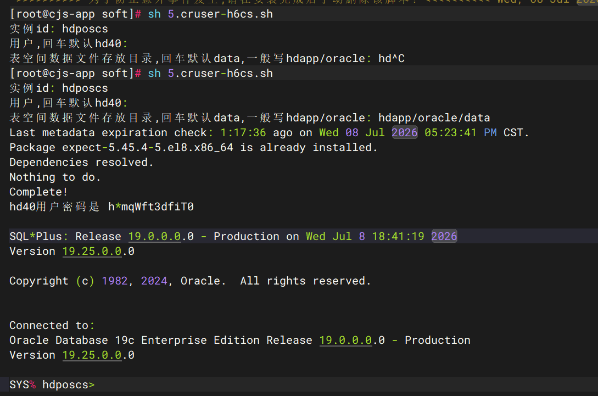

## 一、环境前置处理
### 安装必要工具：
```bash
dnf -y install libnsl expect
```

## 二、系统基础配置

### 1.设置主机名

```bash
hname="lhtgxd-erp-int"
hostnamectl set-hostname ${hname}
```

### 2.配置 hosts

```bash
cat >> /etc/hosts <<EOF
$(hostname -I)   ${hname}
EOF
```

### 3. 挂载数据盘（LVM）
安装 LVM 磁盘管理工具
```bash
yum install -y lvm2 
```
裸硬盘 /dev/vdb 初始化成 LVM 可管理的磁盘
新建一个磁盘资源池，命名 vgdata，把上面初始化好的 /dev/vdb 放进这个资源池。
```bash
pvcreate /dev/vdb  
vgcreate vgdata /dev/vdb
```

LV = 逻辑卷
从卷组 vgdata 里划分空间出来
```bash
lvcreate -l 100%VG -n lvdata vgdata
```

给逻辑卷格式化 XFS 文件系统，只有格式化后才能存放文件 
```bash
mkfs.xfs -f /dev/vgdata/lvdata
```

创建两个目录作为挂载点：
/data：挂载 100G 磁盘，存放 Oracle 数据文件
/fra：空目录备用，放归档日志（无独立磁盘，归档放 /data 内部子目录）
-p：目录不存在就自动创建，不会报错。

```bash
mkdir -p /hdapp/oracle/data /fra
mount /dev/vgdata/lvdata /hdapp/oracle/data
```

写入 fstab（自动挂载） 配置开机自动挂载，服务器重启后自动把磁盘挂到 /hdapp/oracle/data
```bash
echo "$(blkid /dev/vgdata/lvdata | awk '{print $2}' | sed 's/\"//g') /hdapp/oracle/data xfs defaults 0 0" >> /etc/fstab
```

# 检查fstab语法，无输出代表配置正确
mount -a
# 查看磁盘挂载结果
df -h


### 4. 创建 4GB 虚拟内存（swap）

```bash
swapoff -a
rm -f /swapfile
dd if=/dev/zero of=/swapfile bs=1M count=4000
chmod 600 /swapfile
mkswap /swapfile
swapon /swapfile
echo '/swapfile none swap defaults 0 0' >> /etc/fstab
```

### 5.调整 /dev/shm 大小
```bash
echo 'tmpfs /dev/shm tmpfs defaults,size=16G 0 0' >> /etc/fstab
systemctl daemon-reload
mount -o remount /dev/shm
```

### 6.安装依赖包
```bash

dnf install -y bc binutils elfutils-libelf elfutils-libelf-devel \
  fontconfig-devel glibc glibc-devel ksh libaio libaio-devel \
  libXrender libXrender-devel libX11 libXau libXi libXtst libgcc \
  librdmacm-devel libstdc++ libstdc++-devel libxcb make net-tools \
  smartmontools sysstat unzip libnsl libnsl2 zip

dnf install -y chrony tree iotop dstat iptraf iptraf-ng lrzsz


```


## 三、Oracle 软件下载与安装
### 1. 下载安装包
```bash
dnf install -y wget
mkdir /soft && cd /soft
wget http://ka-storage.oss-cn-hangzhou.aliyuncs.com/package/Oracle/oracle19.25_install.zip
unzip oracle19.25_install.zip

```
### 2. 先修改脚本内容（重要）

```commandline
dnf install -y lrzsz
rz -y 
```


####  脚本1：1-Oracle19C_install_software.sh
（ 部署 Oracle 19C 数据库软件）
- 修改参数（第23行）
```bash
app_path="/hdapp/oracle/app"   # Oracle 程序安装路径
```

#### 脚本2：2-Oracle19C_install_instance.sh
（创建数据库实例（示例实例名：hdposcs））
- 修改参数（第5.9.16行）
```bash
data_path="/hdapp/oracle/data"   # 数据文件存放路径
sid="hdposcs"      # 实例名  
正式环境是(sid="hdposzs")     
sidMemory=4000                   # 实例内存（MB）
```


#### 脚本3：5.cruser-h6cs
（自动化创建业务表空间、临时表空间、角色、业务账号并赋权）



## 四、执行脚本
依次执行三个脚本
