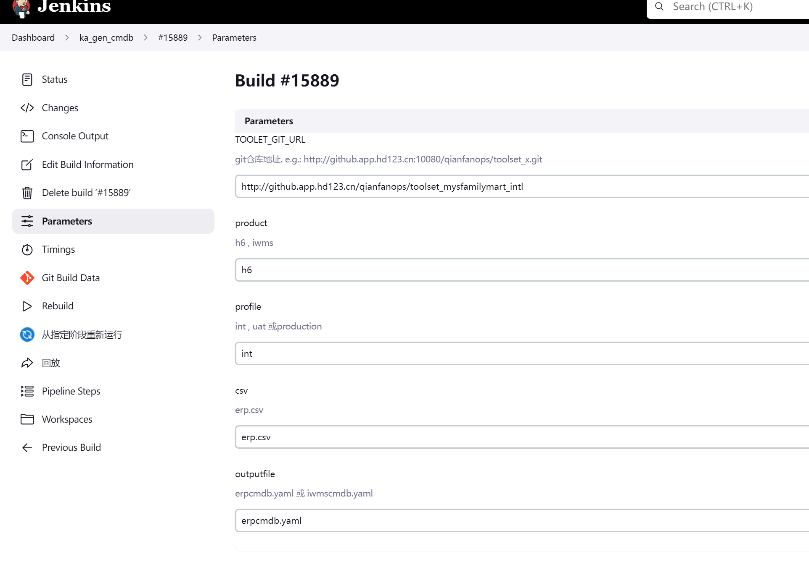
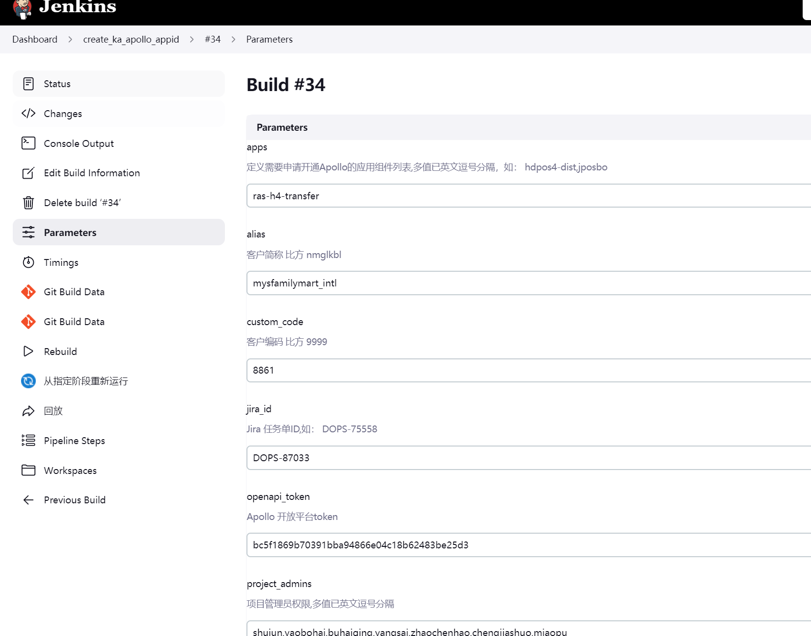
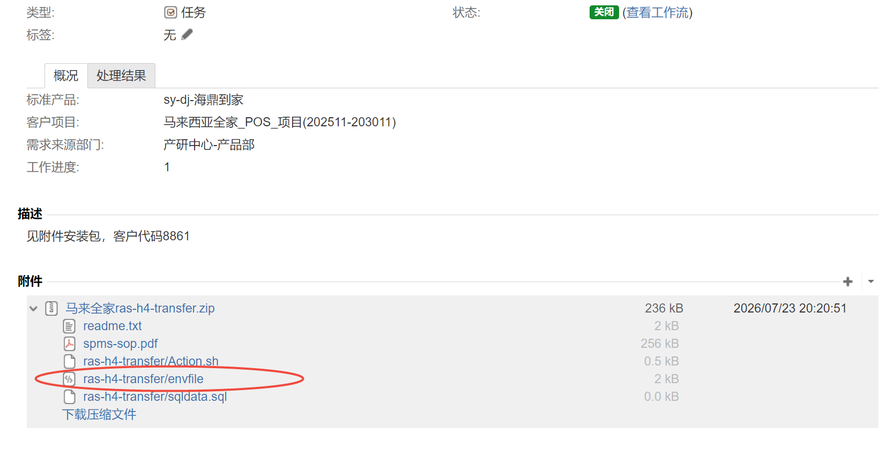
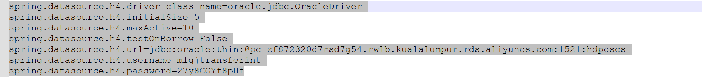
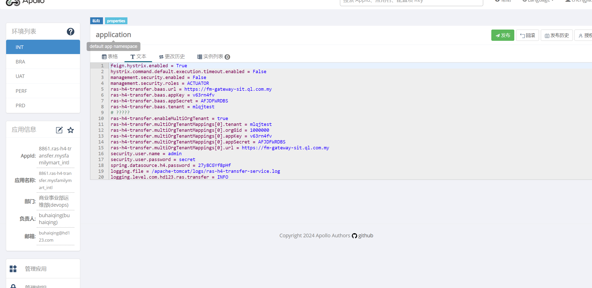
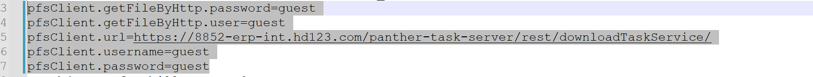
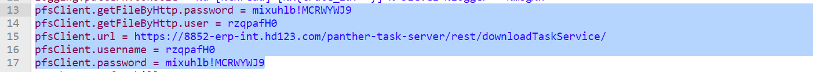

# 部署ras-h4-transfer组件

 

# 1.前期配置修改


# 1.1 Jenkins 
## project-app.yml：

# 1.2erp分支
## 1.2.1 int
## erp.csv
## apollo.yaml(namespace_admins和project_admins加上提单人)
## app.yaml 加上

 

```commandline
 
```


# 2.生成cmdb文件 Pipeline ka_gen_cmdb

 

# 3.创建Apollo用Pipeline create_ka_apollo_appid




# 4.手动上传Apollo配置. 

## 4.1 文件位置


## 4.2 文件删掉
```commandline
 注意一下不要上传的配置
这些是运维配置，也就是在all.yaml 中配置的

```


```shell
spring.datasource 开头的数据库配置
dtflow.mkh 开头的数据库配置
```





## 4.3 文件修改(panther文件账号密码)

### 根据panther-task-server里的
```commandline

panther-task-server.rest.url = http://10.5.28.66/panther-task-server/rest
panther-task-server.rest.username = rzqpafH0
panther-task-server.rest.password = mixuhlb!MCRWYWJ9

```
## 改成这样

## 2.执行 GLOBLE_update_jenkins_config，
 
## 3.应用部署(ERP_app_deploy_int)(不勾选首次安装)
 版本在ras-h4-transfer_Action.sh文件里
 

 
## 6.提交wiki

 
 