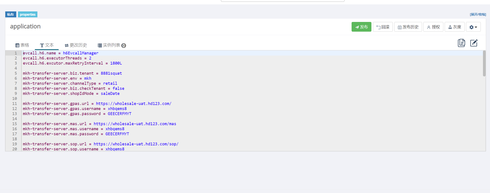

## 部署mkh-mas-transfer组件

应用全称: `mkh-mas-transfer-server`

部署前提：

- ERP已部署
- 需要得知erp数据库hd40用户的密码
- 研发已提transfer的部署单，并且任务单包含配置以及transfer版本
### 一般部署步骤

1、创建apollo appid

> 使用：[create_ka_apollo_appid](http://ci.hddomain.cn/job/create_ka_apollo_appid/)

参数解释：

```shell
apps(应用名称): mkh-mas-transfer-server
alias: 客户简称
custom_code: 客户编码
jira_id: Jira任务单号


以下三个参数，如果是老项目新增组件，而不是全新搭建项目。这一项为空
openapi_token 
project_admins
namespace_admins
```

1.1 把研发给到的transfer的部署单中的transfer配置上传至apollo（点击发布
）



- 注意一下不要上传的配置
这些是运维配置，也就是在all.yaml 中配置的

```shell
spring.datasource 开头的数据库配置
dtflow.mkh 开头的数据库配置
```

2、 创建transfer使用的数据库用户

> 登录该项目的应用服务器执行脚本完成创建：[create_oracle_transfer_user.sh](https://gitlab.hd123.com/yaobohai/notes/-/blob/develop/erp/%E5%B8%B8%E7%94%A8%E8%84%9A%E6%9C%AC/create_oracle_transfer_user.sh)

参数解释：

```shell
数据库实例名(回车默认: hdposcs):
数据库实例地址: 172.16.0.61
数据库实例端口(回车默认: 1521): 默认即可
数据库管理员用户(回车默认: hd40): 默认即可
数据库管理员密码: # hd40的密码

创建的TRANSFER数据库用户(XXXXTRANSFER): 一般为客户简称+TRANSFER 拼接，例如：零食很能嗨的,就叫做 LSHNHTRANSFER
创建的TRANSFER数据库用户密码(回车默认: 27y8CGYf8pHf): 默认即可
```
ZJHZKKTRANSFER
3、配置toolset_x

3.1 jenkins分支: `jenkins/h6/int/project-app.yml` 文件内增加

 
```shell
 groovy: |-
                    return (host.equals('172.16.0.61')) ? ["hdpos4-dist","jposbo","pasoreport","sos-h6-transfer-service","spms-hdpos-web","h6-crm-service","panther-dts-server","panther-taskweb","up-connector-service","gem-service","init-tool","h6-openapi2-service","openapi-doc-service","hdpos6-notice-service","zl-portal-sync","card-server-proxy-service","rumba-oss-server","oss-mysql","license-server","redis","mkh-mas-transfer-server"]:[]
```

3.2 erp分支

`<profile>/all.yaml` 文件内配置

```shell
#Oracle数据库服务器ip，样例：192.168.12.13
transfer_dbserver: "实际数据库的IP"
#Oracle数据库端口
transfer_dbport: 实际数据库的端口
#Oracle数据库实例名，样例：hdposcs
transfer_dbname: "实际数据库的实例名"
#Oracle数据库transfer用户，样例：erptransfer
transfer_dbuser: "通过第二步创建的transfer用户"
#Oracle数据库transfer用户密码，样例：erptransfer
transfer_dbpwd: "通过第二步创建的transfer密码"
```

`<profile>/erp.csv` 文件内配置

```shell
# 注意最后的端口信息: 38201,39201,37201 测试的端口为3开头，生产是 1开头
8881,zjywvtvt,app-01,1.34.0,blue,mkh-mas-transfer-server,harbor.qianfan123.com/mas/mkh-mas-transfer-server,backend,38201,39201,37201,15
```

3.3 生成cmdb应用结构

> 使用：[ka_gen_cmdb](http://ci.hddomain.cn/job/ka_gen_cmdb/)

参数解释：

```shell
TOOLET_GIT_URL(toolset_x完整地址): 
product: h6
profile: 环境(int,uat,profile)

以下两项保持默认
csv
outputfile
```
4.部署transfer
> 使用通过各个项目的Jenkins Job：`Deploy_app` 进行

不用选首次安装（因为我们已经提前执行了ka_gen_cmdb 和 apollo 手动上传，所以不用再勾选）


5、把wiki内容写到wiki，反馈给开单人，提交验收

查看wiki:
```bash
cat /hdapp/heading/*/apollodir/wiki*
```
