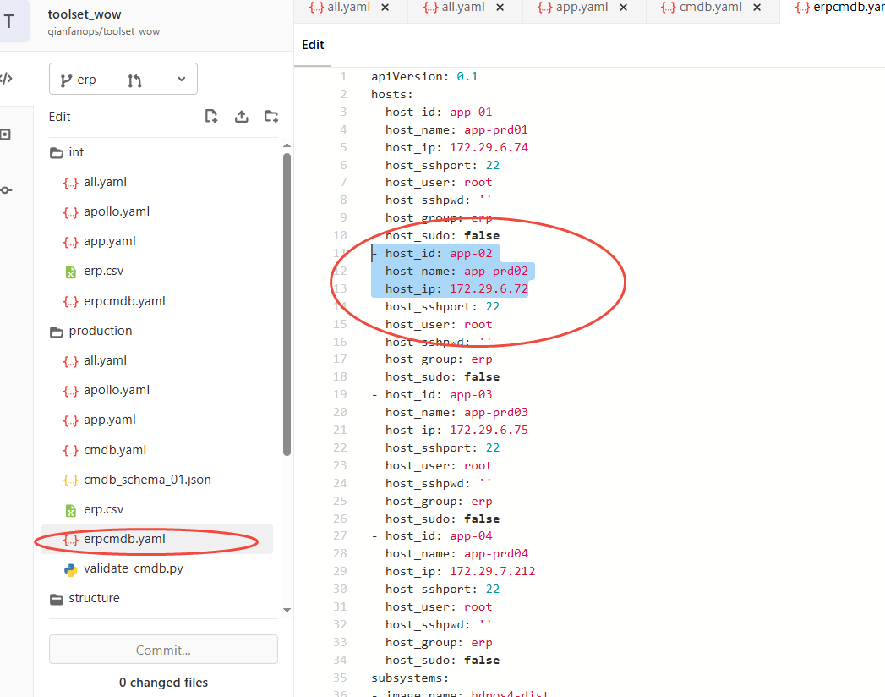

# 今日工作(6.10)

## 金粒门正式环境的网关配置
## WOW- 组件 发布公网 DOPS-85742
## 1.前期配置修改
## erp.csv
追加配置，统一版本，填写指定端口、镜像、参数（参考示例仓库）

### 其中要注意host_id要和erpcmdb.yaml里的host_id 一一对应（因为有的项目可能应用部署在不同主机）

## Jenkins 流水线文件
project-app.yml：添加组件名、端口、JMX、超时等参数
project-db.yml：配置组件对应的 Oracle 连接信息

## 2.执行 GLOBLE-update-jenkins-config刷新配置
## 3.数据库部署（ERP_db_deploy_int）
## 4.应用部署（ERP_app_deploy_int）
##  本次没修改 OpenResty 新配置，不需要执行 GLOBLE_deploy_nginx

# 解决问题
## 1.CRM_deploy_one构建失败MySQL 权限不足，无法创建函数
### 原因：
MySQL 开启了 binlog 日志，普通
账号不能创建函数 / 存储过程。
### 报错信息
```angular2htm
You do not have the SUPER privilege and binary logging is enabled
```
### 完整解决步骤：(优化版)
 

方案一：单条命令完成修改
修改：docker exec mysql mysql -uroot -pheadingcrm -e "SET GLOBAL log_bin_trust_function_creators = 1;"
检验：docker exec mysql mysql -uroot -pheadingcrm -e "SHOW VARIABLES LIKE 'log_bin_trust_function_creators';"


```bash
[root@cjs-int ~]# docker exec mysql mysql -uroot -pheadingcrm -e "SET GLOBAL log_bin_trust_function_creators = 1;"
mysql: [Warning] Using a password on the command line interface can be insecure.
[root@cjs-int ~]# docker exec mysql mysql -uroot -pheadingcrm -e "SHOW VARIABLES LIKE 'log_bin_trust_function_creators';"
mysql: [Warning] Using a password on the command line interface can be insecure.
Variable_name   Value
log_bin_trust_function_creators ON
```

方案二：修改 + 检验 合并为同一条命令
docker exec mysql mysql -uroot -pheadingcrm -e "SET GLOBAL log_bin_trust_function_creators = 1; SHOW VARIABLES LIKE 'log_bin_trust_function_creators';"


```bash
[root@cjs-int ~]# docker exec mysql mysql -uroot -pheadingcrm -e "SET GLOBAL log_bin_trust_function_creators = 1; SHOW VARIABLES LIKE 'log_bin_trust_function_creators';"
mysql: [Warning] Using a password on the command line interface can be insecure.
Variable_name   Value
log_bin_trust_function_creators ON
```

## 1.wow应用部署失败
### 原因：
没有对应的仓库权限，需要检查主机的~/.docker/config.json 文件配置的凭证信息对应的用户是否正确，或者对应用户没有权限
### 报错信息
```angular2htm
Error response from daemon: unauthorized: unauthorized to access repository: toolset/k8s_config_checker, action: pull: unauthorized to access repository: toolset/k8s_config_checker, action: pull
```
### 完整解决步骤：
- 1.检查凭证信息对应的用户是否正确
```bash
vim ~/.docker/config.json
```
- 2.手动拉取镜像
- 3.重新执行job
