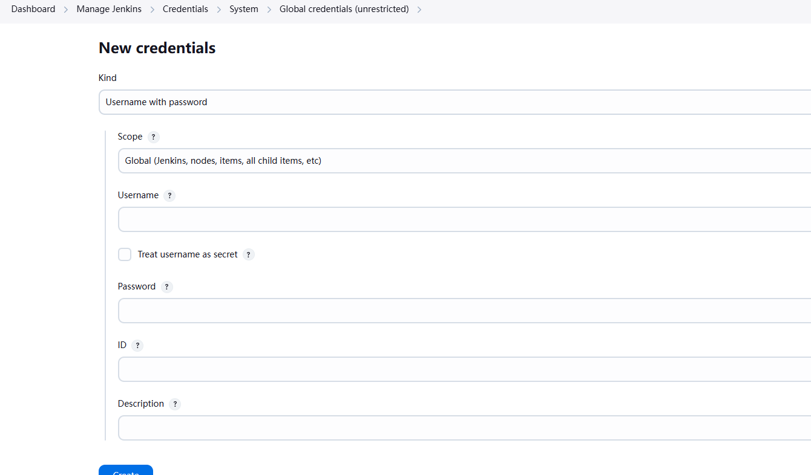

## 添加Jenkins凭据
http://8.153.95.60:8080/manage/credentials/store/system/domain/_/newCredentials



### 参考
http://gitlab.app.hd123.cn/-/ide/project/qianfanops/toolset_chengjiashuo/tree/jenkins/-/config/jenkins.yaml/


#### 其中password要解码 https://base64.us/

## 两个configure的tooleset要修改
1.http://8.153.95.60:8080/job/GLOBLE_update_jenkins_config/configure
2.http://8.153.95.60:8080/job/GLOBLE-update-jenkins-jobs/configure

### 修改配置
- **jenkins/phoenix/subsystem.int**（按照需求）
```angular2html

!join:
- ','
- - dtask 
  - gateway-service 
  - phoenix-crm-web 
  - phoenix-service-web 
  - phoenix-web-ui 

```  
- **config/jenkins.yaml**
```bash
url: http://xxx/ # jenkins内网地址
jenkinsUrl: http://xxx/ # jenkins内网地址
```

我的主机：
```bash
url: http://8.153.95.60:8080/
jenkinsUrl: http://8.153.95.60:8080/
```

- **config/jenkins-jcac-plugin.yaml**（job自动执行）
```bash
url: "<input>" # jenkins公网地址，没有公网就填内网
```
我的主机：
```angular2html
unclassified:
  location:
    adminAddress: "xxx <top@hd123.net>"
    url: "http://8.153.95.60:8080/"

```


- **/jenkins/-/jenkins_jobs.ini**
```bash
url: "<input>" # jenkins公网地址，没有公网就填内网
```
http://gitlab.app.hd123.cn/-/ide/project/qianfanops/toolset_chengjiashuo/tree/jenkins/-/jenkins_jobs.ini/

### 修改配置2
* phoenix.yaml
* docker_environments.yaml

http://gitlab.app.hd123.cn/-/ide/project/phoenix-config/chengjiashuo/tree/integration_test/-/phoenix.yaml/