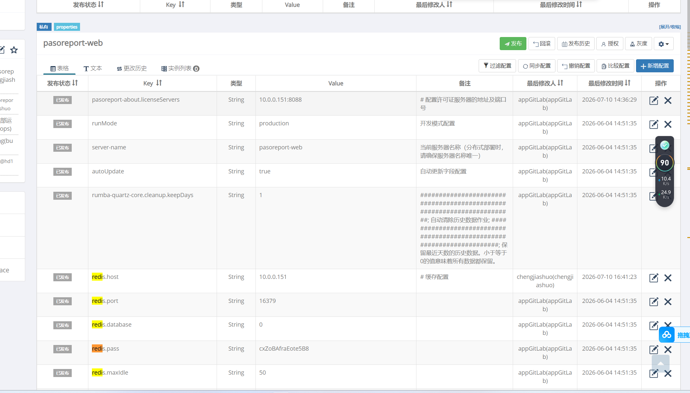
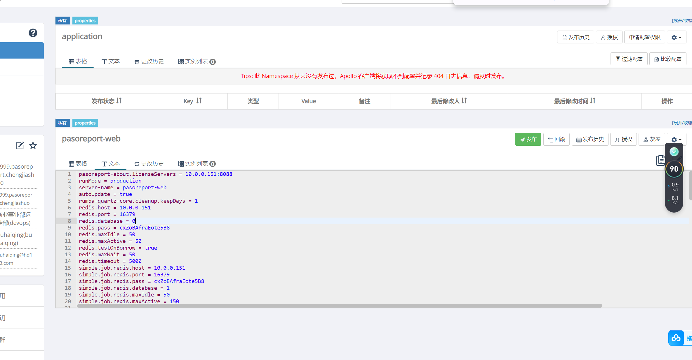
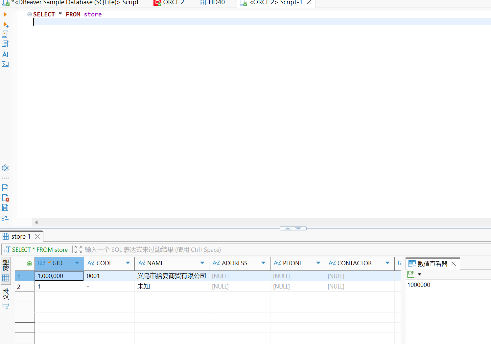
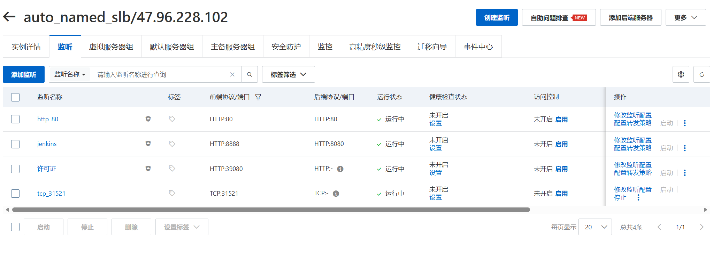

 
## 1. OOM（内存溢出）导致实例重启
### 现象：阿里云控制台显示“实例因操作系统内出现了OOM”
### 原因：16GB 内存同时运行 Oracle + 多个微服务 + 中间件，内存不足
### 解决办法：将 ECS 实例从 4核16GB 升级到 8核32GB
### 验证：free -h 确认内存变为 32GB
### 注意：后续购买机器的话 要参考已有项目


 ## 2. GLOBLE_deploy_nginx执行失败
### 原因：hdpos.conf配置错误
### 解决办法：

#### 1.首先考虑容器openresty看日志
```commandline
docker ps -a|grep openresty_check
docker logs openresty_check
```
#### 2.修改hdpos.conf配置
#### 3.重新执行job
 

 ## 3. 服务pasoreport-web没起来
### 原因：依赖的redis地址写错
如图：



### 解决办法：修改redis地址(文本拉到本地统一替换地址),要点发布


 

 ## 4. 部署hdpos4 job执行失败
### 原因：许可证字段问题
### 解决办法：
#### 1.去如下目录的updatelic.sh文件改一下user字段

- /hdapp/heading/hdpos4-dist_int/rdb/setup
####  如图

#### 连接数据库去改(注意要提交)
```bash
SELECT * FROM store
```


#### 如图



  ## 4.  检查应用是否部署成功
#### 组件hdpos6-notice-service.访问即可
http://47.96.228.102/notice
####  其他带公网的直接公网加域名，如
http://47.96.228.102/pasoreport-web

如图：


## 5.注意slb加监听


## 用到命令：


# 查看容器日志（最后50行）
docker logs --tail=50 <容器名或ID>

# 实时查看日志
docker logs -f <容器名或ID>
docker logs --tail=50 -f <容器名或ID>

# 进入容器内部
docker exec -it <容器名> bash

# 在容器内执行命令
docker exec <容器名> <命令>


# 查看db安装日志

/hdapp/heading/hdpos4-dist_int/rdb/setup/hdpos4-dist-setup-2.15.log
tail -50 hdpos4-dist-setup-2.15.log 


