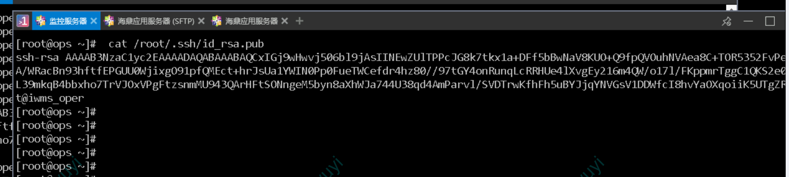
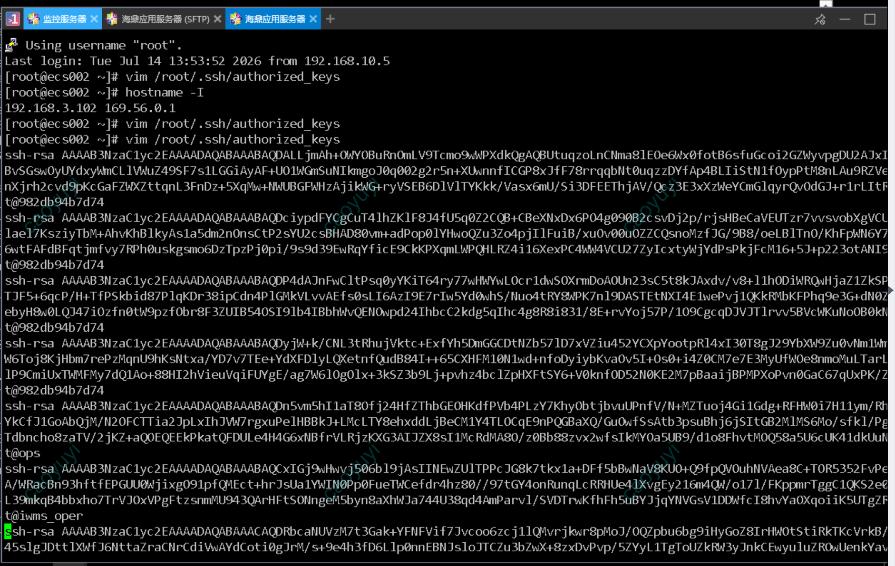
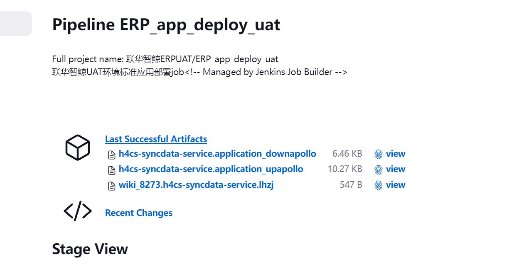
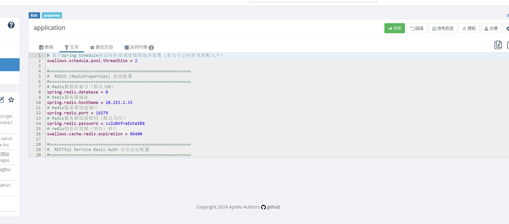
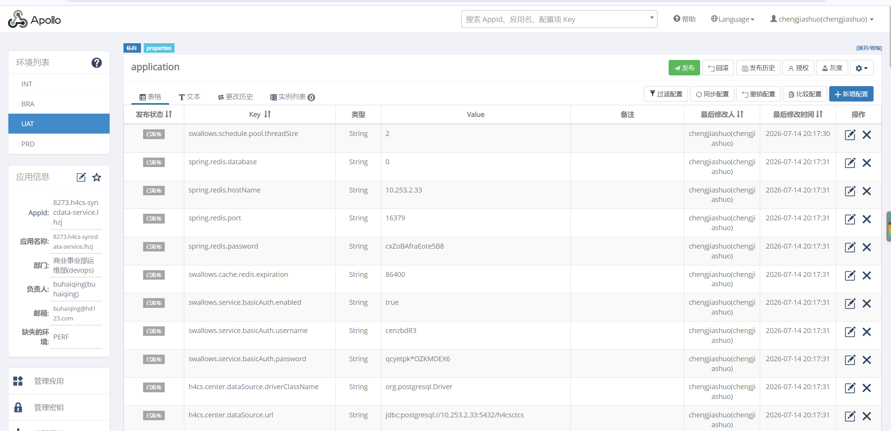

## 易寻医项目部署总结
### 1.ops机器dnet用户部署Jenkins
### 2.Jenkins通过负载均衡发布公网 
### 3.免密操作
### 4.修改toolset配置
#### 4.1 Jenkins分支
##### ps：project-db的groovy写法不一样
```commandline
    groovy: |-
                    return (appname.equals("hdportal"))? ["jdbc:mysql://rm-bp1ao8zb6my5vp638.mysql.rds.aliyuncs.com:3306/hdportal"]:
                    (appname.equals("yxy-service"))? ["jdbc:mysql://rm-bp1ao8zb6my5vp638.mysql.rds.aliyuncs.com:3306/yxy"]:
                    (appname.equals("pasoreport-web"))? ["jdbc:mysql://rm-bp1ao8zb6my5vp638.mysql.rds.aliyuncs.com:3306/pasoreport"]:[]

```
##### ps：folder要补全(注意不要出现erp字样)
```
      name: YXY- folders
      - folder:
          job_name: '{customer}测试'
          description: '{customer}测试环境job'
      - folder:
          job_name: '{customer}生产'
          description: '{customer}生产环境job'
```
##### ps：default.yaml里的credentials_id要和config/jenkins.yaml保持一致

##### ps：toolset_yxy\jenkins_jobs.ini 里只需要内网地址即可

#### 4.2 ERP分支
##### all.yaml
```commandline
dbtype: "MySQL"


prometheus:
  
      endpoint: "http://10.0.1.31:8500"

extranetip: "gateway.yixune.com"  #域名

access_protocol: 'https'

仅保留rdb_url: 'jdbc:mysql://{{dbserver}}:{{dbport}}/{{dbname}}'
其他用#注释掉

dbserver: "rm-bp1ao8zb6my5vp638.mysql.rds.aliyuncs.com"
dbport: 3306

dbname: "pasoreport"
dbuser: "yxy"
dbpwd: "@GxxxsYt"
```

##### apollo.yaml
```commandline
apollo_token:production和int保持一致
```

 
##### apollo.yaml

```commandline
redis_host: "r-bp18vjby9qk2023p5b.redis.rds.aliyuncs.com"
redis_webport: 6379
redis_password: "xxx"

```
再从int里复制yxy pasoreport等四个组件信息
```commandline

#################################################
#yxy-service版本
yxyservice_version: "1.0"
#yxy-service端口
yxyservice_webport: 18338
#yxy-service管理端口
yxyservice_managerport: 19338
#yxy-serviceJMX端口
yxyservice_jmxport: 17338
yxyservice_rdb_url: "jdbc:mysql://rm-bp1ao8zb6my5vp638.mysql.rds.aliyuncs.com:3306/yxy?useUnicode=yes&characterEncoding=utf-8&useSSL=no&serverTimezone=Asia/Shanghai&reWriteBatchedInserts=true"
yxyservice_rdb_user: "yxy"
yxyservice_rdb_pwd: "GL7JSVOsdLsRYt@"
#################################################

#################################################
#hdportal版本
hdportal_version: "1.0"
#hdportal端口
hdportal_webport: 18320
#hdportal管理端口
hdportal_managerport: 19320
#hdportal_rdb_url: 'jdbc:polardb2://<input>?prepareThreshold=0&boolAsInt=true'
#hdportal_rdb_url: 'jdbc:mysql://<input>?characterEncoding=utf-8&zeroDateTimeBehavior=convertToNull'
#hdportal_rdb_url: 'jdbc:postgresql://<input>?reWriteBatchedInserts=true'
hdportal_dbtype: "MySQL"
hdportal_rdb_url: 'jdbc:mysql://rm-bp1ao8zb6my5vp638.mysql.rds.aliyuncs.com:3306/hdportal'
hdportal_rdb_user: 'yxy'
hdportal_rdb_pwd: 'GL7JSVOsdLsRYt@'
#################################################

#################################################
#zl-portal-sync版本
zlportalsync_version: "1.13.0"
#zl-portal-sync端口
zlportalsync_webport: 18298
#zl-portal-syncjmx端口
zlportalsync_jmx_port: 19298
#zl-portal-sync管理端口
zlportalsync_managerport: 9837
#zl-portal-sync数据库地址
zlportalsync_rdb_url: 'jdbc:mysql://rm-bp1ao8zb6my5vp638.mysql.rds.aliyuncs.com:3306/pasoreport'
#zl-portal-sync数据库用户
zlportalsync_rdb_user: 'yxy'
#zl-portal-sync数据库密码
zlportalsync_rdb_pwd: 'GL7JSVOsdLsRYt@'
#################################################

#################################################
#pasoreport-web版本
pasoreportweb_version: "1.25"
#pasoreport-web端口
pasoreportweb_webport: 18980
#pasoreport-web管理端口
pasoreportweb_managerport: 19980
####JMX监控端口配置，为固定端口，无需修改########
pasoreportweb_jmx_port: 9756
#pasoreport-web许可证地址
pasoreportweb_license: '{{app_license}}'
#pasoreport-web许可证端口,注意HDLicense服务默认端口为8088，不要轻易修改
pasoreportweb_license_port: '{{app_license_port}}'
#登录密码加密算法(目前只提供"md5"和"hdpos4"两种，默认为md5)
pasoreportweb_login_encryption: "md5"
#pasoreport-webJVM内存
pasoreportweb_mem: "6g"
#pasoreport-web 独立部署
pasoreportweb_Independent: true
pasoreportweb_dbtype: 'MySQL'
pasoreportweb_rdb_url: 'jdbc:mysql://rm-bp1ao8zb6my5vp638.mysql.rds.aliyuncs.com:3306/pasoreport 
pasoreportweb_rdb_user: 'pasoreport'
pasoreportweb_rdb_pwd: 'GL7JSVOsdLsRYt@'
#################################################


```
#### 4.3 develop分支
 
##### inventory
```commandline
[openresty]
openresty ansible_ssh_host=10.0.1.31

[openresty:vars]
ansible_port=22
ansible_user=dnet
ansible_become=yes
ansible_become_user=root

```
 
 
##### hdpos.conf
```commandline
	  server_name  10.0.1.31 gateway.yixune.com;#nginx服务器ip
```
#####  upstream.conf
 

### 5.后续步骤和erp大体一样
###  ps: zl-portal-sync组件依赖nginx 先不部署


##  zl-portal-sync组件版本号不明确
zl-portal-sync组件的版本信息在
http://wiki.app.hd123.cn/wiki/display/scenter/HDPORTAL-SYNC
 


# 解决问题
 ## 1. JOB-basic_auth执行失败
### 报错：

```commandline
ERROR: Could not find credentials entry with ID '17643215-09f8-4a9a-b0ea-c8e49777yxy'
```
### 原因： default.yaml里的credentials_id要和config/jenkins.yaml未保持一致
 
 
 

 ## 2.JOB-basic_auth执行失败
### 报错：

```commandline
18:44:43  /root/.ssh/config: line 1: Bad configuration option: vim
18:44:43  /root/.ssh/config: terminating, 1 bad configuration options

```

### 原因：写错了，多加一行
### 解决办法：
 
#### 修改  /home/dnet/.ssh/config


 ## 3.JOB-basic执行失败
### 报错：
```commandline
Host key verification failed.
```
方法一：在 Jenkins 容器内手动添加 known_hosts
```commandline
 
docker exec -it jenkins-server bash
ssh-keyscan -H 10.0.1.31 >> ~/.ssh/known_hosts
exit
``` 
方法二：
```commandline
 
docker exec -it jenkins-server ssh root@10.0.1.31
# 输入 yes 确认指纹
# 退出
 
```


```commandline
"Failed to connect to the host via ssh: Permission denied (publickey,gssapi-keyex,gssapi-with-mic,password).
```


## 3.JOB-GLOBLE_deploy_nginx执行失败
### 报错：
```commandline
"Failed to connect to the host via ssh: Permission denied (publickey,gssapi-keyex,gssapi-with-mic,password).
```

### 报错：
```Permission denied (publickey,gssapi-keyex,gssapi-with-mic,password)
```
Ansible 在尝试通过 SSH 连接目标服务器 10.0.1.31 来修改系统参数（limits.conf、sysctl.conf 等）时，被服务器拒绝了。
### 原因：在部署nginx时，执行GLOBLE_deploy_nginx会生成一个iac临时容器，这个容器的启动参数，是将ops服务器的`/root/.ssh`映射到iac容器的`/root/.ssh` ,所以在部署nginx时使用的用户为`root`免密登录到目标服务器的`dnet` 用户（dnet用户是在inventory定义的）

### 解决办法：

```
在ops服务器的root用户下，执行:
ssh-keygen
# 生成root用户的公私钥
```


###  配置root用户到目标机器的root/dent用户免密登录

```
ssh-copy-id root@目标服务器IP
或者
ssh-copy-id dnet@目标服务器IP
```

 

 


### 解决办法：

#### 1.  在 Jenkins 容器内确认已有 SSH 密钥
```commandline
docker exec -it jenkins-server ssh-keygen  # 如果还没生成过
docker exec -it jenkins-server cat /root/.ssh/id_rsa.pub

```
#### 2. 将公钥复制到目标服务器
##### Ansible 默认用 inventory 文件里定义的 ansible_user 连接。如果 inventory 里是 dnet，就复制给 dnet；如果是 root，就复制给 root。
```commandline
docker exec -it jenkins-server ssh-copy-id dnet@10.0.1.31
```
#### 3. 验证免密是否成功
```commandline
docker exec -it jenkins-server ssh dnet@10.0.1.31 echo ok

```


##  SSH 免密配置

### 源端：Jenkins 宿主机（iac 容器内）的 root 用户
Jenkins在运行 iac 容器时，通过 -v /root/.ssh:/root/.ssh 挂载了宿主机的 root 用户 SSH 密钥。


### 目标端：OpenResty 服务器（openresty 主机）上的 SSH 用户(dnet/root)
由 inventory 文件中 openresty 条目对应的 IP 地址（如 10.0.1.31）及其登录用户决定。


### 1.ansible_user=dnet

```commandline
[openresty]
openresty ansible_ssh_host=10.0.1.31

[openresty:vars]
ansible_port=22
ansible_user=dnet
ansible_become=yes
ansible_become_user=root

```


### 步骤：
### 1.在 Jenkins 宿主机（即运行 Jenkins 容器的那台服务器10.0.1.31）上，以 root 用户身份执行： 
```commandline
ssh-copy-id dnet@10.0.1.31
```

### 2.在该命令自动将 /root/.ssh/id_rsa.pub 公钥内容追加到目标服务器 10.0.1.31 上 dnet 用户的 ~/.ssh/authorized_keys 文件中。
### 3.之后 Ansible（在 iac 容器内通过挂载的 /root/.ssh 使用同一份私钥）就能无需密码直接 SSH 登录目标服务器，从而成功执行部署任务。
```
通过 ssh-copy-id dnet@10.0.1.31 把 Jenkins 宿主机的 root 
公钥推送到了目标服务器的 dnet 用户下，Ansible 就能免密登录，
再 sudo 到 root 去修改系统参数、启动 OpenResty 容器了。

```

### 2.ansible_user=root

```commandline
 ssh-copy-id root@10.0.1.31
```

```
既然直接用 root 登录，本身就有最高权限，
ansible_become=yes 和 ansible_become_user=root 这两行可以删除。
```

```commandline

[openresty]
openresty ansible_ssh_host=10.0.1.31

[openresty:vars]
ansible_port=22
ansible_user=root

```


### 启动agent节点
https://gitlab.hd123.com/qianfanops/jenkins-manager
 
```
docker pull harbor.qianfan123.com/jenkins/jenkins-agent:3283.v92c105e0f819-jdk17
docker rm -f jenkins-agent
docker run  --init -d --restart always --name jenkins-agent \
  -e JAVA_OPTS="-XX:MaxMetaspaceSize=256m -Xms256m -Xmx2048m" \
  -v ~:/root \
  -v $(which docker):/usr/bin/docker \
  -v /var/run/docker.sock:/var/run/docker.sock \
  -v /hdapp/jenkins/agent/:/hdapp/jenkins/agent/ \
  harbor.qianfan123.com/jenkins/jenkins-agent:3283.v92c105e0f819-jdk17  \
  -url http://<jenkins-server:port>  \
  -webSocket \
  <secret> <agent name>
ln -s /hdapp/jenkins/agent/workspace /var/jenkins_home/workspace
```

```commandline
<jenkins-server:port>  222.85.189.26:60080 
<secret> e1639b5432cfed4e9166f4fdf16869d530e3a78fd4d33a73d65d4ecfecdd2409
<agent name> iWMS
```


## ops机器免密到应用服务器：

#### 1.查公钥
```
cat /root/.ssh/id_rsa.pub
```

 

####  2.手动复制到应用服务器
```commandline
 vim /root/.ssh/authorized_keys
```


####  3.测试
```commandline
ssh 目标ip
```


## 老项目新增组件 要在Apollo手动上传
#### 下载h4cs-syncdata-service.application_upapollo

####  进入编辑 全选 复制手动发布


