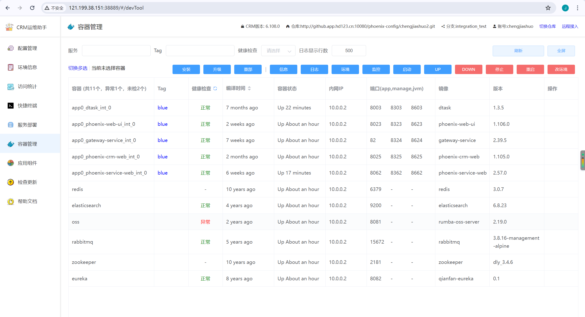
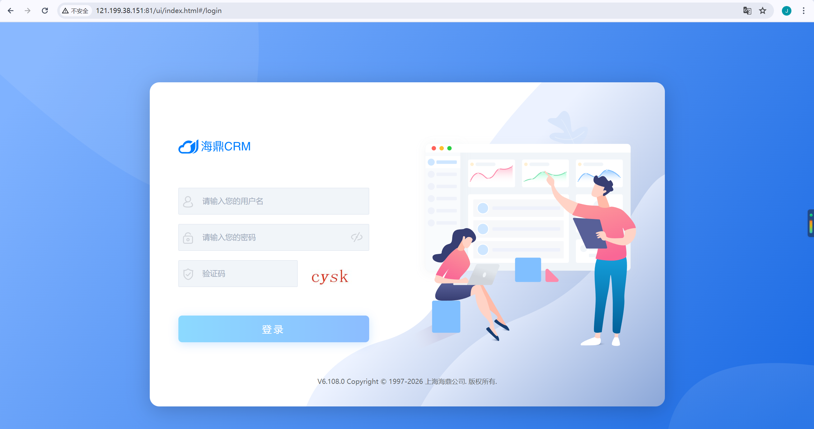

#  工作
## SLB上传证书 
见附件(阿里云SLB上传SSL证书步骤.zip)
## 部署crm 总结

## 问题1：RabbitMQ 密码特殊字符导致服务启动失败

### 原因：
RabbitMQ 密码 包含 URL 特殊字符（`!` 和 `#`），在构建 RabbitMQ 管理 API 的 时，这些字符被错误解析，导致 `phoenix-service-web` 
无法连接 RabbitMQ，启动失败。

### 报错信息
```commandline

java.net.MalformedURLException: For input string: "x2v!ue3Np"
Caused by: java.lang.IllegalStateException: java.net.MalformedURLException: For input string: "x2v!ue3Np"

```

 
### 完整解决步骤：

#### 1. 确认当前 RabbitMQ 密码
```bash
docker inspect <容器id> | grep -i "RABBITMQ_DEFAULT_PASS"

"RABBITMQ_DEFAULT_PASS=x2v!ue3Np#Ea"
```

#### 2.RabbitMQ 容器已删除
#### 3.修改 phoenix.yaml 中的 RabbitMQ 密码 ,提交git


#### 4. 重新部署 RabbitMQ
在 Jenkins 中执行 CRM_Deploy_Middleware_One，只勾选 rabbitmq


## 问题2： 部署仓库缺少 key 证书目录(练习遇到，项目没遇到过）
####  现象：Ansible 执行时提示 Could not find or access .../key
####  原因：Git 仓库没有key文件夹，git 不支持空目录，未添加.gitkeep占位文件
####  解决：本地仓库创建key/.gitkeep，推送develop分支，Jenkins 拉取后目录存在，Ansible 正常同步目录


## 问题2： conf.d 目录遗留 https.conf HTTPS 配置文件
####  现象：OpenResty 启动报错找不到证书
```commandline
cannot load certificate "/usr/local/openresty/nginx/key/crm.rulaipalm.net.pem": No such file or directory
```
####  解决： 直接删除 conf.d/https.conf，不再加载 HTTPS 相关配置，不再校验证书


### 自检

## 最终容器部署成功

## 能通过slb访问到crm应用
