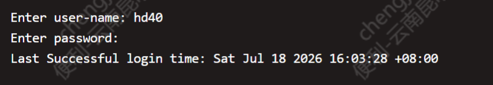
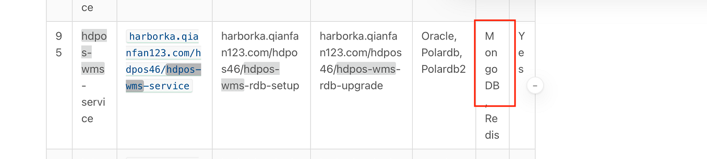
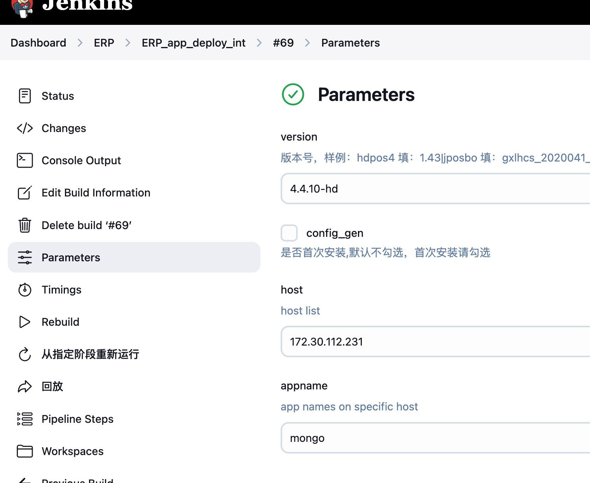
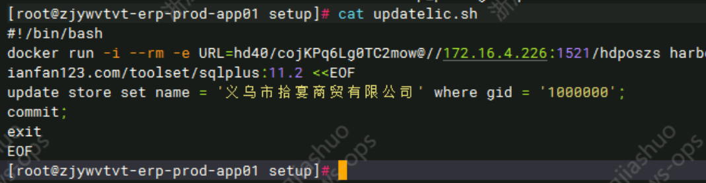
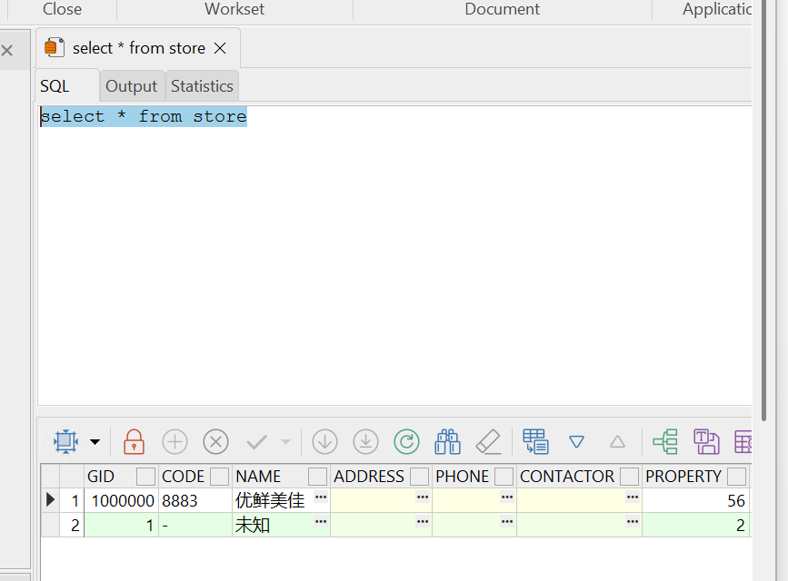

# 问题


## JOB-ERP_db_deploy_int 失败  vss-spider-46 数据库版本冲突
### 报错：
```commandline
TASK [vss-spider-46 : vss-spider-46 执行数据库安装程序，版本号：1.53.0] **********************
fatal: [127.0.0.1]: FAILED! => {"changed": true, "cmd": "docker run -i --rm --name ka-toolset-rdb-20260717152350Z -v /hdapp/heading/vss-spider-46_int/rdb/setup:/tmp harborka.qianfan123.com/vss/vss-spider-46-rdb-setup:1.53.0 all --log-file=/tmp/vss-spider-46-setup-1.53.0.log -d 'jdbc:oracle:thin:@172.30.112.231:1521:hdposcs' -u hd40 -p h*nvXn36hQnyo", "rc": 1}

stdout:
[INFO] Target Version: 1.53.0
[ERROR] 
com.hd123.rumba.rdbver.upgrader.UpgraderManagerException: Unsupported base version: 1.54.0
	at com.hd123.rumba.rdbver.upgrader.UpgraderManager.checkInPrepare(UpgraderManager.java:353)
	at com.hd123.rumba.rdbver.upgrader.UpgraderManager.doPrepare(UpgraderManager.java:317)
	at com.hd123.rumba.rdbver.upgrader.UpgraderManager.all(UpgraderManager.java:292)
	at com.hd123.rumba.rdbver.cli.CommandDispatcher.dispatch(CommandDispatcher.java:160)
	at com.hd123.rumba.rdbver.cli.CommandLineMain.run(CommandLineMain.java:77)
	at com.hd123.vss.spider46.rdb.setup.Main.main(Main.java:36)
```

### 原因：
Oracle RDB 不支持从高版本降级到低版本。 数据库中 vss-spider-46 的版本已经是 1.54.0，无法再安装 1.53.0。


### 解决办法：
 
####  1.登录数据库
```commandline
 su - oracle 
```

#### 2.设置正确的 SID 并连接
```commandline
export ORACLE_SID=hdposcs
```
 输入username pwd
```
sqlplus
```


#### 3. 查看当前记录
```
select COMPONENT from rbcomponentversion;
```
#### 4. 删除记录
```
delete from rbcomponentversion where component='HEADING Vendor HDPOS46 Service System';
```
#### 5..提交事务
```
COMMIT;
```
#### 5. 确认已删除
``` 
select COMPONENT from rbcomponentversion;
```
#### 6. 退出
```
EXIT;
```

参考：
```
如果第一次执行setup 报错，出现 SQL 异常等问题。研发修复后需要再次执行setup 的

需要先进入h6 的数据库(注意是正式环境还是测试)，查询出要安装的应用在数据库中记录的component 名称是什么，

select COMPONENT from rbcomponentversion;
delete from rbcomponentversion where component='HEADING Vendor HDPOS46 Service System';
commit;
 
每条命令要执行一次回车
注意在oracle 中，进行了增删改的动作后，一定要 commit 提交事务(否则增删改不生效)
commit;
```

 


### ps1:app.yaml

 ```
#对外发布公网或者域名，样例：120.124.5.68
extranetip: "h6-int.ynyxmj.com"
#对外发布公网或者域名协议
access_protocol: 'https'
```

### ps2: apollo.yaml
```commandline

amespace_admins: 'shujun,yaobohai,zhaochenhao,chengjiashuo,liuqinghua,dongruoyu,ganwangrong,jiangyilian,liliqun,tianbofeng'
project_admins: 'shujun,yaobohai,zhaochenhao,chengjiashuo,liuqinghua,dongruoyu,ganwangrong,jiangyilian,liliqun,tianbofeng'

```

### ps3:app.yaml


```commandline

#################################################
#redis部署主机ip
redis_host: "172.30.112.231"
 

#################################################
#项目客户简称，和以下版本前一部分客户名称要匹配
#背景：镜像地址变更需求 /:[标签名] -》 /[客户名称]/[标签名]
jposbo_client: "ynkmyxmj"

####-Mysql的配置###########################
#-Mysql服务ip,默认本机
jposbo_mysql_host: "172.30.112.231"
 

 
```


### ps4:创建Apollo时候openapi_token要写git里的 不要默认


### ps5:wiki带目录


### ps6:上传apollo

先找到所有符合条件的文件（Linux）
```
find /hdapp/heading -path "*/apollodir/*" -name "*upapollo*" -print0 | xargs -0 tar -zcvf /tmp/upapollo_all.tar.gz
```
打包所有匹配文件再 sz
```
 sz /tmp/upapollo_all.tar.gz
```

### ps6:dpos-wms 这个组件，是需要依赖mongodb 
所以要deploy-app 这个job去部署  mongdb  
版本
 




### ps7：更改许可证
```

SELECT * FROM store

update store set name='优鲜美佳' where GID='1000000';

commit;
```


目录:
```commandline
/hdapp/heading/hdpos4-dist_int/rdb/setup
```


####  如图



#### 连接数据库去改(注意要提交)
```bash
SELECT * FROM store
update store set name='优鲜美佳' where GID='1000000';
commit;
```


#### 如图
 

### ps8：licence-server不用创建Apollo
### ps9：erp-csv里，中间件不需要写