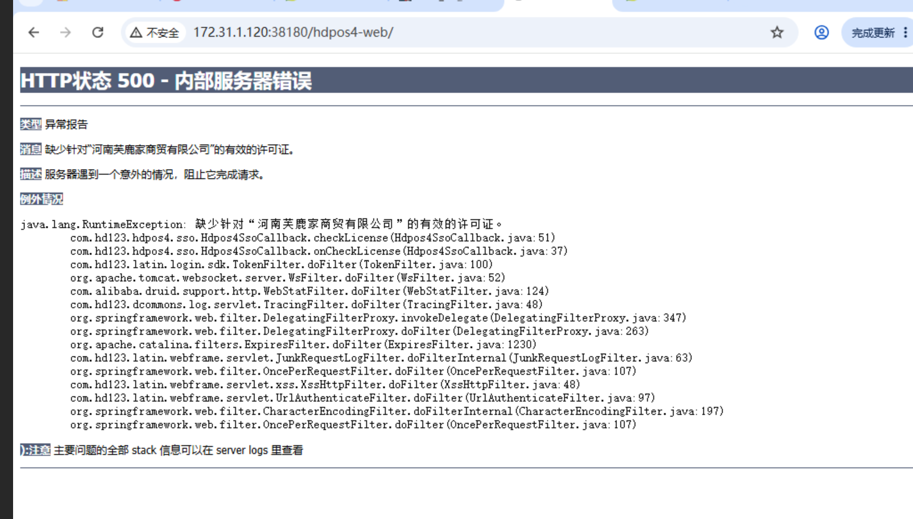

  
####  1.登录数据库
```commandline
 su - oracle 
```

 
### ps1：ssh-keygen不要随便执行(影响其他机器)


### ps2：数据库如果是项目安装好的话，再执行部署，要改一下目录用户属主
```commandline
sudo chown dnet /hdapp/
sudo chown dnet /opt

```
 
### ps3：jposbo需要mysql(5.7.14)
老项目就手动上传Apollo三个文件配置

### ps4：许可证user不一样 可能要换(CRM和hdpos4的user字段可能不一样)


进入oracle 
```
SELECT * FROM store where GID='1000000'

update store set name='郑州...' where GID='1000000';

commit;

```
