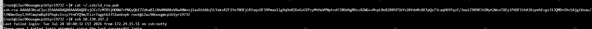
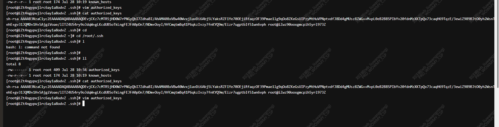
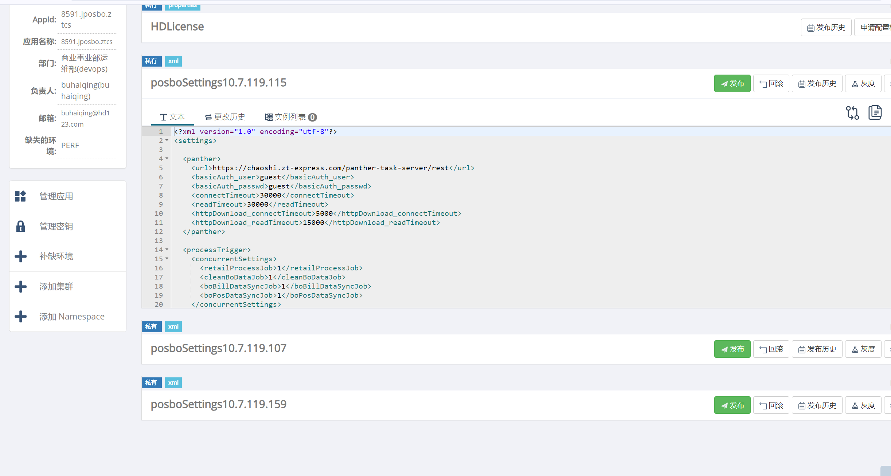
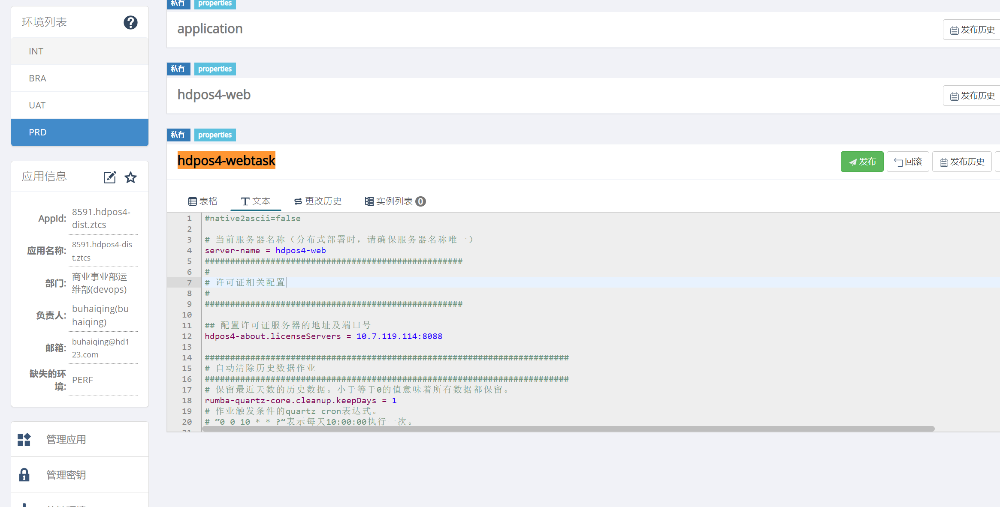

## ops：



##  app:

### root：cd ~/.ssh/authorized_keys



```
useradd dnet
mkdir -p /home/dnet/.ssh
chmod 700 /home/dnet/.ssh
chown -R dnet:dnet /home/dnet/.ssh
```
## dnet生成密钥(root用户)
```
su - dnet -c "ssh-keygen -t rsa -b 4096 -N '' -f /home/dnet/.ssh/id_rsa"
```

## dnet用户直接
```commandline

ssh-keygen -t rsa -b 4096 -N "" -f /home/dnet/.ssh/id_rsa

cat /home/dnet/.ssh/id_rsa.pub

```
### 目标应用服务器加上访问白名单
```commandline
cat /etc/hosts.deny
cat /etc/hosts.allow
vi /etc/hosts.allow
最上面加上
sshd: 10.7.119.0/24,10.9.25.0/24,10.10.4.159/32,10.7.178.0/24
```

##  hdpos4-disttask 以及jposbo 多节点部署时需要额外配置一些，可以参考下，后续其他项目的生产环境可能也会用到
### 1、toolset_x 配置(主要是区分多节点部署时获取apollo 配置逻辑)：
http://github.app.hd123.cn/qianfanops/toolset_zhongtong/-/commit/6abac3d9f23a94d9b3c940f382049ad20f3a11f0


#### erp/production/app.yaml
```commandline
#################################################
#Hdpos4.6版本
 
hdpos4disttask_mem: "10g"(修改)
#Hdpos4.6许可证地址
hdpos4disttask_license: '{{app_license}}'
#Hdpos4.6许可证端口,注意HDLicense服务默认端口为8088，不要轻易修改
hdpos4disttask_license_port: '{{app_license_port}}'
####JMX监控端口配置，为固定端口，无需修改########
hdpos4disttask_jmx_port: 9744
#是否开启万能验证码，仅为公司内部自动化测试用，默认是不开启的，开启设置为true
#万能验证码开启后，值为：6284
hdpos4disttask_enable_universal_captcha: false
#部署后等待健康检查时间,单位s(秒)
hdpos4disttask_check_after: 240(修改)
hdpos4distscenemode: "{{erpappname.split('hdpos4dist') | join('')}}"

#################################################

#################################################
#Hdpos4.6-Nome版本


#特殊配置
jposbonode: '{{ansible_host}}'
#################################################

```

### 2、apollo配置： 

 ### 2.1  - jposbo： 新增三个posboSettings 的配置，以主机 IP 做区分：posboSettings10.7.119.115、posboSettings10.7.119.107、posboSettings10.7.119.159 用来存放不同的配置



```commandline
<?xml version="1.0" encoding="utf-8"?>
<settings>

  <panther>
    <url>https://chaoshi.zt-express.com/panther-task-server/rest</url>
    <basicAuth_user>guest</basicAuth_user>
    <basicAuth_passwd>guest</basicAuth_passwd>
    <connectTimeout>30000</connectTimeout>
    <readTimeout>30000</readTimeout>
    <httpDownload_connectTimeout>5000</httpDownload_connectTimeout>
    <httpDownload_readTimeout>15000</httpDownload_readTimeout>
  </panther>

  <processTrigger>
    <concurrentSettings>
      <retailProcessJob>0</retailProcessJob>
      <cleanBoDataJob>0</cleanBoDataJob>
      <boBillDataSyncJob>0</boBillDataSyncJob>
      <boPosDataSyncJob>0</boPosDataSyncJob>
    </concurrentSettings>
  </processTrigger>

  <retailProcessJob>
    <intervalInSeconds>300</intervalInSeconds>
  </retailProcessJob>
  <cleanBoDataJob>
    <intervalInSeconds>86400</intervalInSeconds>
  </cleanBoDataJob>
  <boBillDataSyncJob>
    <enable>false</enable>
    <intervalInSeconds>180</intervalInSeconds>
  </boBillDataSyncJob>
  <boPosDataSyncJob>
    <intervalInSeconds>60</intervalInSeconds>
  </boPosDataSyncJob>

  <dataClean>
    <intervalInMins>1440</intervalInMins>
    <orderCache>
      <keepDays>30</keepDays>
    </orderCache>
    <videoPlayHistory>
      <keepDays>30</keepDays>
    </videoPlayHistory>
  </dataClean>

  <maxDownloadStores>0</maxDownloadStores>

  <sqlDataDownloadService>
    <fetchSize>0</fetchSize>
  </sqlDataDownloadService>

  <inventoryQueryServiceImpl>
    <queryLowAndHighInv>false</queryLowAndHighInv>
    <queryGoodsBackRule>false</queryGoodsBackRule>
    <queryDlvQtyAndAvaQty>false</queryDlvQtyAndAvaQty>
    <busgate>false</busgate>
    <useInvQty>true</useInvQty>
    <useQpc>true</useQpc>
  </inventoryQueryServiceImpl>

  <addValueSaleService>
    <useMultiOrgIsolate>true</useMultiOrgIsolate>
  </addValueSaleService>

  <otterWeb>
    <url>https://chaoshi.zt-express.com/hdpos4-web</url>
  </otterWeb>

  <wholesale>
    <useStoreOut>true</useStoreOut>
    <showStoreClient>false</showStoreClient>
  </wholesale>
  <wholesaleReturn>
    <useStoreOut>true</useStoreOut>
  </wholesaleReturn>

  <apos>
    <installImmediately>false</installImmediately>
  </apos>

  <saJvmMonitorReceive>
    <enable>true</enable>
  </saJvmMonitorReceive>

  <hdposOrderService4>
    <useDefaultOperator>false</useDefaultOperator>
  </hdposOrderService4>

  <listPosStations>
    <ascending>false</ascending>
  </listPosStations>

  <hdpos>
    <useProductMultiCode>false</useProductMultiCode>
  </hdpos>

  <filedownloadservice>
    <url></url>
  </filedownloadservice>

  <programDownload>
    <ignoreTimeOffsetMaxMinute>0</ignoreTimeOffsetMaxMinute>
  </programDownload>

  <billReceiveService>
    <allocateReturnRequestOrderService>
      <autoCheck>true</autoCheck>
    </allocateReturnRequestOrderService>
    <appendPosBuy>
      <ignoreFillDateOlderThan>-1</ignoreFillDateOlderThan>
      <useBuyUuid>true</useBuyUuid>
    </appendPosBuy>
    <storeOrderService>
      <userDownloadOrderFunction>true</userDownloadOrderFunction>
    </storeOrderService>
    <newTransferOutOrderService>
      <userDownloadOrderFunction>true</userDownloadOrderFunction>
    </newTransferOutOrderService>
    <newTransferInOrderService>
      <userDownloadOrderFunction>true</userDownloadOrderFunction>
    </newTransferInOrderService>
    <directReceiptOrderService>
      <userDownloadOrderFunction>true</userDownloadOrderFunction>
    </directReceiptOrderService>
    <stockTakingService>
      <sendPreAndCheckToOtter>false</sendPreAndCheckToOtter>
    </stockTakingService>
    <allocateReturnOrderService>
      <canReturnStat400Bill>false</canReturnStat400Bill>
    </allocateReturnOrderService>
    <ValueAddedOrderService>
      <userMorePosMode>false</userMorePosMode>
    </ValueAddedOrderService>
    <DirectSendBaseService>
      <useSupplierGoodsTaxrate>true</useSupplierGoodsTaxrate>
    </DirectSendBaseService>
    <LimitRequisitionService>
      <typeName_0>销售比领用</typeName_0>
      <typeName_1>正常领用</typeName_1>
    </LimitRequisitionService>
    <useMultOrg>true</useMultOrg>
    <gdFirstDistService>
      <enable>true</enable>
    </gdFirstDistService>
    <orderCache>
      <keepDays>7</keepDays>
    </orderCache>
    <wrhinvusesign>
      <auditToDelivered>false</auditToDelivered>
    </wrhinvusesign>
    <wolesale>
      <auditToFinish>false</auditToFinish>
      <auditState>0</auditState>
    </wolesale>
    <useQtyEqualsAllocQty>true</useQtyEqualsAllocQty>
    <directReceiptOrder>
      <continueReceivingGoods>true</continueReceivingGoods>
    </directReceiptOrder>
  </billReceiveService>

  <boAdmin>
    <mediaServer>
      <disableFtp>true</disableFtp>
      <disableBt>true</disableBt>
    </mediaServer>
  </boAdmin>

</settings>
```

### 2.2  - hdpos4-web： 新增hdpos4-webtask 配置，来单独存放hdpos4-disttask 节点的配置，主要涉及到零售加工的逻辑


```commandline
#native2ascii=false

# 当前服务器名称（分布式部署时，请确保服务器名称唯一）
server-name = hdpos4-web
###################################################
#
# 许可证相关配置
#
###################################################

## 配置许可证服务器的地址及端口号
hdpos4-about.licenseServers = 10.7.119.114:8088

########################################################################
# 自动清除历史数据作业
########################################################################
# 保留最近天数的历史数据。小于等于0的值意味着所有数据都保留。
rumba-quartz-core.cleanup.keepDays = 1
# 作业触发条件的quartz cron表达式。
# “0 0 10 * * ?”表示每天10:00:00执行一次。
# “45 30 10,14,16 * * ?”表示每天10:30:45、14:30:45、16:30:45各执行一次。
# “0 5,25,45 10 * * ?”表示每天10:05:00、10:25:00、10:45:00各执行一次。
# “0 5/20 10 * * ?”表示每天10点的60分钟内，从第5分钟开始，每隔20分钟执行一次。
# “0 0/30 9-17 * * ?”表示每天9点到17点，每半小时执行一次。
# “0 0 23-7/2 * * ?”表示每天23点到第二天7点，每2小时执行一次。
# “0 0/5 * * * ?”表示每5分钟执行一次。
#rumba-quartz-core.cleanup.cronExpression=0 0 0 * * ? 2099

## 发起执行作业的最大线程数
latin-quartz.threadPool.threadCount = 50

# 运行模式配置：development-开发模式，production-生产模式。
runMode = production

## 缓存配置
redis.host = 10.7.119.114
redis.port = 16379
redis.pass = cxZoBAfraEote5B8
redis.database = 0
redis.maxIdle = 50
redis.maxActive = 50
redis.maxWait = 50
redis.testOnBorrow = true
redis.timeout = 5000
## 配置缓存类型，如果是redis配置为redis-cache.xml，如果是ehcache配置为ehcache-cache.xml
cache.config = redis-cache.xml

## 报表查询缓存配置
simple.job.redis.host = 10.7.119.114
simple.job.redis.port = 16379
simple.job.redis.pass = cxZoBAfraEote5B8
simple.job.redis.database = 1
simple.job.redis.maxIdle = 50
simple.job.redis.maxActive = 150
simple.job.redis.maxWait = 50
simple.job.redis.testOnBorrow = true
simple.job.redis.timeout = 5000


## 报表结果缓存配置
report.result.redis.host = 10.7.119.114
report.result.redis.port = 16379
report.result.redis.pass = cxZoBAfraEote5B8
report.result.redis.database = 2
report.result.redis.maxIdle = 50
report.result.redis.maxActive = 150
report.result.redis.maxWait = 50
report.result.redis.testOnBorrow = true
report.result.redis.timeout = 5000
## 报表redis有效时间(默认1440分钟)
report.result.redis.expireMinutes = 1440

## simpleJob配置
# 报表查询的线程池大小
simple.job.threadCount = 30
# 报表查询的队列等待数
simple.job.queueSize = 200
## druid数据源监控界面登录账号配置（地址：http://localhost:8080/hdpos4-web/druid/login.html）
druid.loginUsername = admin
druid.loginPassword = 123456

## 登录密码加密算法(目前只提供"md5"和"hdpos4"两种，默认为md5)
latin-webframe.loginPwdEncryption = hdpos4
## 万能验证码配置
#latin-webframe.universalCaptcha=1234
## token名称
latin-webframe.login.tokenName = _uid_
## Token签名用的私钥
latin-webframe.login.secret = 123456
## Token登录入口配置 https://chaoshi.zt-express.com/hdpos4-web/www/view/selectorg.html
latin-webframe.login.url = /hdpos4-web/www/view/login2.html
# 对外可访问的应用系统地址，比如“http://localhost:8080/hdpos4-web”,请将协议（http或者https)和具体域名调整为客户现场的对应域名，其它保持不变
#latin-webframe.file.rootUrl = https://chaoshi.zt-express.com/hdpos4-web
# 登录cookie的有效期模式fixed-指定生效时间，session-浏览器关闭前一直有效
latin-webframe.login.expiresMode = fixed
## Token生效时间（单位：秒）
latin-webframe.login.expiresIn = 86400
## Token刷新时间（单位:秒)
latin-webframe.login.refreshIn = 600
## 系统cookie名
latin-webframe.login.embeddedTokenName = hdpos4
## tomcat access log不记录的请求url的匹配规则
latin-webframe.junkRequestLog.excludeUrlPatterns = *.js*,*.css*,*.html*,*.json*,*.png,*.jpg,*.ico
## 清理临时文件JOB定时时间配置
latin-sys-core.cleanTempFile.cronExpression = 0 0 1 * * ?
# SimpleJob数据缓存的过期时间，默认为24小时
latin-sys-core.simpleJob.timeout = 86400
# 数据库中存储的params字段是否记录，true表示记录(Def)，false表示不记录。
latin-sys-core.simpleJob.db.params.enabled = true
latin-webframe.login.spiTokenName = X-Auth-Token
# 是否启用防止网站被其它网站嵌套的安全限制（默认不启用）
latin-webframe.x-frame-options.enabled = false
# 可选值：DENY-浏览器拒绝当前页面加载任何Frame页面;SAMEORIGIN-页面只能加载入同源域名下的页面。（默认为SAMEORIGIN）
latin-webframe.x-frame-options.value = SAMEORIGIN

## SPIToken签名用的私钥
latin-webframe.login.spiSecret = 123456
## SPIToken生效时间（单位：秒）
latin-webframe.login.spiExpiresIn = 86400
## SPIToken刷新时间（单位:秒)
latin-webframe.login.spiRefreshIn = 600
## 第三方集成模块安全限制
# 是否启用url验签
latin-webframe.security.enabled = false
# 签名的加密密钥
latin-webframe.security.secret = 2c9180896015b54501601f591b9f2a61

## 事件处理机制相关配置
# 事件处理线程数
latin-commons-core.eventHandler.threads = 10
# 事件失败重试次数
latin-commons-core.eventDispatcher.maxRetries = 10
# 事件分发间隔时间（单位：秒）
latin-commons-core.eventDispatcher.scanseconds = 5
# 事件采样间隔时间（单位：秒）
latin-commons-core.eventStore.sampleseconds = 300

# old-最开始完全基于数据库的版本,默认为old； database-每次必查数据库最大单号(适用于存在代码和存储过程生成单据的场景)；redis-基于redis缓存中的最大单号进行分配（适用于只由代码生成单据的场景）
# latin-commons-dao.nextBillNumberGenerator.mode=old

# 生成盘点数据加工的线程池大小（默认10）
hdpos4-wrh-core.ckDataProcessTask.threads = 5
# 生成盘点数据加工的线程池等待队列（默认200）
hdpos4-wrh-core.ckDataProcessTask.queueSize = 200

## 队列redis缓存配置
# 消息队列redis服务地址
queue.redis.connectString = 10.7.119.114:16379
# 服务器连接密钥
queue.redis.password = cxZoBAfraEote5B8
# 连接的redis中的数据库实例
queue.redis.database = 0
# 获取连接时的最大等待毫秒数
queue.redis.maxWaitMillis = -1
# 最大连接数
queue.redis.maxTotal = 100
# 超时时间
queue.redis.timeout = 3000

# 当前服务器是否禁用消息队列加工：0-不禁用，1-禁用，默认为禁用；目前仅用于门店促销申请队列的加工，如果需要该功能，请配置成0。
latin.cluster.queueConsumeServer.stop = 1
# 加工门店促销申请的线程数
hdpos4-prom-core.storePromProcessTask.threads = 5
# 加工门店促销申请的线程等待数
hdpos4-prom-core.storePromProcessTask.queueSize = 500
# 促销价计算线程数
hdpos4-prom-core.promPriceTask.threads = 10
# 促销价计算定时表达式
hdpos4-prom-core.promPriceCalcJob.cronExpression = 0 0 0 * * ? 2099
# 促销商品记录计算定时表达式
hdpos4-prom-core.promProductCalcJob.cronExpression = 0 0 0 * * ? 2099

# 鼎力云定单生成批发单定时任务线程数
hdpos4-sale-core.cloudOrderProcessTask.threads = 5
# 鼎力云定单取消定时任务线程数
hdpos4-sale-core.cloudCancelProcessTask.cronExpression = 0 0/3 16 * * ? 2099
# 鼎力云定单生成批发单定时任务周期配置
hdpos4-sale-core.cloudOrderProcessTask.cronExpression = 0 0 2 * * ? 2099

###因为该作业执行可能比较耗时，所以执行时间配置的间隔应大一些，比如配置一两个小时执行一次，该期间所能执行的队列数（queues）应根据现场实际处理速度进行调整，如果上一次作业没有处理完成，下次作业可能会造成阻塞
# 分摊作业线程数
hdpos4-sale-core.prmShareRuleTask.threads = 5
# 批量加工零售单数量大小
# 注意：该配置为获取有效数据后，按该批量大小进行事务保存，直到当前线程数据处理完，而非处理100条后不再处理
hdpos4-sale-core.prmShareRuleTask.retailSize = 100
# 分摊队列重试次数
hdpos4-sale-core.prmShareRuleTask.retry = 3
# 分摊作业执行时间
hdpos4.sale.prmShareRuleTask.cronExpression = 0 0 0 * * ? 2099
# 增加系统配置，控制加工的线程数量，默认是5
seriessaleplan.queryhistory.threadPool.threadCount = 5

# 批量生成售价改价单数据加工的线程池大小（默认1）
hdpos4-sale-core.batchGenRprc.threads = 1
# 批量生成售价改价单数据加工的线程池等待队列（默认100）
hdpos4-sale-core.batchGenRprc.queueSize = 100
# 定时任务执行周期：每天零点执行一次，默认不执行
hdpos4.autoCkDataTask.cronExpression = 0 0 0 * * ? 2099
# 定时加工今日交易门店数
hdpos4.sys.adsStoreQtyDailyProcess.cronExpression = 0 0 4,8,12,16,20 * * ?

###########################################################
# 以下为4.6对接CS的配置，如无需此功能无需配置
###########################################################
# 启动加工CS作业容器的可同时执行的作业线程数
#hdpos.connect.cs.jobContainer.threads=1
# 消费CS业务单据消息队列的保持的最小线程数
#hdpos.connect.cs.jobExecutor.corePollSize=1
# 消费CS业务单据消息队列的最大可执行线程数
#hdpos.connect.cs.jobExecutor.maxPoolSize=10
# 消费CS业务单据消息队列的最大线程等待队列
#hdpos.connect.cs.jobExecutor.queueCapacity=200
# 清理CS单据消息队列缓存数据的定时表达式
#hdpos.connect.cs.cleanQueue.cronExpression=0 0 0 1/1 * ? 2099
# 清理CS单据消息队列缓存数据的线程数
#hdpos.connect.cs.cleanQueue.threadPool.threadCount=1
# 消息队列每一条数据处理完成后，线程休眠时间，让出cpu给其他线程。单位：毫秒。
# hdpos.connect.cs.queue.sleepTime=200
# 删除无用图片明细任务周期，默认每天0点执行一次
hdpos4-dist-core.imageDetailClear.cronExpression = 0 0 0 * * ?

###########################################################
# 以下为合同自动出账加工的配置
###########################################################
# 合同定时出账作业的定时表达式(每天凌晨0点开始执行)
contract.settle.autoProcess.cronExpression = 0 0 0 * * ?
# 定时处理合同出账数据加工的线程池大小（默认5）
hdpos4-account-core.settleProcessTask.threads = 5
###########################################################
# 以下为联营合同自动续约的配置
###########################################################
# 联营合同自动续约作业的定时表达式(每天凌晨1点开始执行)
contract.autoReNew.cronExpression = 0 0 1 * * ?
# 批量设置商品配送方案门店供应商组验证，线程数大小（默认5）
hdpos4-mdata-core.gdAlcSchemeBatchVerifyProcessTask.threads = 5

# SQL日志输出
latin-core.druid.log.stmt = true
latin-core.druid.log.stmt.executableSql = true
# 应用日志存储的有效时间，单位天，默认为15天
log4j.expiredDays = 15
# 慢SQL执行时间，单位为毫秒
latin-core.druid.log.slowSqlMillis = 300000
latin-core.druid.log.slowSql = true
# 清除岗位日志定时任务周期配置
latin-sys-core.cleanRoleLog.cronExpression = 0 0 2 * * ? 2099
# 允许最大上传文件的大小，单位M，默认为空或者-1表示不限制
latin-core.upload.maxSize = 
# 允许下载的最大文件的大小，单位M，默认为空或者-1表示不限制
latin-core.download.maxSize = 
# 允许上传的文件类型(小写），默认为空表示不限制，多个以逗号分隔，默认值如下
latin-core.upload.fileType.includes = image,txt,xls,xlsx,csv,pdf,zip,jasper,doc,docx,ppt,pptx,mp3,mp4,xml,md

###########################################################
# 以下为帆软报表集成配置，不需要请保持注释
###########################################################
# 帆软报表登录认证服务接口地址，不配置表示不启用帆软报表
#fineBI.server.token.url=http://172.17.10.144:37799/webroot/decision
# 是否启用密码加密，启用时，帆软默认使用的是SHA256加密策略，可以自定义加密策略。
#fineBI.server.encrypted=false
# 帆软报表登录认证用户
#fineBI.server.username=admin
# 帆软报表登录认证密码
#fineBI.server.password=admin
# 售价公式加工cron表达式
hdpos4-sale-core.rtlPrcFormulaExecCronTime.cronExpression = 0 0 2 * * ? 2099

# 新建组织分布式锁过期时间，单位秒
hdpos4.OrgCreate.LimitLock.overduetime = 900


# 生成不停业盘点数据加工的线程池大小（默认5）
hdpos4-wrh-core.openCkDataProcessTask.threads = 5
# 生成不停业盘点数据加工的线程池等待队列（默认200）
hdpos4-wrh-core.openCkDataProcessTask.queueSize = 200
# 库存周转监控/系列预测销售最大导出行数
hdpos4-wrh-core.invturnover.excel.export.maxlines = 50000

# 报表查询作业超时中断任务，默认1分钟执行一次
pasoreport-core.report-query-timer.cronExpression = 0 0/1 * * * ?

#------------------------------------------------------------------------------
# rumba-oss-aliyun 配置
#------------------------------------------------------------------------------
#rumba-oss-aliyun.connection.endpoint=http://oss-cn-qingdao.aliyuncs.com
#rumba-oss-aliyun.connection.accessKeyId=
#rumba-oss-aliyun.connection.accessKeySecret=
#rumba-oss-aliyun.bucketName=

#------------------------------------------------------------------------------
# 消息处理器
#------------------------------------------------------------------------------
# 消息处理器线程数量
rumba.listener.processorCount = 5
# 默认关闭，如果配置为true,则启动RumbaMQ,同时会关闭Redis消息队列
# 用于多应用时的MQ启动开关
hdpos4.rumbamq.autoStartup = false
# 消息处理方式, 0表示redis队列，1表示rumbaMQ
hdpos4.queue.type = 0
# 是否启用银泰消息监听，默认不启用
yt.message.listener.enabled = 0

# rumba-mq-amqp
#------------------------------------------------------------------------------
rumba-mq-amqp.host = localhost
rumba-mq-amqp.port = 5672
rumba-mq-amqp.user = guest
rumba-mq-amqp.passwd = guest

# ---------------------------------
# ReliableEventManager
# ---------------------------------
## 可靠事件管理器名称。取值满足以下限定条件：
## * 长度为0-22个字符；
## * 允许使用的字符包括数字字符（0-9）大小写英文字母（a-zA-Z）以及下划线字符（_）；
## * 用于重复性检查时“大小写不敏感”。
rumba-mq-reliableevent.manager.name = MQRE
## 数据库或Schema名。取值满足以下限定条件：
## * 长度为0-30个字符；
## * 允许使用的字符包括数字字符（0-9）大小写英文字母（a-zA-Z）以及下划线字符（_）
rumba-mq-reliableevent.manager.dbName = HD40
## 每次从数据库拉取调用任务的最大时间间隔，单位毫秒，取值范围大于等于1秒。默认为1分钟。
rumba-mq-reliableevent.manager.pollingInterval = 60000
## 内存最大任务队列大小，取值范围大于0。默认为1000。
rumba-mq-reliableevent.manager.maxQueueSize = 1000
## 并发的执行器线程数，取值范围大于0。默认为5。
rumba-mq-reliableevent.manager.executorThreads = 5
## 调度器运行模式。默认为MULTI。可能的取值即含义：
## * MULTI - 多调度器模式。
## * SINGLE - 单调度器模式。
rumba-mq-reliableevent.manager.schedulerRunMode = MULTI
## 当任务调用失败导致再次重试的最大允许间隔时长，单位毫秒。默认为3600000（1小时）。取值范围大于等于1000（1秒）。
rumba-mq-reliableevent.manager.maxRetryInterval = 3600000
## 调度器启动后将随机等待从0到属性取值的时间后开始工作。单位秒，默认为5秒。取值范围0-60。
rumba-mq-reliableevent.manager.maxWaitForStart = 5
## 用于单调度器模式下集群节点间相互访问的IP地址或域名。默认为null，表示取值来自InetAddress.getLocalHost().getHostAddress()的返回值。
rumba-mq-reliableevent.manager.remoteServerHost = 
## 用于单调度器模式下集群节点间相互访问的端口号。默认为5923，取值范围0-65535，其中0表示由操作系统自动分配。
rumba-mq-reliableevent.manager.remoteServerPort = 5923
## 在单调度器模式下，用于接收处理来自其它节点请求最大线程数。默认为100。取值范围大于等于1。
rumba-mq-reliableevent.manager.remoteCallThreads = 100
## 是否生成调用请求跟踪日志。默认为true。
rumba-mq-reliableevent.manager.traceLog = false
## 是否启用自动升级表结构的功能。默认为true。
rumba-mq-reliableevent.manager.autoUpdateSchema = true
## 每批最大可处理的的调用请求数量。取值范围1-10000。默认为128。
rumba-mq-reliableevent.manager.executorBatchSize = 128
###########################################################
# quartz配置文件
###########################################################
# 指定quartz配置文件Oracle
hdpos4.quartz.config.file = classpath:quartz.properties
# Crm券、积分日清加工cron表达式
crm.pointscoupon.process.cronExpression = 0 0 2 * * ? 2099
# 自动记录库存快照定时任务
hdpos4.autoCkDirTask.cronExpression = 0 0 0 * * ? 2099
# 自动加工门店叫货池到配货池定时任务
hdpos4.autoProcAlcPoolTask.cronExpression = 0 0 0 * * ? 2099
# 启用H6的消息队列加工，1表示关闭，0表示打开
hdpos4.queueConsumeServer.stop = 1
# 服务器启动是否刷新全部缓存，默认为false
cache.serverStartClear = false
# 是否开启限流器，默认开启
api.rate-limit.enabled = true
# 服务接口每秒允许的最大TPS，默认值为50（比如BO请求H6、外部调用H6的rest接口等业务）
api.rate-limit.permitsPerSecond = 50
# 配置获取许可的等待时间，单位毫秒，默认100ms，小于等于0代表无等待
api.rate-limit.waitTimeoutMills = 100
# 过滤无需输出日志的请求uri正则匹配表达式，多个以逗号分隔，默认为空，取值示例：*/proOrder/*,*/directOrder/*
controller-access-log.uri.exclude.pattern = 
# 过滤无需输出的请求头参数属性，默认为空，多个以逗号分隔
controller-access-log.header.exclude.properties = 
# 需要输出的json日志属性pattern，默认值如下所示
controller-access-log.pattern = client,method,uri,headers,queryString,requestTime,responseTime,costMillis,stackTrace

#### 需要开启uni对接的项目调整以下配置即可：
## 登录地址改为Uni登录地址
# latin-webframe.login.url=https://portal.hd123.com/uni-portal-int/

# cable.thirdparty.getAccount.url=http://10.7.119.119/jiuduorouduo-service/rest/creditCheck/check
# cable.thirdparty.getAccount.username=guest
# cable.thirdparty.getAccount.password=guest

###################################################
#
# 新增以下Uni对接配置
#
###################################################

## Uni单点登录对接配置
# 是否启用uni
# heading.uni.enable=true
# uni访问服务地址
# heading.uni.server.url=
# uni注册应用id
# heading.uni.server.appId=
# uni注册应用密钥
# heading.uni.server.appSecretKey=
# uni访问用户名
# heading.uni.server.username=
# uni访问密钥
# heading.uni.server.password=

## 是否启用ldap登录认证
#ldap.login.enable=false
## ldap服务地址，多个以分号“;”分隔，ldaps端口一般为636
#ldap.server.url=ldaps://<ip:port>
## 服务连接超时时间，单位毫秒，默认3000毫秒
#ldap.server.connect.timeout=3000
## ldap管理员账号名，格式为"zhangsan@demo.com"
#ldap.server.admin.username=
## ldap管理员明文密码
#ldap.server.admin.password=
## 密码修改的外部链接，配置后框架修改密码仅做外部跳转
#latin-webframe.modifyPwd.url=

###########################################################
# SSO登录认证相关配置
###########################################################
## 是否启用sso登录，默认为false
#sso.zto.enabled = true
## 中通应用appId
#sso.zto.appId = ztscjGbHsxV0mpVTUt8cbPkw
## 中通应用app密钥
#sso.zto.appSecret = p-G7rSlvVPm2Uh7hiXHVQg
## 中通sso登录地址
#sso.zto.url = https://sso.zto.com/oauth2/authorize
## 中通oauth2接口访问地址
#sso.zto.oauth2.server.url = https://sso.zto.com/oauth2
## 接口连接超时时间,单位毫秒
#sso.zto.oauth2.server.connectTimeout = 3000
# 中通token有效时长，单位秒
#sso.zto.oauth2.token.expiredSecond = 3600
```


### 3、nginx 配置
     - jposbo需要区分不同的访问路径来处理不同的业务，  提交的内容和注释
 http://github.app.hd123.cn/qianfanops/toolset_zhongtong/-/commit/007d98ea903decd8c8f8649df880090cc0214975


