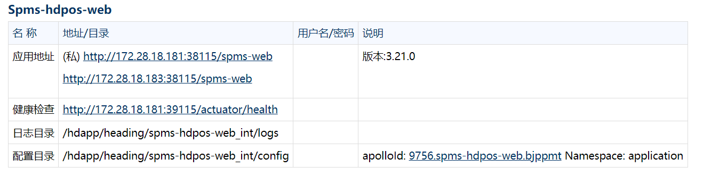

## 今日工作(7.7)

## 泡泡玛特-新增节点spms

## 1.前期配置修改
 
## 1.1 Jenkins 
#### project-app.yml：
```commandline

               groovy: |-
                    return (host.equals('172.28.18.181'))? ["license-server","redis","spms-hdpos-web","rumba-oss-server","oss-mysql","hdpos4-dist","jposbo","gem-service","hdpos6-notice-service","ppmt-web",'ppmt-webexternal',"mysql","panther-dts-server","panther-taskweb","h6-openapi2-service",'h6-openapi2-serviceexternal',"pasoreport-web","vss-spider-server","bpfm-app-service","ppmt-product-web-service","card-server-proxy-service","door-service",'init-tool','pasoreport-webauth','ras-h4-transfer','sas-h4-transfer','spms-stdpms-transfer','gateway-service',"zl-portal-sync","mkh-mas-transfer-server","sos-h6-transfer-service"]:
                    (host.equals('172.28.18.183'))? ['gateway-service',"spms-hdpos-web"]:
                    (host.equals('172.28.18.100'))? ['ppmt-web']:[]
```

## 1.2erp分支
### 1.2.1 int
#### erp.csv(注意和erpcmdb.yaml文件里的host_id对应，是部署在哪一台机器)
``` 9756,bjppmt,app-01,1.54.0,blue,zl-portal-sync,harbor.qianfan123.com/ka-sail/zl-portal-sync,backend,38298,9837,39298,15
9756,bjppmt,app-03,1.48-alpha.202511201906,blue,ppmt-web,harborka.qianfan123.com/component/ppmt-web,backend,38092,39092,9784,15
9756,bjppmt,app-01,1.65.2,blue,sos-h6-transfer-service,harborka.qianfan123.com/hdpos46/sos-h6-transfer-service,backend,38135,19135,9773,15
9756,bjppmt,app-01,1.31.0,blue,mkh-mas-transfer-server,harbor.qianfan123.com/mas/mkh-mas-transfer-server,backend,38201,39201,37201,15
9756,bjppmt,app-02,3.31.ppmt.2,blue,spms-hdpos-web,harborka.qianfan123.com/component/spms-hdpos-web,backend,38115,39115,9752,15
```
 
## 1.3 deveop分支 
###  openresty_config/erp/integration_test

#### hdpos.conf：


#### upstream.conf

```commandline

upstream spms-hdpos-web {
      server 172.28.18.181:38115;#spms-web应用的服务器ip和端口
      server 172.28.18.183:38115;#spms-web应用的服务器ip和端口
}

```


## 2.执行 GLOBLE_update_jenkins_config

 
## 3.执行 http://ci.hddomain.cn/job/ka_gen_cmdb/


## 4.应用部署（ERP_app_deploy_int）
## 5.执行 GLOBLE_deploy_nginx 
## 6.提交wiki



# 复习erp架构
 # ERP 系统整体部署架构

## 一、架构总览

ERP 系统部署于阿里云（杭州地域），整体采用**单 VPC 私有网络 + 公网 SLB 接入**的架构。所有业务组件以 Docker 容器化方式运行在 ECS 云服务器上，通过 OpenResty 反向代理网关统一对外提供服务，由 Jenkins 自动化流水线驱动 CI/CD 全流程。

### 架构全景图

```
┌─────────────────────────────────────────────────────────────────────────┐
│                          公网（Internet）                                 │
│                                                                         │
│  门店POS / 办公PC / 移动端 ──→ 域名(example.hdpos.com) ──→ HTTP 80端口    │
└───────────────────────────────────┬─────────────────────────────────────┘
                                    │
                                    ▼
┌─────────────────────────────────────────────────────────────────────────┐
│                       阿里云 公网SLB（Server Load Balancer）               │
│                     对外暴露80端口，绑定弹性公网IP(EIP)                     │
│                       SSL证书挂载点（HTTPS → HTTP转发）                    │
└───────────────────────────────────┬─────────────────────────────────────┘
                                    │ 内网转发
                                    ▼
┌═════════════════════════════════════════════════════════════════════════┐
║                      VPC 专有网络（私有网络空间）                          ║
║                                                                         ║
║  ┌──────────────────────────────────────────────────────────────────┐  ║
║  │                   安全组（防火墙规则）                               │  ║
║  │             入站：公网SLB → 80端口 / Jenkins → 22端口               │  ║
║  │             出站：NAT网关 → Harbor镜像仓库 / Git仓库 / Apollo配置中心│  ║
║  └──────────────────────────────────────────────────────────────────┘  ║
║                                                                         ║
║  ┌──────────────────────────────────────────────────────────────────┐  ║
║  │              业务服务器 ECS（如 172.16.0.61）                       │  ║
║  │                                                                    │  ║
║  │  ┌──────────────────────────────────────────────────────┐         │  ║
║  │  │        OpenResty 反向代理网关（:80）                    │         │  ║
║  │  │   hdpos.conf（URL路径匹配） + upstream.conf（端口映射）  │         │  ║
║  │  └────┬────┬────┬────┬────┬────┬────┬────┬────┬────┘         │  ║
║  │       │    │    │    │    │    │    │    │    │    │          │  ║
║  │       ▼    ▼    ▼    ▼    ▼    ▼    ▼    ▼    ▼    ▼          │  ║
║  │  ┌──────────────────────────────────────────────────────┐     │  ║
║  │  │            Docker 容器化微服务（20+个组件）              │     │  ║
║  │  │                                                      │     │  ║
║  │  │  hdpos4-dist  jposbo  pasoreport  spms-hdpos-web      │     │  ║
║  │  │  :38180        :38280  :38980      :38115             │     │  ║
║  │  │                                                      │     │  ║
║  │  │  h6-crm-service   panther-dts-server  panther-taskweb│     │  ║
║  │  │  :38169           :38480              :38380          │     │  ║
║  │  │                                                      │     │  ║
║  │  │  up-connector  gem-service  init-tool  openapi-doc    │     │  ║
║  │  │  :38110         :38105       :38093     :38210        │     │  ║
║  │  │                                                      │     │  ║
║  │  │  h6-openapi2   hdpos6-notice  sos-transfer  zl-sync  │     │  ║
║  │  │  :38176         :38136         :38135        :38298   │     │  ║
║  │  │                                                      │     │  ║
║  │  │  card-server-proxy  mkh-mas-transfer  rumba-oss      │     │  ║
║  │  │  :38119             :38201            :38112         │     │  ║
║  │  └──────────────────────────────────────────────────────┘     │  ║
║  │                                                               │  ║
║  │  ┌──────────────────────────────────────────────────────┐     │  ║
║  │  │              Docker 中间件容器                          │     │  ║
║  │  │   Redis(:6379)  OSS-MySQL(:3306)  License-server(:8088) │     │  ║
║  │  └──────────────────────────────────────────────────────┘     │  ║
║  │                                                               │  ║
║  │  ┌──────────────────────────────────────────────────────┐     │  ║
║  │  │             Oracle 数据库（:1521）                       │     │  ║
║  │  │           实例名: hdposcs / hdposzs                     │     │  ║
║  │  │           用户: hd40 / transfer                        │     │  ║
║  │  └──────────────────────────────────────────────────────┘     │  ║
║  └──────────────────────────────────────────────────────────────────┘  ║
║                                                                         ║
║  ┌──────────────────────────────────────────────────────────────────┐  ║
║  │              OPS 运维服务器 ECS（独立宿主机）                        │  ║
║  │   Docker 容器运行 Jenkins Server（:8080）                           │  ║
║  │   通过 SSH 免密（dnet用户）远程管控业务服务器                         │  ║
║  └──────────────────────────────────────────────────────────────────┘  ║
║                                                                         ║
║  ┌──────────────────────────────────────────────────────────────────┐  ║
║  │              NAT 网关 → 访问外网资源                                │  ║
║  │   Harbor镜像仓库 / Git配置仓库 / Apollo配置中心                     │  ║
║  └──────────────────────────────────────────────────────────────────┘  ║
║                                                                         ║
╚═════════════════════════════════════════════════════════════════════════╝
```
